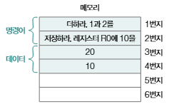
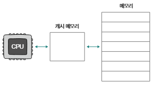
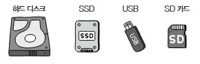
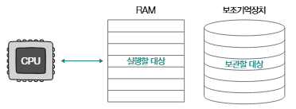
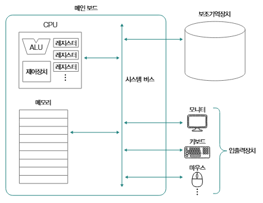
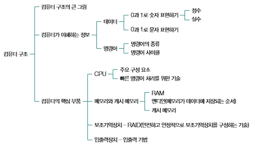

# Computer Architecture Overview
## 컴퓨터 구조의 큰 그림
### 컴퓨터가 이해하는 정보
- 컴퓨터가 이해할 수 있는 정보: **데이터와 명령어**
    - 컴퓨터는 프로그래밍 언어를 직접 이해하지 못함
    - 소스 코드는 내부적으로 컴퓨터가 이해할 수 있는 데이터와 명령어 형태로 변환된 뒤 실행됨

- 컴퓨터의 명령어: **수행할 동작과 수행할 대상**으로 이루어져 있음
    - ex. 1과 2를 더하라. 'hello world'를 출력하라. cat.jpg를 USB 메모리에 저장하라.

- 데이터: 숫자, 문자, 이미지, 동영상과 같은 **정적인 정보**
    - 컴퓨터와 주고받는 정보나 컴퓨터에 저장된 정보 자체를 '데이터'라 통칭하기도 함
    - ex. 1, 2와 같은 숫자. "hello world"라는 문자열. 'cat.jpg'라는 파일명
    - 즉, 데이터는 명령어에 **종속적인 정보**이며, 명령어의 대상임

- 컴퓨터는 기본적으로 0과 1만 이해할 수 있음 - 데이터와 명령어 또한 0과 1로 이루어져 있음
    - 즉, 컴퓨터는 0과 1만으로 다양한 숫자(정수, 실수)와 문자 데이터를 표현하고, 이 데이터를 활용해 명령어를 실행함
        - 명령어를 실행하는 주체: CPU
        - 따라서, CPU의 종류에 따라 실행 가능한 세부적인 명령어의 종류와 처리 양상이 달라질 수 있음

### 컴퓨터의 핵심 부품
- CPU(중앙처리장치)
    - 정보를 **읽고, 해석하고, 실행**하는 부품
    - CPU 구성 요소
        - 산술논리연산장치(ALU): 연산을 수행할 회로로 구성되어있는 일종의 계산기
        - 제어장치(CU): 명령어를 해석해 제어 신호를 내보내는 장치
            - 제어신호(control signal): 부품을 작동시키기 위한 전기 신호
            - CPU가 메모리를 향해 제어 신호를 보내면 메모리를 작동시킬 수 있고, 입출력장치로 신호 보내면 입출력장치 작동시킬 수 있음
        - 레지스터(register): CPU 내부의 작은 임시 저장장치로, 데이터와 명령어를 처리하는 과정의 중간값을 저장함
            - CPU 내에는 여러 개의 레지스터가 존재함
            - CPU가 처리하는 명령어는 반드시 레지스터에 저장되기 때문에 레지스터 값만 잘 관찰해도 프로그램이 어떻게 실행되는지 파악할 수 있음

- 메모리(주기억장치)
    - 전제
        - 메인 메모리 역할을 하는 하드웨어는 RAM과 ROM으로 구성됨
        - 일반적으로 '(메인)메모리'는 RAM을 지칭하는 경우가 많으므로, 이를 전제로 함
    - 현재 '실행 중인' 프로그램을 구성하는 데이터와 명령어를 저장하는 부품
        - 프로그램이 실행되려면 그 프로그램을 이루는 데이이터와 명령어가 메모리에 저장되어 있어야 함
    - 메모리(RAM) 특징 - ① 주소
        - CPU가 메모리에 접근할 때 컴퓨터가 빠르게 작동하기 위해서 메모리 속에서 정돈시킴?

            
    - 메모리(RAM) 특징 - ② 휘발성
        - 전원이 공급되지 않을 때 저장하고 있는 정보가 지워지는 특성
        - 메모리(RAM)는 휘발성 저장장치
            - 따라서, 메모리에 저장된 정보는 컴퓨터 전원이 꺼지면 모두 삭제됨
    
- 캐시 메모리
    - CPU가 조금이라도 더 빨리 메모리에 저장된 값에 접근하기 위해 사용하는 저장장치
    - 빠른 메모리 접근을 보조하는 저장장치로, CPU와 메모리 사이에는 반드시 하나 이상의 캐시 메모리가 존재함
    - CPU 안에 위치하기도 하고, CPU 밖에 위치하기도 함

        

- 보조기억장치
    - 전원이 꺼져도 저장된 정보가 사라지지 않는 비휘발성 저장장치
        - 휘발성 저장장치인 메모리를 보조하기 위해 사용
    - ex. CD-ROM, DVD, 하드디스크 드라입, 플래시 메모리(SSD, USB메모리), 플로피 디스크

        
        - 오늘날 자주 사용되는 보조기억장치: 하드디스크 드라이브, 플래시 메모리 기반 SSD
    - 메모리가 **현재 실행 중인** 프로그램을 저장한다면, 보조기억장치는 **보관할** 프로그램을 저장함

        
    - 단, CPU가 보조기억장치에 저장된 프로그램을 바로 가져와 실행할 순 없음
        - 프로그램 실행을 위해서는 보조기억장치에 보관하고 있는 프로그램을 메모리로 복사해야함
    - 보고지억장치를 구성하는 기술: **RAID**

- 입출력장치
    - 컴퓨터 외부에 연결되어 컴퓨터 내부와 정보를 교환하는 장치
        - 입력장치: 컴퓨터에 어떠한 입력을 할 때 사용하는 장치
        - 출력장치: 컴퓨터의 정보를 받기 위해 사용하는 장치
    - ex. 입력장치 - 마우스 키보드, 마이크 등 / 출력장치 - 스피커, 모니터, 프린터 등
    - 보조기억장치는 메모리를 보조하는 임무를 수행하는 특별한 '입출력장치'로 볼 수 있음
        - 보조기억장치가 컴퓨터 내부와 정보를 주고받는 방식이 입출력장치와 크게 다르지 않기 때문
        - 보조기억장치와 입출력장치를 **주변장치** 라고 통칭하기도 함

### 메인 보드와 버스
- 메인 보드 (또는 마더 보드)
    - 앞에서 설명한 컴퓨터의 핵심 부품들을 고정하고 연결하는 기판
    - 메인 보드에는 여러 부품들을 연결할 수 있는 슬롯과 연결 단자들이 있음
    - 메인 보드에 연결된 부품들은 각자의 역할을 수행하기 위해 서로 정보를 주고 받음
        - 이때, 각 컴퓨터 부품들이 정보를 주고받는 통로를 **버스** 라고 함
        - 핵심 부품을 연결하는 **시스템 버스**가 가장 중요

            

### 정리

## CPU
