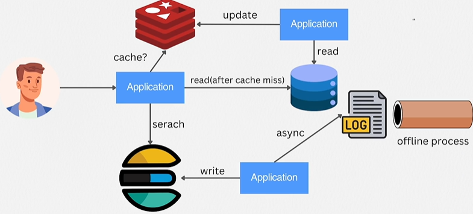
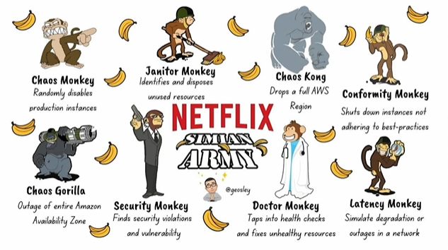

# Reliable, Scalable & Maintainable Applications

> [!NOTE]
> ### 목차
> - [Data-Intensive Application](#data-intensive-application)
> - [Data system with components](#data-system-with-components)
> - [Complex issues](#complex-issues)
> - [Reliability (신뢰성)](#reliability-신뢰성)
> - [Scalability (확장성)](#scalability-확장성)
> - [Maintainability (유지보수성)](#maintainability-유지보수성)

### 요약
- 대부분의 소프트웨어 시스템이 고민해야 하는 3가지 핵심 요소

    - Reliability (신뢰성): 문제가 생겨도 올바르게 동작하기
        - 결함(Fault)은 반드시 발생함 → 결함이 장애(Failure)로 번지지 않게 설계 (Fault-Tolerance)
        - Hardware Failure / Software Bugs / Human Mistakes

    - Scalability (확장성): 부하가 늘어도 성능 유지하기
        - 부하를 숫자로 정의(Load Parameters)하고 → 성능을 분포(백분위수)로 측정하고 → 스케일 업/아웃 전략 선택
        - Characterizing Load / Characterizing Performance / Strategies for Managing Load

    - Maintainability (유지보수성): 시간이 지나도 사람이 다루기 쉽게 만들기
        - Operability: 운영을 단순하게
        - Simplicity: 우발적 복잡성 제거 (도구: 추상화)
        - Evolvability: 변경을 쉽게

## Data-Intensive Application
- Compute-intensive → Data-intensive Application
    - 오늘날 대부분의 애플리케이션은 데이터의 저장·처리·분석이 핵심 과제가 됨
    - 따라서 "연산을 어떻게 빠르게 하나"보다 "대용량 데이터를 어떻게 저장·검색·처리하나"가 설계의 중심

- 구성 요소 (Components)
    - 데이터베이스 (Databases) – MySQL, PostgreSQL, MongoDB
        - 데이터를 저장하고, 나중에 다시 찾을 수 있게 하는 요소 (Source of Truth)
    - 캐시 (Caches) – Redis
        - 비용이 큰 연산(DB 조회 등)의 결과를 기억해뒀다가 빠르게 재사용하는 요소
        - 메모리 기반이라 디스크 기반 DB보다 훨씬 빠름
    - 검색 인덱스 (Search indexes) – Elasticsearch, Lucene, Solr
        - 키워드 검색, 필터링 등 검색에 특화된 요소
        - DB의 `LIKE '%검색어%'`는 풀스캔이라 느리지만, 검색 인덱스는 역색인(Inverted Index) 구조라 대량 텍스트에서도 빠름
    - 스트림 처리 (Stream processing) – Kafka, Redis Streams
        - 데이터(이벤트)가 발생하는 **즉시** 다른 프로세스로 메시지를 보내 처리하는 방식
        - ex. 사용자 클릭 로그가 발생할 때마다 Kafka로 전송 → 컨슈머가 실시간 집계
    - 배치 처리 (Batch processing) – Spark, Hadoop
        - 일정 기간 쌓인 대량의 데이터를 한꺼번에 처리하는 방식
        - 온라인 프로세싱: 요청 즉시 응답 (사용자가 기다림)
        - 오프라인 프로세싱: 쌓아둔 데이터(로그, 이벤트)를 정해진 주기로 한꺼번에 처리 (사용자가 기다리지 않음) → 배치 처리가 여기에 해당
        - ex. 하루치 로그를 매일 새벽 Spark로 집계해서 일간 리포트 생성
    - 각 구성 요소는 서로 다른 목적을 가지며, 하나의 도구로 모든 요구사항을 만족할 수 없기 때문에 조합해서 사용함

### Data system with components

- 읽기 경로 (Read Path)
    - 유저 요청이 오면 애플리케이션은 먼저 캐시(Redis)를 확인
        - Cache Hit: 캐시에 있으면 바로 반환 (DB까지 안 감 → 빠름)
        - Cache Miss: 캐시에 없으면 DB에서 조회 → 결과를 Redis에 저장(캐싱) → 반환
        - 이 패턴을 **Cache-Aside 패턴**이라고 함
- 검색 경로 (Search Path)
    - 키워드 검색은 DB 대신 Elasticsearch로 처리
    - 검색 인덱스는 스스로 데이터를 가져가지 않으므로, 애플리케이션이 DB에 쓸 때 **Elasticsearch에도 색인 요청을 보내야(push)** 함
        - 이때 DB와 검색 인덱스 두 곳에 쓰기가 발생 → 둘 사이의 동기화(일관성)가 새로운 고민거리가 됨
- 배치 경로 (Batch Path)
    - 애플리케이션이 남긴 로그를 모아뒀다가 오프라인으로 배치 처리 (집계, 분석 등)
- 이렇게 저장·캐시·검색·배치가 조합된 것이 데이터 중심(Data-Intensive) 애플리케이션의 전형적인 구조

### Complex issues
1. 시스템 내부에 문제가 발생하더라도 데이터를 정확하고 온전하게 유지하려면 어떻게 해야 하는가?
2. 시스템의 일부 구성 요소의 성능이 저하되더라도 사용자에게 지속적으로 높은 성능을 제공하려면 어떻게 해야 하는가?
3. 급격한 트래픽 증가에도 효율적으로 확장하려면 어떻게 해야 하는가?
4. 효율적인 API를 정의하는 기준은 무엇인가?

    ⇒ 고민해봐야할 문제임

- 대부분의 소프트웨어 시스템에서 고려해야 하는 세 가지 핵심 요소
    - Reliability (신뢰성)
        - Hardware Failure (하드웨어 장애)
        - Software Bugs (소프트웨어 버그)
        - Human Mistakes (사람의 실수)
    - Scalability (확장성)
        - Characterizing Load (부하 특성 분석)
        - Characterizing Performance (성능 특성 분석)
        - Strategies for Managing Load (부하를 관리하기 위한 전략)
    - Maintainability (유지보수성)
        - 운영성(Operability): 운영을 단순하게 만드는 것
        - 단순성(Simplicity): 복잡성을 효과적으로 다루는 것
        - 변화 용이성(Evolvability): 변경을 쉽게 만드는 것

### Reliability (신뢰성)
> The system must continue to function correctly—delivering its intended performance levels—even when facing challenges like hardware or software failures, or even human error.

시스템은 하드웨어 장애, 소프트웨어 오류, 사람의 실수와 같은 문제가 발생하더라도 **의도한 성능 수준을 유지하며 정상적으로 동작**해야 한다.

- 일반적으로 기대되는 사항
    - The application carries out the functions that the user expects.
        - 애플리케이션은 사용자가 기대하는 기능을 수행해야 한다.
    - It can gracefully handle user errors or unexpected ways the software is used.
        - 사용자의 실수나 예상하지 못한 사용 방식도 안정적으로 처리할 수 있어야 한다.
    - Its performance meets the needs of the required use case, even under the anticipated load and data volume.
        - 예상되는 부하와 데이터 양에서도 요구되는 사용 사례에 맞는 성능을 제공해야 한다.
    - The system prevents unauthorized access and abuse.
        - 시스템은 무단 접근과 악의적인 사용을 방지해야 한다.

- 결함(Fault)과 장애(Failure)의 차이
    > A fault is typically when a component of the system doesn't operate according to its specification, whereas a failure is when the entire system stops delivering the expected service to the user.
    - 결함(Fault): 시스템의 **일부 구성 요소**가 명세대로 동작하지 않는 상태
        - ex. 디스크 1개 고장, 서버 1대 다운
    - 장애(Failure): **시스템 전체**가 사용자에게 기대한 서비스를 제공하지 못하는 상태
        - ex. 서비스 접속 불가
    - 핵심: 결함은 확률적으로 반드시 발생함 → 목표는 결함을 0으로 만드는 것이 아니라, **결함이 장애로 번지지 않게 막는 것**
    - 결함을 미리 예상하고 견디도록 설계된 시스템을 장애 허용(Fault-tolerant) 또는 회복 탄력성(Resilient)을 갖춘 시스템이라고 함

- 결함에 대한 신뢰성을 어떻게 높일 수 있을까?
    - 의도적으로 결함을 일으켜서 시스템이 견디는지 지속적으로 테스트 (Chaos Engineering)
        - ex. Netflix Simian Army — 운영 환경에서 일부러 장애를 발생시키는 도구 모음

            
            - Chaos Monkey - 운영 중인 인스턴스를 무작위로 종료
            - Janitor Monkey - 사용하지 않는 리소스를 식별하고 제거
            - Chaos Kong - AWS 리전 전체를 장애 상황으로 가정
            - Conformity Monkey - 모범 사례(Best Practices)를 따르지 않는 인스턴스를 종료
            - Chaos Gorilla - Amazon Availability Zone 전체 장애를 시뮬레이션
            - Security Monkey - 보안 취약점과 보안 위반 사항을 탐지
            - Doctor Monkey - 헬스 체크를 수행하고 비정상 리소스를 복구
            - Latency Monkey - 네트워크 지연 및 장애를 시뮬레이션
        - "장애가 나도 견디는가"를 평소에 검증해두면, 실제 장애 때 놀랄 일이 없다는 발상
    - 단, 결함을 견디는 것(tolerance)보다 애초에 막는 것(prevention)이 나은 영역도 있음 (Prevention > Cure)
        - ex. 보안 사고(민감한 데이터 유출)는 한 번 발생하면 되돌릴 수 없으므로 예방이 유일한 답

- Hardware Failure (하드웨어 장애)
    - 대규모 데이터 센터에서는 하드웨어 장애가 흔하게 발생하며, 디스크 손상, RAM 오류, 네트워크 장애 등의 문제가 자주 발생함
    - 기존의 하드웨어 이중화(예: RAID 구성, 이중 전원 공급 장치)는 장애 발생률을 낮출 수 있지만, 하드웨어 문제를 완전히 없애지는 못함
    - 애플리케이션이 확장되어 더 많은 서버를 사용할수록 하드웨어 장애 발생 가능성도 증가함
        - ex. 디스크 1개의 연간 고장률이 낮아도, 디스크 10,000개를 쓰면 매일 어딘가는 고장 남
        - 특히 클라우드 환경에서는 가상 머신이 예고 없이 사용할 수 없게 될 수도 있음
    - 최근에는 서버 전체가 장애를 일으켜도 서비스를 계속 운영할 수 있도록 하는 소프트웨어 기반 장애 허용(Fault Tolerance) 기법으로 전환되고 있음
        - 하드웨어 이중화 = 부품 단위 대비 / 소프트웨어 장애 허용 = 서버·노드 단위 대비
        - 이를 통해 무중단 유지보수(롤링 업데이트 등)가 가능하며 시스템의 회복 탄력성도 향상됨

- Software Bugs (소프트웨어 버그)
    - 하드웨어 장애는 일반적으로 랜덤이며 서로 독립적으로 발생함
        - 다만 서버 랙의 온도처럼 공통 원인으로 인해 연관되어 발생할 수도 있음
    - 반면 소프트웨어 버그는 **같은 코드가 모든 노드에서 돌기 때문에**, 조건이 맞으면 여러 노드에서 동시에 터짐 → 하드웨어 장애보다 더 심각한 대규모 장애로 이어질 수 있음
    - 대표적인 유형    
        - 특정 입력으로 인한 프로그램 충돌
        - 자원 고갈(Resource Exhaustion): 메모리 누수 등으로 시스템 자원을 계속 소비하는 비정상 프로세스(Runaway Process)
            - ex. JVM 애플리케이션에서 메모리 누수가 있으면 heap 사용량이 계속 증가하다가 할당된 한도를 넘는 순간 OutOfMemoryError로 죽음
        - 의존하는 외부 서비스의 장애
        - 작은 장애가 연쇄적으로 확산되는 장애(Cascading Failure)
    - 이러한 시스템적인 결함은 드문 조건에서 갑자기 드러나는 경우가 많음
    - 빠른 해결책은 없지만, 철저한 테스트, 프로세스 격리(Process Isolation), 장애 발생 시 재시작(Crash-Restart), 지속적인 모니터링을 통해 영향을 줄일 수 있음

- Human Mistakes (사람의 실수)
    - 특히 설정(Configuration) 오류는 시스템 장애의 주요 원인 중 하나
        - 하드웨어 장애보다 더 큰 비중을 차지함
    - 사람의 실수에도 신뢰성 있는 시스템을 만들기 위한 전략
        - 직관적인 추상화, API, 인터페이스를 설계하여 실수가 발생할 가능성을 줄인다. 단, 지나치게 제한적인 설계는 피해야 함
        - 실제 데이터를 안전하게 실험할 수 있도록 샌드박스 환경(실제 운영 시스템과 격리된 실험 공간)을 제공하여 위험한 작업과 핵심 시스템을 분리
        - 자동화 테스트를 포함한 모든 수준의 철저한 테스트를 수행함으로써 드물게 발생하는 예외 상황(Corner Case)까지 발견
        - 빠른 롤백(Rollback), 점진적인 코드 배포(Gradual Rollout), 필요 시 데이터를 다시 계산할 수 있는 도구를 통해 사람의 실수에서 신속하게 복구할 수 있도록 함
        - 성능을 추적하고 이상 징후를 조기에 발견하며 문제 원인을 분석할 수 있도록 상세한 모니터링과 텔레메트리(Telemetry)를 구축
        - 좋은 운영 관리 방식과 적절한 교육 역시 사람의 실수로 인한 장애를 최소화하는 데 중요한 요소임

### Scalability (확장성)

> As the system expands—in data volume, traffic load, or complexity—there should be practical ways to manage this growth. How to cope with system growth and how to add computing resources to handle the extra load effectively.

데이터의 양, 트래픽 부하, 시스템의 복잡성이 증가하더라도 이를 효과적으로 관리할 수 있는 현실적인 방법이 필요하다. **시스템의 성장에 어떻게 대응할 것인지**, 그리고 증가하는 부하를 효과적으로 처리하기 위해 컴퓨팅 자원을 어떻게 추가할 것인지를 고민해야 한다.

- Characterizing Load (부하 특성 분석)
    - "부하가 두 배로 늘면?"을 논의하려면 먼저 **지금 부하가 무엇인지** 숫자로 정의할 수 있어야 함
    - 부하는 핵심 지표(Key Metrics) 또는 부하 파라미터(Load Parameters)로 측정하며, 무엇이 부하 파라미터인지는 시스템 아키텍처에 따라 다름
        - ex. 초당 요청 수(RPS), 읽기/쓰기 비율, 동시 활성 사용자 수, 캐시 적중률(Cache Hit Rate)
        - 같은 "SNS 서비스"라도 읽기가 병목인 시스템과 쓰기가 병목인 시스템은 부하 정의가 다름
    - 평균 부하가 중요한 시스템인지, 극단적인 순간(피크)이 중요한 시스템인지도 구분해야 함
        - ex. 커머스라면 평시 평균보다 이벤트 오픈 직후 스파이크가 설계 기준이 됨

- Characterizing Performance (성능 특성 분석)
    - 부하 증가가 시스템에 미치는 영향을 보는 두 가지 질문
        - 자원을 고정하고 부하를 늘리면 → 성능이 얼마나 나빠지는가?
        - 성능을 유지하려면 → 자원을 얼마나 추가해야 하는가?
    - 시스템 유형에 따라 중요한 성능 지표가 다름
        - 배치 처리 시스템: **처리량(Throughput)** — 초당 처리 레코드 수, 전체 작업 소요 시간
        - 온라인 시스템: **응답 시간(Response Time)** — 요청부터 응답까지 걸리는 시간
    - 응답 시간은 요청마다 달라지므로, 하나의 고정된 값이 아니라 **값들의 분포(Distribution)**로 이해해야 함
        - 그래서 "평균 응답 시간"보다 백분위수(Percentile)를 씀
    - Latency vs. Response Time
        - 응답 시간(Response Time): **클라이언트가 체감하는 전체 시간** = 실제 처리 시간 + 네트워크 왕복 + 큐 대기 시간
        - 지연 시간(Latency): 요청이 처리되기를 **기다리는** 시간 (대기 구간)
        - 즉, Response Time ⊃ Latency. 실무에서는 혼용되는 경우가 많지만 DDIA는 이렇게 구분함
    - 백분위수 (p50, p95, p99, p999)
        - pN = 전체 요청을 응답 시간순으로 정렬했을 때, **N%의 요청이 이 값 이하**로 처리됨
        - p50 (중앙값): 절반의 요청이 이 시간 안에 처리됨 → "전형적인" 사용자 경험
        - p95: 95%는 이 값 이하 / 가장 느린 5%는 이 값보다 느림
        - p99: 99%는 이 값 이하 / 가장 느린 1%가 겪는 경험
        - p999: 가장 느린 0.1%가 겪는 경험
        - ex. p99 = 1.5s → "100명 중 99명은 1.5초 안에 응답받고, 1명은 그보다 오래 기다린다"
    - 높은 백분위수 = 테일 레이턴시(Tail Latency)가 중요한 이유
        - 소수라도 그 사용자에겐 서비스가 "느린 서비스"임
        - 특히 데이터가 많은 사용자(= 대형 고객, 가장 중요한 고객)일수록 요청이 무거워서 테일에 걸릴 확률이 높음
        - 한 화면을 그리는 데 내부적으로 여러 번의 호출이 필요하면, 그중 하나만 느려도 전체가 느려짐 → 호출 수가 많을수록 테일 레이턴시에 걸릴 확률이 증폭됨

        > Amazon found that a 100 ms increase in response time reduces sales by 1%, while a 1-second delay lowers customer satisfaction by 16%.

        - Amazon의 연구에 따르면 응답 시간이 100ms 증가하면 매출이 1% 감소하고, 1초 지연되면 고객 만족도가 16% 감소한다.
    - 다만 p99.99처럼 극단적인 백분위수까지 최적화하는 것은 비용 대비 효과가 급감하고, 통제 불가능한 외부 요인(네트워크 등)의 영향이 커서 비효율적일 수 있음

    - 서비스 수준 협약(SLA)과 서비스 수준 목표(SLO)
        - SLO (Service Level Objectives): 서비스가 지키려는 **내부 목표치**
            - ex. "p99 응답 시간 300ms 이하, 월 가용성 99.9% 이상"
        - SLA (Service Level Agreements): SLO를 기반으로 고객과 맺는 **계약**. 못 지키면 환불 등 보상 조항이 따라옴
            - ex. AWS가 "가용성 99.99% 미달 시 크레딧 지급"을 약속하는 것
        - 관계: SLO = 목표, SLA = 그 목표를 걸고 하는 약속. 그래서 보통 SLA는 SLO보다 느슨하게 잡음
        - 두 지표 모두 평균이 아닌 백분위수 기반으로 정의하는 것이 일반적

    - 큐 대기(Queueing Delay)와 HOL 블로킹
        - 높은 백분위수에서 발생하는 큐 대기 시간(Queueing Delay)은 응답 시간에 큰 영향을 줌
        - 서버가 동시에 처리할 수 있는 요청 수는 제한되어 있으므로, 느린 요청 몇 개가 앞에 있으면 뒤의 빠른 요청까지 줄에서 기다리게 됨 → Head-of-Line Blocking
        - 이 대기 시간은 서버 내부가 아니라 클라이언트 쪽에서만 보이므로, **응답 시간은 반드시 클라이언트 관점에서 측정**해야 함
    - 부하 테스트 시 주의점
        - 부하 테스트 시스템은 이전 요청의 응답을 기다리지 않고 독립적으로 요청을 생성해야 함
        - 테스트 클라이언트가 "이전 요청의 응답을 받고 나서 다음 요청을 보내는" 방식이면, 서버가 느려질수록 요청도 천천히 들어가서 큐가 쌓이지 않음 → 실제보다 좋은 결과가 나오는 왜곡 발생
        - 따라서 응답과 무관하게 정해진 속도로 요청을 계속 보내야 (ex. 한꺼번에 트래픽 발생) 실제 부하 상황이 재현됨

- Strategies for Managing Load (부하 관리 전략)
    - 확장성이란 부하가 증가하더라도 성능을 유지하는 것이며, 부하가 한 자릿수 배로 커질 때마다 아키텍처를 다시 검토하게 되는 경우가 많음
    - 확장 방법
        - 스케일 업(Scaling Up, 수직 확장): 더 높은 성능의 서버로 교체 — more powerful machines
        - 스케일 아웃(Scaling Out, 수평 확장): 여러 대의 서버에 부하를 분산 — distributing load across multiple machines
        - 실제로는 두 방식을 함께 사용하는 경우가 많음 (적당히 좋은 서버 여러 대)
    - 탄력적 시스템(Elastic System)은 부하에 따라 자원을 자동으로 조절함
        - ex. AWS Auto Scaling: 부하가 늘면 같은 이미지(AMI)로 인스턴스를 자동 증설, 줄면 자동 축소
        - 반면 수동 확장 시스템은 구조는 단순하지만 사람이 직접 자원을 조정해야 함
    - Stateless vs. Stateful
        - Stateless: 서버가 요청 처리에 필요한 상태(세션, 데이터)를 **자기 안에 저장하지 않음** → 어떤 서버가 받아도 결과가 같음
            - ex. 세션을 EC2 로컬 메모리가 아니라 Redis에 두면, 요청이 어느 EC2로 가든 상관없음 → 서버를 그냥 늘리면 됨 (확장 쉬움)
        - Stateful: 서버(노드)가 데이터를 직접 들고 있음 → 분산하려면 "어떤 데이터가 어느 노드에 있는가"를 관리해야 해서 복잡성이 급증
            - ex. 데이터베이스. 그래서 DB는 **분산이 반드시 필요해지는 시점까지 단일 노드(스케일 업)로 버티는 것**이 일반적인 권장 사항
        - 정리: 애플리케이션 서버는 Stateless로 만들어 스케일 아웃, 상태는 DB·캐시로 모아서 관리

    - > There's no one-size-fits-all scalable architecture
        - *"모든 상황에 적합한 단일 확장 아키텍처는 존재하지 않는다."*
        - 읽기/쓰기 비율, 데이터 크기, 접근 패턴 등 애플리케이션의 특성에 따라 적절한 구조가 달라짐
    - 좋은 확장 아키텍처는 부하 특성에 대한 올바른 가정을 바탕으로 설계되어야 함
        - 다만 **초기 단계에서는 확장성보다 빠른 개발과 반복(Iteration)이 더 중요**할 수 있음
        - 오지 않을 미래 부하를 위해 미리 분산 시스템을 만드는 것은 낭비 + 복잡성만 증가
    - 확장 가능한 시스템은 일반적으로 범용적인 구성 요소(Building Blocks)를 잘 알려진 설계 패턴에 맞게 조합하여 구축함

### Maintainability (유지보수성)

> As time goes on, many different people—including engineers and operations staff—will collaborate on the system to maintain its current functionality and adapt it to new use cases, and they should all be able to work on it effectively.

시간이 지날수록 개발자와 운영자를 포함한 다양한 사람들이 시스템을 함께 유지보수하고 새로운 요구사항에 맞게 발전시킨다. 따라서 누구나 효율적으로 시스템을 이해하고 작업할 수 있어야 한다.

- "왜 중요한가"
    - 소프트웨어 비용의 대부분은 최초 개발이 아니라 **유지보수 단계**(버그 수정, 운영, 장애 대응, 신규 요구사항 반영)에서 발생함

- 운영성(Operability)
    - 운영팀이 시스템을 **쉽게 관리하고 유지보수**할 수 있도록 설계하여, 서비스가 중단 없이 안정적으로 운영되도록 해야 함
    - "좋은 운영은 나쁜 소프트웨어의 한계를 어느 정도 커버할 수 있지만, 좋은 소프트웨어도 나쁜 운영 위에서는 안정적으로 돌 수 없다"
    - 운영팀의 주요 역할 (Key Responsibilities of Ops Teams)
        - 시스템 모니터링 및 장애 복구
        - 문제 원인 진단 및 분석
        - 유지보수 및 업데이트
        - 시스템 간 연관성 파악 (Inter-System Awareness)
        - 선제적인 문제 해결
        - 배포 및 설정 관리
        - 보안 유지 관리
        - 운영 프로세스 정의
        - 지식 및 운영 노하우의 보존

    - 데이터 시스템의 운영성 향상 (Enhancing Operability in Data Systems)
        - 가시성 및 모니터링: 시스템 내부 동작을 밖에서 관찰할 수 있게 (메트릭, 로그)
        - 자동화 지원: 표준 도구와 연동 가능한 인터페이스 제공
        - 특정 머신에 의존하지 않는 구조: 어떤 노드든 내리고 교체할 수 있어야 무중단 유지보수 가능
        - 충분하고 체계적인 문서화
        - 유연한 설정(Configuration): 합리적인 기본값 + 필요 시 재정의 가능
        - 자가 복구(Self-Healing) 기능: 장애 시 자동 재시작 등
        - 예측 가능한 동작: "가끔 이상하게 동작하는" 시스템이 운영자를 가장 괴롭힘

- 단순성(Simplicity)
    - 새로운 개발자도 쉽게 이해할 수 있도록 시스템 내부의 **불필요한 복잡성을 제거**해야 함
        - 이는 사용자 인터페이스(UI)가 아니라 시스템 내부 구조를 단순하게 만드는 것을 의미

    - 필수 복잡성 vs. 우발적 복잡성
        - 필수 복잡성(Essential Complexity): 해결하려는 문제 자체가 가진 복잡성 → 제거 불가
        - 우발적 복잡성(Accidental Complexity): 문제가 아니라 **구현 방식에서 생겨난** 복잡성 (얽힌 의존성, 일관성 없는 네이밍, 임시방편 해킹 등) → 제거 대상

    - 규모가 커지는 소프트웨어 프로젝트의 복잡성
        - 프로젝트 규모가 커질수록 시스템은 더욱 복잡해지고 이해하기 어려워짐
        - 복잡성이 증가하면 개발 속도가 느려지고 유지보수 비용도 증가함
        - 이처럼 구조 없이 뒤엉킨 프로젝트를 'Big Ball of Mud(커다란 진흙 덩어리)'라고 부름
    - 복잡성이 유지보수에 미치는 영향
        - 유지보수가 어려워지면서 예산과 일정이 초과될 가능성이 커짐
        - 변경 작업을 할 때 새로운 버그가 발생할 위험이 높아짐
        - 숨겨진 가정(Hidden Assumptions)과 의도하지 않은 상호작용(Unintended Interactions)을 놓치기 쉬움

    - 복잡성을 줄이는 최고의 도구: 추상화(Abstraction)
        - 단순하고 이해하기 쉬운 인터페이스 뒤에 구현 세부 사항을 숨기는 것
        - ex. `SQL`: "어떻게 디스크에서 읽을지"를 몰라도 "무엇을 원하는지"만 선언하면 됨 — 내부의 인덱스 탐색, 동시성 제어가 전부 추상화 뒤에 숨어 있음
        - ex. `프로그래밍 언어`: CPU 레지스터와 기계어를 숨긴 추상화
        - 여러 애플리케이션에서 재사용 가능 + 추상화 계층이 개선되면 이를 사용하는 모든 곳이 함께 좋아짐

    - 좋은 추상화를 찾는 어려움
        - 특히 분산 시스템에서는 효과적인 추상화를 찾기가 어려움

    - 재사용 가능한 컴포넌트를 목표로 하기
        - 대규모 시스템의 일부를 분리할 수 있는 좋은 추상화를 찾는다
        - 복잡성을 관리하기 위해 명확하게 정의된 재사용 가능한 컴포넌트를 만든다

- 변화 용이성(Evolvability)
    - 앞으로 새로운 요구사항과 예상하지 못한 사용 사례가 등장하더라도 개발자가 **쉽게 수정하고 확장**할 수 있도록 시스템을 설계해야 함
        - 이를 확장성(Extensibility), 수정 용이성(Modifiability), 또는 유연성(Plasticity)이라고도 함

    - 시스템 요구사항은 반드시 변화한다
        - 변화를 일으키는 요인: 새로운 정보, 예상하지 못한 사용 사례, 비즈니스 우선순위 변경, 사용자 기능 요청, 플랫폼 업데이트, 법률 및 규제 변화, 시스템 성장에 따른 아키텍처 변경 등

    - 변화에 대응하기 위한 애자일 방법론
        - 애자일 개발 방식은 변화하는 요구사항에 적응할 수 있는 개발 프레임워크를 제공함
        - 테스트 주도 개발(TDD)과 리팩터링 같은 기법이 이를 지원함
        - 다만 이러한 기법은 일반적으로 개별 애플리케이션 내부의 작은 변경에 초점을 맞추므로, 여러 애플리케이션과 서비스로 구성된 대규모 데이터 시스템 수준에서도 같은 민첩성을 확보하는 것이 과제
    
    - 단순성과 추상화를 통한 변화 용이성 확보
        - 시스템을 얼마나 쉽게 수정할 수 있는지는 단순성과 추상화의 품질에 크게 좌우됨
        - 즉, 세 가지 유지보수성 요소는 독립적이지 않음: **단순한 시스템 → 이해하기 쉬움 → 바꾸기 쉬움(Evolvability) → 운영하기도 쉬움(Operability)**
        - 변화 용이성(Evolvability)은 데이터 시스템 수준에서의 민첩성을 의미하며, 시간이 지나면서 지속적으로 발전할 수 있는 시스템을 설계하는 것이 중요함
