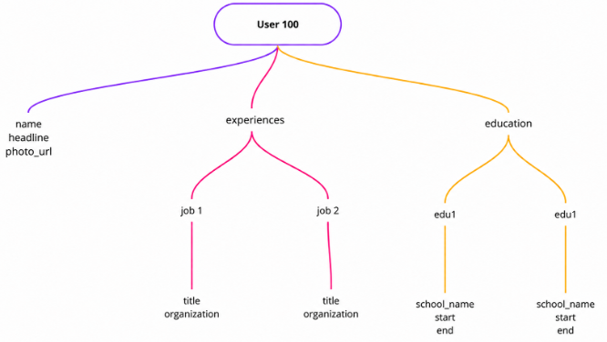
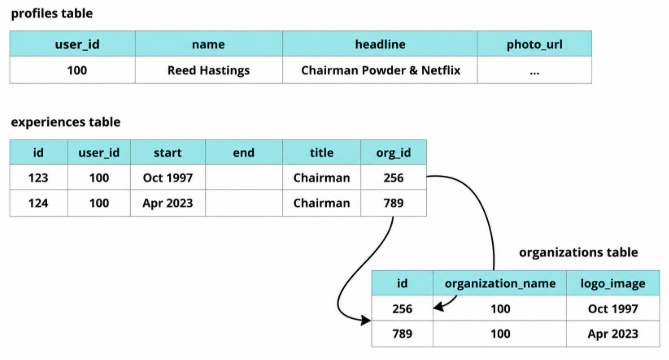
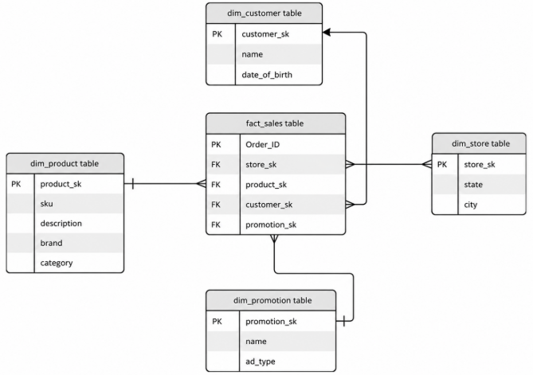
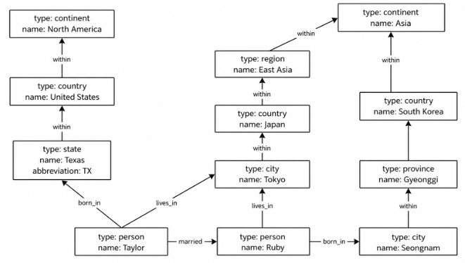
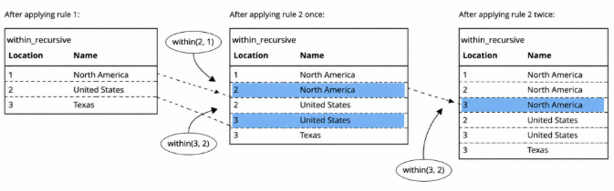

# Data Models & Query Languages

## Data Models

- 데이터 모델은 애플리케이션 구성 계층이라 할 수 있음
    - App developer: 실 세계의 데이터 모델을 구현하는 것
        - ex. 쇼핑몰 - 구매자, 판매자, 상품, 결제 등을 객체나 데이터 구조, API 등을 이용해 수행
    - Data Structure in Storage: JSON, XML, 관계형 데이터베이스의 테이블, 그래프
        - 실 세계 데이터 모델을 저장하기 위한 방법을 의미하는 데이터 모델
    - DB Software: 바이트 표현, 질의(Query), 검색(Search), 처리(Process)
        - 상위 데이터 모델을 byte 단위로 표현하고, 저장된 데이터를 쿼리, 검색, 처리 방식으로 구현함
    - 하드웨어
        - byte를 어떻게 표현할 것인지 구현?

- 추상화 (Abstraction)
    - 각 층의 데이터 모델은 내부의 복잡한 모델을 숨겨놓은 추상화라고 할 수 있음
    - Hides complexity in each layer 각 계층의 복잡성을 숨긴다.
    - Effective collaboration 효율적인 협업을 가능하게 한다.

- 어떤 데이터 모델과 질의 언어를 사용하여 우리의 데이터를 표현하는 것이 가장 좋을까?

### Declarative Query Language 선언형 질의 언어

- SQL, Cypher, SPARQL, Datalog

- Only specify 무엇을 원하는지만 명시한다.
    - 결과로 얻을 데이터의 형태(패턴): `SELECT FROM`
    - 결과의 조건: `WHERE`
    - 데이터 변환: `ORDER BY`, `GROUP BY`, `AGG`

- 목표를 어떻게 달성할지는 명시하지 않는다. 즉, 어떤 방식으로 작업을 진행할 것인지에 대한 알고리즘은 지정하지 않음
    - 알고리즘을 직접 기술하는 명령형 프로그래밍 언어와 대비됨

- Abstraction 추상화
    - 내부적으로 복잡한 사항을 추상화로 숨기고, 쿼리를 수정하지 않고 DB 병렬 처리 등을 이용하여 쿼리 성능을 개선할 수 있음
        - Without breaking changes, DB can improve query performance 기존 코드를 변경하지 않아도 데이터베이스는 질의 성능을 개선할 수 있다.

### Relational Model vs Document Model

- 관계형(Relational) 모델
    - 데이터를 관계(Relation) 형태로 구성함: SQL - table을 의미
    - 관계(Relation)는 순서가 없는 튜플(Tuple)의 집합임: SQL - 행(Row)을 의미
    - 현재까지 가장 널리 사용되는 데이터 모델임

- NoSQL과 NewSQL의 등장
    - 관계형 모델의 한계를 극복하기 위해 등장
    - 유연한 스키마, 확장성, 오픈소스 기술 채택이 주 목적
    - 최근에는 NoSQL 기술에 트랜잭션 지원을 더해 NewSQL이라는 기술도 나옴

- 문서(Document) 모델
    - 데이터를 JSON 형태로 표현함
    - MongoDB, CouchDB 
    - 대부분의 관계형 데이터베이스에서도 JSON 기능을 지원함

- 왜 Document 모델을 사용할까?
    - 객체-관계형 불일치(Object-Relational Mismatch)
        - 객체를 관계형 모델로 직관적으로 변환하기 쉽지 않기 떄문
        - 즉, 객체를 행(Row)과 열(Column)로 변환하기 어렵다 (=Impedance Mismatch)
    - 이를 대행해주는 라이브러리: `ORM`
        - 객체-관계 매핑(Object-Relational Mapping, ORM)
    - ORM의 문제점
        - 복잡함
        - 관계형 OLTP 데이터베이스에서만 잘 동작함
            - OLTP란? 트랜잭션 지원하고, 잦은 쓰기 연산을 효율적으로 지원하며, 주로 운영에 사용되는 DB 종류를 뜻함
            - ex. Postgresql, Mysql, Oracle .. 

        - 비효율적이며 N+1 Query 문제가 발생함
            - N+1 Query : 하나의 컨텐츠를 가져오기 위해 여러 쿼리를 순차적으로 실행해야하는 문제
            ex. 게시판 글 목록을 가져올 때, 각 글의 작성자 이름을 보여줘야 한다면 글 목록은 작성자 ID를 가지고 있음. 그럼 작성자 이름을 ID로부터 가져오기 위해 ID별로 쿼리를 실행해야하는 경우가 생김
        - 객체 모델 정의가 변경될 때 스키마 마이그레이션 오버헤드가 발생함
    - ORM의 장점
        - Productivity 생산성
        - Caching 캐싱
        - Helpful for schema migration and operations 스키마 마이그레이션과 운영에 도움이 된다.(운영 쉽게하는 툴 제공?)

- One-To-Many (1:N) document data model

    ```scala
    case class Experience(
        id: Long,
        title: String,
        organization: String,
        startAt: LocalDate,
        endAt: LocalDate
    )

    case class Education(
        id: Long,
        schoolName: String,
        major: String,
        startAt: LocalDate,
        endAt: LocalDate
    )

    case class Profile(
        id: Long,
        name: String,
        experience: List[Experience],
        education: List[Education]
    )
    ```
    - Experience는 Experience 클래스의 리스트로 표현됨 
        - 1명의 프로필에 여러 경력과 학력이 존재할 수 있기 때문에 리스트로 표현

    - 관계형 모델 테이블로 저장하면 클래스 별로 테이블 만들어지고, Experience, Education은 id라는 FK로 묶임

    - 만약 이를 JSON Document로 표현한다면?

        ```JSON
        {
        "user_id": 100,
        "name": "Reed Hastings",
        "headline": "Chairman Powder & Netflix",
        "photo_url": "/p/0/1/2/3/3082e.jpg",
        "experience": [
            {"title": "Chairman", "organization": "Powder", "startAt": "Apr 2023"},
            {"title": "Chairman", "organization": "Netflix", "startAt": "Oct 1997"}
        ],
        "education": [
            {
            "schoolName": "Stanford University",
            "degree": "MSAI",
            "major": "Computer Science",
            "startAt": "1986",
            "endAt": "1988"
            },
            {
            "schoolName": "Bowdoin College",
            "degree": "BA",
            "major": "Math",
            "startAt": "1979",
            "endAt": "1983"
            }
        ]
        }
        ```

- JSON 문서의 특징

    
    - 데이터가 모여있기 때문에(Data Locality) 조인이 필요 없어 빠르고 단순한 질의가 가능함
    - 그림과 같이 계층을 가진 트리 구조로 표현 가능
    - 부모노드 아래 자식 노드 개수가 그리 크지 않은 1:N(One-to-Few) 관계에 적합함
        - One-to-Many보다 One-to-Few에 적합
        - ex. 유명인이 작성한 게시물에 댓글이 수천수만개가 달리면, 없던 문제도 생길 수 있음

### Normalization, Denormalization, Joins
- 정규화 (Normalization)
    - 문자열(Text) 대신 ID를 사용
        - 일관된 표기와 철자를 유지할 수 있음
        - 동일한 문자열로 인한 모호성을 방지할 수 있음
        - 수정 및 갱신이 쉬움
        - 다국어(Localization)를 지원하기 쉬움
        - 검색 성능이 향상됨

    - 정규화에 대한 고민
        - 정규화: 사람이 이해하기에는 덜 직관적이다. (사람이 이해하기 힘든 방향으로 데이터를 조직하는 것)
        - 비정규화: 사람이 이해하기에는 더 직관적이다. (사람이 더 이해하기 쉽게 데이터를 조직하는 것)

- 정규화된 데이터는 관계형 모델에서 Join을 통한 추가적인 조회(Lookup)가 필요함

    ```sql
    SELECT profiles.*, experiences.organization
    FROM profiles
    JOIN experiences ON profiles.id = experiences.user_id
    WHERE profiles.id = 100
    ```
    - id가 100인 사람이 다녔던 회사 목록을 가져오려면
    - `user_id`로 조인 필요

- 비정규화된 문서 모델에서는 조인은 필요 없지만 별도의 조회(Query)를 수행해야함

    ```js
    db.profiles.aggregate([
        { $match: { _id: 100 }},
        { $lookup:
            {
                from: "experiences",
                localField: "user_id",
                foreignField: "_id",
                as: "organization"
            }
        }
    ])
    ```
    - id가 100을 가진 문서를 매치 수행한 뒤, lookup 쿼리를 통해 ..

- 정규화의 트레이드오프(Trade-off)
    - ex. 학교나 회사의 로고를 추가하려면 어떻게 해야 하는가?
    - 해결 방법
        - 비정규화된 표현: 모든 레코드를 업데이트해야 함
        - 정규화된 표현: 해당 조직 엔터티만 업데이트
    - 정규화된 데이터
        - 쓰기는 더 빠르고, 조회는 더 느리다.
        - OLTP에 더 적합하며, 읽기와 업데이트 모두 우수한 성능을 보임
    - 비정규화된 데이터
        - 읽기는 더 빠르지만, 쓰기 비용은 더 크다.
        - 데이터 일관성 문제가 발생할 수 있음
        - 대규모 OLAP에 더 적합함

- 다대일(Many-to-One), 다대다(Many-to-Many) Relationships
    - One-to-Many: person <-> experience
        - 한 사람은 여러 경력을 가질 수 있음
    - Many-to-One: person <-> region_id
        - 여러 사람은 한 지역에 속함
    - Many-to-Many: person <-> organization
        - 여러 사람은 여러 조직에 속할 수 있음
        - 관계형 모델에서는 연결 테이블(Associative Table) 또는 조인 테이블(Join Table)로 구현됨

            
            - 두 테이블의 FK를 가진 연관 테이블을 만든 뒤, 연결하는 방식? 
            - 한단계 거쳐서 user_id로 lookup한 다음, org_id로 lookup

        - 그러나, 문서 모델은 하나로 합쳐져 있으므로 join이 필요없음

            ```json
            {
            "user_id": 100,
            "name": "Reed Hastings",
            "headline": "Chairman Powder & Netflix",
            "photo_url": "/p/0/1/2/3/3082e.jpg",
            "experience": [
                {"title": "Chairman", "organization": "Powder", "startAt": "Apr 2023"},
                {"title": "Chairman", "organization": "Netflix", "startAt": "Oct 1997"}
            ],
            "education": [
                {
                "schoolName": "Stanford University",
                "degree": "MSAI",
                "major": "Computer Science",
                "startAt": "1986",
                "endAt": "1988"
                },
                {
                "schoolName": "Bowdoin College",
                "degree": "BA",
                "major": "Math",
                "startAt": "1979",
                "endAt": "1983"
                }
            ]
            }
            ```

- 다대다(Many-to-Many) 관계를 조회하는 방법
    - 양방향 조회가 필요
    - 비정규화 방식
        - 양쪽에 ID 참조를 저장
        - 단, 데이터 불일치 문제가 발생할 수 있음
    - 정규화 방식
        - 보조 인덱스(Secondary Index)를 사용
        - 관계형 스키마: user_id, org_id에 인덱스를 생성
        - 문서 모델: positions 배열 내부 객체의 org_id 필드에 인덱스를 생성

### 데이터 분석을 위한 스키마 - Stars, Snowflakes
- 데이터 웨어하우스에서 주로 쓰이는 데이터 모델
    - Star schema, Snowflake schema, Dimensional modeling (차원 모델링), one big table (OBT)
    - Star schema는 event가 Fact table에 저장됨
        - 이벤트는 주로 숫자로 표현되는 속성(attributes)과 차원(dimensions)을 포함함
        - 차원은 차원 테이블(dimension tables)이라는 테이블에 별도로 저장되면서 참조 FK만을 가지고 있음
    - 각 차원은 누가, 무엇을, 어디서, 언제, 어떻게, 왜를 나타낸다.

- Star schema

    
    - Order_ID가 PK
    - store, product, customer, promotion이 dimensions으로 구성되어 있음
    - 가운데 Fact Table이 있고, 주변에 별 모양으로 차원이 구성되어 있어서 Star schema라고 함
    - dimensions table과 Fact table은 FK로 연결되어 있음

- Snowflake 
    - Star schema의 확장 느낌
    - 차원을 하위 차원으로 분리함 (차원이 좀 더 세분화 되어있음)
    - 스타 스키마보다 더 정규화되어 있음

- Star schma와 Snowflake
    - 주로 다대일 관계로 구성됨
    - 다대다 관계는 단순화를 위해 비정규화하는 것이 보편적

- One big table
    - 모든 관계를 비정규화한 것
    - 더 많은 저장 공간을 사용하지만 조회(Query)는 더 빠름

- 분석 환경에서 OLAP는 OLTP와 다르다.
    - 과거 데이터이며, 일반적으로 변경되지 않는다.
    - 일관성과 쓰기 오버헤드는 상대적으로 중요도가 낮다.

### 문서(Document) 모델을 언제 사용할 것인가?
- 문서와 유사한 구조
    - 일대다 관계의 트리 구조이며, 전체 트리를 한 번에 불러오는 경우 문서 모델이 더 적합함
    - 관계형 모델의 테이블 구조보다 더 적합할 수 있다.

- 순서를 자연스럽게 지원함(정렬)

- 문서 내부에 중첩된 항목을 직접 참조하기 어려움
    - 위치로만 접근함 (Position only)

- 스키마가 유연함
    - Schema-on-read vs Schema-on-write
    - 문서 모델은 읽을 때 관계가 결정되고, 관계형 모델은 쓸 때 관계가 결정됨
        - 그래서 스키마가 일치하지 않으면 관계형 모델에서는 에러가 남
    - 문서 모델은 서로 상이한 데이터들을 하나의 모델에 넣고 싶을 때 좋음

- 업데이트가 쉬움
    - 새로운 파생 컬럼을 추가하려는 경우 
        - 문서 모델

            ```js
            if (user && user.name && !user.first_name) {
                // Documents written before Dec 8, 2023 don't have first_name
                user.first_name = user.name.split(" ")[0];
            }
            ```

        - 관계형 모델 - 마이그레이션 오버헤드

            ```sql
            ALTER TABLE users ADD COLUMN first_name text DEFAULT NULL;
            UPDATE users SET first_name = split_part(name, ' ', 1);    -- PostgreSQL
            UPDATE users SET first_name = substring_index(name, ' ', 1);    -- MySQL
            ```

- 그 밖의 차이점
    - 읽기와 쓰기에서의 데이터 지역성
        - 문서는 하나의 연속된 문자열 형태로 저장되므로, 문서 전체를 읽는 데 효율적임
        - 그러나, 업데이트 시 모든 참조를 다 수정?해야해서 오버헤드가 발생함
        - 최근에는 관계형 DB와 NoSQL DB들이 부분적으로 문서 모델을 지원하기도 하므로, 섞어서 사용 가능

    - Query language
        - 관계형 모델은 SQL 사용
        - 문서 모델은 고유(Proprietary)의 쿼리 언어를 구현해서 사용함
            ```sql
            SELECT date_trunc('month', observation_timestamp) AS observation_month,
                sum(num_animals) AS total_animals
            FROM observations
            WHERE family = 'Sharks'
            GROUP BY observation_month;
            ```
            ```js
            db.observations.aggregate([
                { $match: { family: "Sharks" } },
                { $group: {
                    _id: {
                        year: { $year: "$observationTimestamp" },
                        month: { $month: "$observationTimestamp" }
                    },
                    totalAnimals: { $sum: "$numAnimals" }
                } }
            ]);
            ```

### Graph-Like Data Model
- 만약 다대다 관계가 매우 빈번할 경우, 그래프형 데이터 모델을 사용하는 것이 더 자연스러움

- 구성 요소
    - 정점(Vertex)과 간선(Edge)
        - 인접 리스트와 인접 행렬로 구현 가능

- 그래프에서 정점은 어떤 형태의 데이터든 될 수 있기 때문에 서로 상이한 데이터를 다룰 수 있음 

- 종류
    - Property graph model
        - Neo4j, Memgraph, KùzuDB
    - Triple-store model
        - Datomic, AllegroGraph, Blazegraph

- Different query language
    - Cypher, SPARQL, Datalog, GraphQL

- 그래프 모델 예시

    
    - Taylor는 TX(텍사스)에서 태어나, Tokyo(도쿄)에서 살고있고 Ruby와 결혼했다

- Property Graph
    - 정점 (Vertex)
        - ID
        - 객체(object)를 설명하는 레이블
        - 나가는 간선 (Outgoing edges)
        - 들어오는 간선 (Incoming edges)
        - 속성 (key-value 쌍)
    - 간선 (Edge)
        - ID
        - 관계(relationship)를 설명하는 레이블
        - 간선이 시작되는 정점(꼬리 정점, Tail Vertex)
        - 간선이 끝나는 정점(머리 정점, Head Vertex)
        - 속성(키-값 쌍)

- Property Graph를 관계형 스키마로 표현

    ```sql
    CREATE TABLE vertices (
        vertex_id   integer PRIMARY KEY,
        label       text,
        properties  jsonb
    );

    CREATE TABLE edges (
        edge_id     integer PRIMARY KEY,
        tail_vertex integer REFERENCES vertices (vertex_id),
        head_vertex integer REFERENCES vertices (vertex_id),
        label       text,
        properties  jsonb
    );

    CREATE INDEX edges_tails ON edges (tail_vertex);
    CREATE INDEX edges_heads ON edges (head_vertex);
    ```

- Property Graph에서 고려할 사항
    - 어떤 정점이든 간선을 통해 연결할 수 있으며, 타입 제약이 없다.
    - 꼬리 정점과 머리 정점에 인덱스를 두어 양방향 탐색이 가능하다.
    - 레이블과 속성을 사용해 하나의 그래프에 다양한 정보를 저장할 수 있다.
    - 간선 테이블은 다대일 또는 다대다 관계의 조인 테이블과 유사하다.
    - 데이터 모델링의 유연성이 매우 높다.
        - 서로 다른 데이터 세분성(granularity)이나 컬럼 레이블을 사용할 수 있다.
    - 복잡한 관계를 조회하는 쿼리를 작성하기 쉽다.
    - 변화 용이성에 적합하다.

- Cypher Query Language
    - Neo4j 그래프 데이터베이스를 위해 만들어졌으며, 이후 openCypher 표준으로 발전함
    
        ```cypher
        CREATE
            (namerica :Location {name:'North America',  type:'continent'}),
            (usa      :Location {name:'United States', type:'country'  }),
            (texas    :Location {name:'Texas',         type:'state'    }),
            (taylor   :Person   {name:'Taylor'                         }),
            (texas) -[:WITHIN ]-> (usa) -[:WITHIN]-> (namerica),
            (taylor) -[:BORN_IN]-> (texas)
        ```
    - ex. 대한민국에서 미국으로 이주한 모든 사람의 이름을 찾는다.

        ```cypher
        MATCH
            (person) -[:BORN_IN]-> () -[:WITHIN*0..]-> (:Location {name:'South Korea'}),
            (person) -[:LIVES_IN]-> () -[:WITHIN*0..]-> (:Location {name:'United States'})
        RETURN person.name
        ```
        - 방법 1 : 데이터베이스의 모든 사람을 스캔한 뒤 출생지와 거주지를 기준으로 필터링
        - 방법 2 :
            - 두 개의 위치 정점에서 시작해 역방향으로 탐색한다
            - 이름 속성 인덱스를 사용하여 미국과 대한민국을 찾는다
            - WITHIN 간선을 따라 모든 위치를 탐색한다 (간헐적 탐색 가능)
            - BORN_IN 또는 LIVE_IN 간선을 따라 모든 사람을 탐색한다

- SQL에서의 그래프 쿼리
    - 관계형 데이터베이스에서 간선을 탐색하는 것은 조인에 해당함
    - 몇 번의 탐색 또는 조인을 수행해야 하는지 미리 알 수 없음
        - `:WITHIN*0..` -> `*`을 이용해 리컬젼 표현??
    - SQL 재귀 공통 테이블(CTE; common table expressions) 표현식(`WITH RECURSIVE`)
        - 복잡한 쿼리를 단순화하기 위해 중간 결과값을 임시 테이블에 저장하는 방식?

        ```sql
        WITH RECURSIVE

        -- in_usa is the set of vertex IDs of all locations within the United States
        in_usa(vertex_id) AS (
            SELECT vertex_id FROM vertices
                WHERE label = 'Location' AND properties->>'name' = 'United States'
            UNION
            SELECT edges.tail_vertex FROM edges
                JOIN in_usa ON edges.head_vertex = in_usa.vertex_id
                WHERE edges.label = 'within'
        ),

        -- in_south_korea is the set of vertex IDs of all locations within South Korea
        in_south_korea(vertex_id) AS (
            SELECT vertex_id FROM vertices
                WHERE label = 'location' AND properties->>'name' = 'South Korea'
            UNION
            SELECT edges.tail_vertex FROM edges
                JOIN in_europe ON edges.head_vertex = in_south_korea.vertex_id
                WHERE edges.label = 'within'
        ),
        ```
        - 레이블이 location이고, 이름이 United States인 vertex들의 vertex_id를 찾은 다음, 이것과 union을 하는데,
        - in_usa에 리컬시브하게 따라가면서? 엣지 테이블과 조인 
        - head_vertex가 in_usa에 속해져있는 엣지들..? 그렇게 찾아나감
        - 한국도 비슷하게..
        - 이렇게 in_usa와 in_korea 정의한 다음

        ```sql
        -- born_in_south_korea is the set of vertex IDs of all people born in South Korea
        born_in_south_korea(vertex_id) AS (
            SELECT edges.tail_vertex FROM edges
                JOIN in_south_korea ON edges.head_vertex = in_south_korea.vertex_id
                WHERE edges.label = 'born_in'
        ),

        -- lives_in_united_states is the set of vertex IDs of all people living in United States
        lives_in_united_states(vertex_id) AS (
            SELECT edges.tail_vertex FROM edges
                JOIN in_usa ON edges.head_vertex = in_usa.vertex_id
                WHERE edges.label = 'lives_in'
        )

        SELECT vertices.properties->>'name'
        FROM vertices
        -- join to find those people who were both born in South Korea *and* live in United States
        JOIN born_in_south_korea
            ON vertices.vertex_id = born_in_south_korea.vertex_id
        JOIN lives_in_united_states
            ON vertices.vertex_id = lives_in_united_states.vertex_id;
        ```
        - born_in_south_korea와 lives_in_united_states 임시테이블 만들고??
        - 쿼리 설명..
        - 기존 vertices, born_in_south_korea, lives_in_united_states 조인하면서 이름, 속성 뽑아내면 한국에서 미국으로 이민간 사람들 이름 쿼리 완성

- Triple Stores와 SPARQL
    - property graph model과 유사함
    - (주어, 서술어, 목적어)로 이루어진 튜플들의 나열
        - (subject, predicate, object)
        - (Elon, 소유한다, X)
    - 주어는 그래프의 정점
    - 목적어는 다음과 같은 형태가 될 수 있음
        - 기본 타입 값(문자열이나 숫자 등): 주어의 키-값 속성
            - ex. (Elon, birthYear, 1971)은 birthYear=1971을 의미한다.
        - 그래프의 다른 정점이 목적어가 될 수 있으며, 이때 서술어는 간선이 됨

- Notation3(N3)의 하위 집합인 Turtle
    - Triple Stores 표현 방법 중 하나

        ```turtle
        @prefix : <urn:example:>.

        _:taylor    a           :Person.
        _:taylor    :name       "Taylor".
        _:taylor    :bornIn     _:texas.

        _:texas     a           :Location.
        _:texas     :name       "Texas".
        _:texas     :type       "state".
        _:texas     :within     _:usa.

        _:usa       a           :Location.
        _:usa       :name       "United States".
        _:usa       :type       "country".
        _:usa       :within     _:namerica.

        _:namerica  a           :Location.
        _:namerica  :name       "North America".
        _:namerica  :type       "continent".
        ```

### RDF data model
- Semantic Web
    - 2000년대 초반, 사람과 기계가 모두 읽을 수 있는 표준화된 형식으로 웹 페이지를 게시하여 인터넷 전체에서 데이터를 교환하려는 개념
    - 성공적으로 정착하지는 못했지만 그 유산은 여전히 남아 있음
        - 연결 데이터 표준인 JSON-LD
        - 생의학 분야의 온톨로지(Ontologies)
        - Wikipedia와 같은 지식 그래프

- Resource Description Framework
    - 시맨틱 웹을 위해 설계된 데이터 모델
    - XML or Turtle

        ```xml
        <rdf:RDF xmlns="urn:example:"
                xmlns:rdf="http://www.w3.org/1999/02/22-rdf-syntax-ns#">

            <Location rdf:nodeID="Texas">
                <name>Texas</name>
                <type>state</type>
                <within>
                    <Location rdf:nodeID="usa">
                        <name>United States</name>
                        <type>country</type>
                        <within>
                            <Location rdf:nodeID="namerica">
                                <name>North America</name>
                                <type>continent</type>
                            </Location>
                        </within>
                    </Location>
                </within>
            </Location>

            <Person rdf:nodeID="Taylor">
                <name>Taylor</name>
                <bornIn rdf:nodeID="Texas"/>
            </Person>

        </rdf:RDF>
        ```

- RDF triple의 모든 구성 요소(주어, 술어, 목적어)는 URI로 표현할 수 있음
    - WITHIN 서술어: `http://my-company.com/namespace#within`
    - LIVES_IN 서술어: `http://my-company.com/namespace#lives_in`

- within 또는 lives_in이라는 단어에 서로 다른 의미를 가진 여러 데이터를 결합할 수 있음
    - `http://other.org/foo#within` or `http://other.org/foo#lives_in`

- `http://my-company.com/namespace`는 단지 네임스페이스일 뿐이며, 실제로 접속하거나 해석할 필요는 없음
    - 혼동을 피하기 위해 `urn:example:within`을 사용 가능

- SPARQL query language
    - SPARQL Protocol and RDF Query Language이며, '스파클'이라고 읽음
    - ex. 대한민국에서 미국으로 이주한 사람을 찾는다.

        ```sparql
        SELECT ?personName WHERE {
            ?person :name ?personName.
            ?person :bornIn / :within* / :name "South Korea".
            ?person :livesIn / :within* / :name "United States".
        }
        ```
    - Cypher와 유사함

        ```cypher
        (person) -[:BORN_IN]-> () -[:WITHIN*0..]-> (location)    # Cypher

        ?person :bornIn / :within* ?location.                     # SPARQL
        ```

- Datalog: 재귀적 관계형 질의(Recursive Relational Queries)
    - SPARQL이나 Cypher보다 오래된 언어임
    - 상대적으로 잘 알려져 있지 않으며, 주류 데이터베이스에서는 널리 지원되지 않음
    - 표현력이 매우 높고 복잡한 질의에 강력함
    - 관계형 데이터 모델을 사용하지만, 그래프에 대한 재귀 질의가 강점
    - 사실(Fact)로 구성되며, 이는 관계형 테이블의 행에 해당함
        - ex. location 테이블은 ID, 이름, 타입의 세 개 컬럼으로 구성된다. -> location(2, "United States", "country")

        ```prolog
        location(1, "North America", "continent").
        location(2, "United States", "country").
        location(3, "Texas", "state").

        within(2, 1).    /* US is in North America */
        within(3, 2).    /* Texas is in the US */

        person(100, "Taylor").
        born_in(100, 3). /* Taylor was born in Texas */
        ```

    - 가상 테이블(virtual tables)을 생성하는 규칙

        ```prolog
        within_recursive(LocID, PlaceName) :-
            location(LocID, PlaceName, _).          /* Rule 1 */

        within_recursive(LocID, PlaceName) :-
            within(LocID, ViaID),                   /* Rule 2 */
            within_recursive(ViaID, PlaceName).

        migrated(PName, BornIn, LivingIn) :-
            person(PersonID, PName),                /* Rule 3 */
            born_in(PersonID, BornID),
            within_recursive(BornID, BornIn),
            lives_in(PersonID, LivingID),
            within_recursive(LivingID, LivingIn).

        south_korea_to_us(Person) :-
            migrated(Person, "South Korea", "United States").    /* Rule 4 */
        ```
        - 설명..
    
    - ex. 텍사스가 미국과 북아메리카에 속한다는 것을 재귀적(recursively)으로 탐색하는 방법

        
        - 그림 설명 ..

### GraphQL
- frontend에서 JSON 문서를 서버로부터 가져오면서 특정 구조를 랜더링하기 위한 용도로 사용됨
- 프론트에서 주로 사용되므로, 인증되지 않은 클라이언트에서도 요청이 올 수 있음
    - 잠재적으로 일어날 수 있는 문제를 방지하기 위해 스펙?도 한정적임
- 그러나, 서버 수정사항 없이 클라이언트의 랜더링을 쉽게 바꿀 수 있다는 장점이 있음

    ```graphql
    query ChatApp {
    channels {
        name
        recentMessages(latest: 50) {
        timestamp
        content
        sender {
            fullName
            imageUrl
        }
        replyTo {
            content
            sender {
            fullName
            }
        }
        }
    }
    }
    ```
    ```json
    {
    "data": {
        "channels": [
        {
            "name": "#general",
            "recentMessages": [
            {
                "timestamp": 1693143014,
                "content": "Hey! How are y'all doing?",
                "sender": {
                "fullName": "Aaliyah",
                "imageUrl": "https://..."
                },
                "replyTo": null
            },
            {
                "timestamp": 1693143024,
                "content": "Great! And you?",
                "sender": {
                "fullName": "Caleb",
                "imageUrl": "https://..."
                },
                "replyTo": {
                "content": "Hey! How are y'all doing?",
                "sender": {
                    "fullName": "Aaliyah"
                }
                }
            },
            ...
            ]
        }
        ]
    }
    }
    ```

### 이벤트 소싱(Event Sourcing)과 CQRS
- 순차적으로 일어난 이벤트들을 append 방식으로 log 구조로 저장하는 방식?
    - event log: 상태 변화를 기록으로 남김
        - 때문에 반드시 timestamp가 있어야 함
        - 한번 발생한 이벤트는 수정되지 않아야 함(불변)
        - append only이기 때문에 쓰기에 적합

    - 구체화된 뷰(Materialized View)를 만들어서 보여주는 방식?
        - 읽기에 최적화된 구조
    
    - 이렇게 쓰기와 읽기로 나누는 방식을 CQRS라고 함

- 예제: 커퍼런스에서 예약 시스템에서 발생한 모든 이벤트들을 소싱한 다음, 두 가지의 구체화된 뷰를 보여줌
    - 집계 요약..
    - 입출금 내역 그래프 보여주는 방식으로 또 하나의 구체화된 뷰
        - 데이터 분석에 용이하다는 장점이 있지만
        - 이벤트 처리 시간에 민감하기 떄문에
            - 타임스탬프 순으로 처리해야하는 오버헤드
            - 이전 데이터를 다시 처리하는 과정에서 상태를 다른 테이블에서 가져오는 경우에는(조인) 상태 데이터가 바뀌어서 결과가 바뀐다던지 하는 문제가 생길 수 잇음
    - 하나의 이벤트 로그로부터 여러 개의 머티리얼라이즈드 뷰를 생성한다.

### Dataframes, Matrices, and Arrays
- 데이터프레임
    - 분석과 머신러닝을 위한 데이터 모델
- Python의 Pandas 라이브러리, Apache Spark 등에서 사용됨
- 관계형 테이블과 유사하지만 다양한 추가 기능을 제공함
    - 희소 배열(Sparse Arrays)
    - 벡터화 연산(Vectorized Computation)

