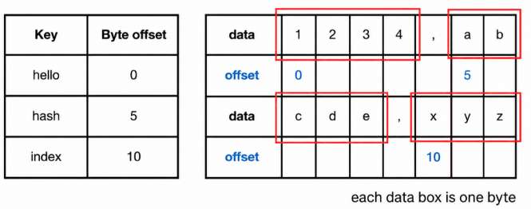
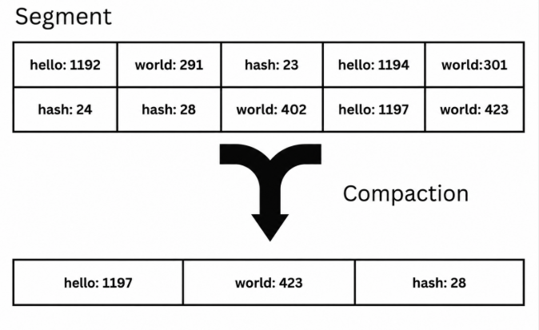
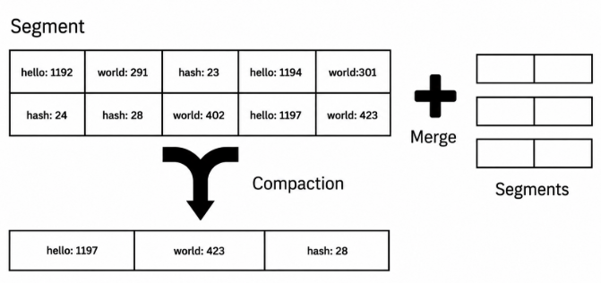
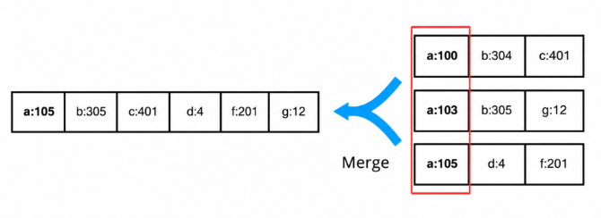
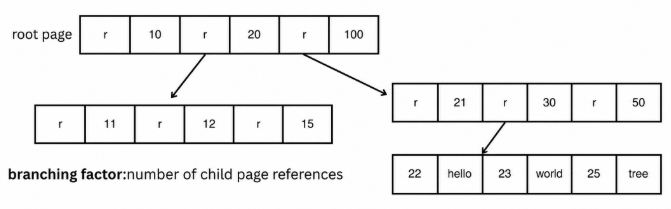
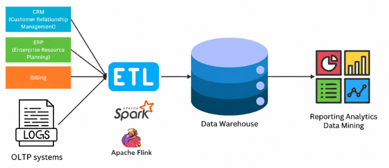
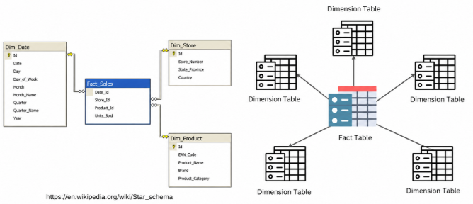
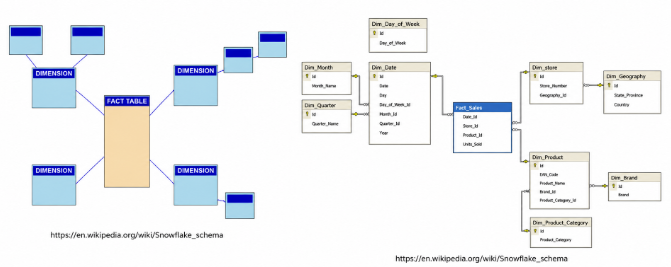
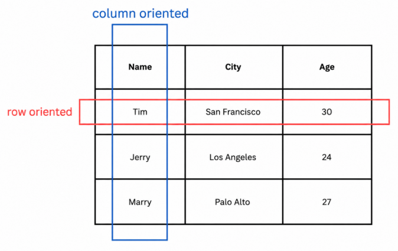
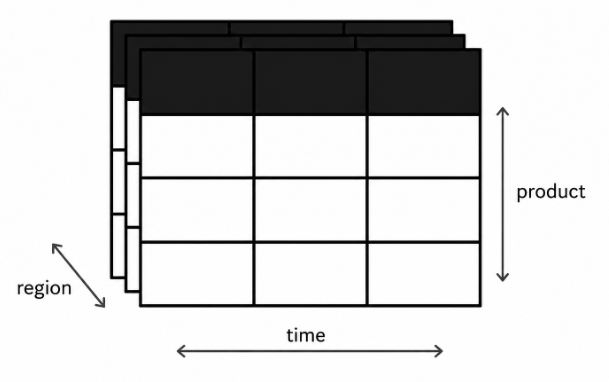

# OLTP & OLAP

> [!NOTE]
> - [Online Transaction Processing (OLTP)](#online-transaction-processing-oltp)
>   - [데이터베이스 내부의 데이터 구조](#데이터베이스-내부의-데이터-구조)
>   - [해시 인덱스(Hash Indexes)](#해시-인덱스hash-indexes)
>   - [Sorted String Table (SSTable)](#sorted-string-table-sstable)
>   - [B-Tree](#b-tree)
>   - [LSM Tree vs. B-Tree](#lsm-tree-vs-b-tree)
>   - [키-값 인덱스를 넘어선 인덱스 구조](#키-값-인덱스를-넘어선-인덱스-구조-indexing-structures-beyond-key-value-indexes)
>   - [In-Memory Databases](#in-memory-databases)
> - [Online Analytics Processing (OLAP)](#online-analytics-processing-olap)
>   - [OLTP vs. OLAP](#oltp-vs-olap)
>   - [데이터 웨어하우징(Data Warehousing)](#데이터-웨어하우징data-warehousing)
>   - [분석을 위한 스키마: Star Schema / Snowflake Schema](#분석을-위한-스키마-star-schema--snowflake-schema)
>   - [저장 구조(Storage Layout)](#저장-구조storage-layout)

### 요약
- 이 장의 질문: OLTP 엔진은 데이터를 **어떻게** 저장·조회할까 (1~2장이 "어떤 모양으로"였다면, 3장은 "물리적으로 어떻게")

- OLTP 스토리지 엔진: append(추가) 방식 vs in-place(제자리 수정) 방식의 대결
    - 해시 인덱스: 키→오프셋을 메모리 해시맵에 (모든 키가 메모리에 있어야 함, 범위 조회 불가)
    - SSTable/LSM Tree: 정렬을 도입해 해시 인덱스의 한계를 해소 (희소 인덱스, 효율적 병합, 범위 조회 가능) — **쓰기 최적화**
    - B-Tree: 정렬된 트리를 디스크에서 직접 제자리 갱신 — **읽기 최적화**, 대신 WAL·Latch 필요
    - → 쓰기 많은 워크로드는 LSM(Cassandra 등), 읽기 많은 워크로드는 B-Tree(MySQL, PostgreSQL 등)

- OLAP: 대량의 과거 데이터를 요약·분석 (BI 목적) — OLTP를 보호하기 위해 별도 시스템(DW)으로 분리, ETL로 적재
    - 저장 구조: 행 지향(OLTP) vs **열 지향(OLAP)** — 컬럼 단위 저장 → 압축·정렬에 압도적으로 유리, 대신 쓰기가 비쌈(그래서 여기도 LSM 재활용)
    - 스키마: Star/Snowflake (2장 참고), 사전 집계(Data Cube, Materialized View)로 조회 속도 확보

- 관통하는 원칙 하나: **"랜덤 접근은 메모리에서, 순차 접근은 디스크에서"** — 순차 쓰기가 랜덤 쓰기보다 빠르다는 물리적 특성이 해시 인덱스, SSTable, B-Tree, 컬럼 스토어 설계를 전부 관통함

## Online Transaction Processing (OLTP)

- OLTP란?
    - **사용자의 요청을 실시간으로 처리하는 시스템** — 주문 생성, 결제, 로그인, 좌석 예약 등 서비스 운영 그 자체
    - 특징
        - 소수의 레코드를 키(ID)로 찾아 읽고 쓰는 패턴이 대부분.
        - 낮은 지연 시간(사용자가 기다리고 있음)과 정합성(트랜잭션)이 생명
    - ex. PostgreSQL, MySQL 같은 관계형 DB가 대표적인 OLTP 시스템
    - 1~2장이 "데이터를 어떤 **모양**(모델)으로 저장할까"였다면, 이 장은 "그 데이터를 디스크에 **어떻게** 저장하고 찾을까"
        - 즉 **스토리지 엔진**의 이야기
    - 왜 앱 개발자가 이걸 알아야 하나
        - 엔진을 직접 만들 일은 없지만, 워크로드에 맞는 엔진(LSM vs B-Tree)을 **선택**하고 튜닝하려면 내부 동작을 알아야 함

### 데이터베이스 내부의 데이터 구조
- 세상에서 가장 단순한 데이터베이스: 파일 하나 + 함수 두 개

    ```py
    def db_set(key, value):
        with open('database', 'a') as db:
            db.write(f"{key},{value}\n")


    def db_get(key):
        with open('database', 'r') as db:
            lines = db.readlines()

        for line in reversed(lines):
            if line.startswith(f"{key},"):
                return line.split(",", 1)[1].strip()

        return None
    ```
    ```py
    # set data
    db_set("hello1", "world1")
    db_set("hello2", "world2")

    # get data
    print(db_get("hello2"))

    # output
    """
    world2
    """
    ```
    - 코드 동작
        - `db_set`: 기존 값을 찾아 수정하지 않고, 무조건 파일 끝에 새 줄을 추가함 (같은 키를 다시 set하면 새 줄이 하나 더 생김)
        - `db_get`: 파일을 **뒤에서부터** 스캔 → 같은 키가 여러 줄 있어도 가장 마지막에 쓰인(최신) 값을 반환
        - "수정 = 덮어쓰기"가 아니라 "수정 = 새 버전 추가"라는 발상이 이 장 전체를 관통함

- 데이터 저장(Set), 데이터 조회(Get)
    - `db_set` 의 성능
        - 파일 끝에 추가(Appending)만 하므로 매우 효율적 — 많은 데이터베이스가 사용하는 **Append-Only Log** 방식과 같은 원리
        - 실제 데이터베이스는 여기에 동시성(Concurrency), 디스크 공간 회수(Disk Space Reclamation), 오류 처리(Error Handling) 같은 복잡성을 추가로 처리함
        - 로그(Log)는 데이터베이스에서 반복적으로 등장하는 핵심 개념이며, 사람이 읽는 텍스트일 필요는 없음 (바이너리 로그가 일반적)

    - `db_get` 의 성능
        - 조회할 때마다 전체 파일을 스캔 → **조회 비용 O(n)**, 데이터가 커질수록 선형으로 느려짐
        - 이 문제를 해결하는 것이 **인덱스**

- 인덱싱(Indexing)
    - 인덱스 = 데이터 본체와 별도로 유지하는 **추가 메타데이터** ("어떤 키가 어디에 있는지"의 지도)
    - 다양한 유형의 질의를 지원하려면 여러 개의 인덱스가 필요할 수 있음

- 인덱스의 트레이드오프
    - **읽기는 빨라지고, 쓰기는 느려진다**
        - 데이터를 쓸 때마다 인덱스도 함께 갱신해야 하기 때문 (본체 쓰기 + 인덱스 쓰기 = 오버헤드)
    - 그래서 데이터베이스는 모든 컬럼에 인덱스를 만들지 않음
        - 애플리케이션의 조회 패턴을 보고 **필요한 인덱스만** 개발자가 선택 (자동이 아님)
    - 이 장에 나오는 모든 저장 구조는 결국 이 트레이드오프(읽기 vs 쓰기)의 서로 다른 균형점임
    
### 해시 인덱스(Hash Indexes)
- 가장 단순한 인덱스: 키 → 바이트 오프셋의 해시맵
    - 키-값 저장소(Key-Value Store)에서 주로 사용 — 프로그래밍 언어의 해시맵(dict)과 같은 원리
    - 인덱싱 전략(Indexing Strategy):
        - **메모리 안의 해시맵(In-Memory Hash Map)** 에 각 키와 데이터 파일의 바이트 오프셋(Byte Offset)을 매핑하여 저장함
        - `{키: 그 키의 값이 저장된 파일 위치(바이트 오프셋)}`

- 동작 방식
    - 쓰기: 파일 끝에 데이터를 추가 + 해시맵에 그 키의 새 위치를 갱신
    - 읽기: 해시맵에서 키의 바이트 오프셋을 찾음 → 파일의 그 위치로 **바로 점프**해서 값을 읽음 (전체 스캔 불필요, O(1))
    - 바이트 오프셋(Byte Offset): 파일 시작점에서 몇 바이트 떨어진 위치인가 하는 값
    - 예시

        
        - 데이터 파일에 3개의 값이 저장됨: `1234`(0번째 바이트부터), `abcde`(5번째부터), `xyz`(10번째부터)
        - 인메모리 해시맵: {hello: 0, hash: 5, index: 10}
        - `db_get("hash")` → 해시맵에서 5를 얻음 → 파일의 5번째 바이트로 점프해서 읽음
        - 즉, "전체 스캔"이 "해시맵 조회 1번 + 디스크 점프 1번"으로 줄어듦

- Bitcask (Riak의 스토리지 엔진)
    - 이 방식의 실제 구현체
    - **모든 키가 메모리에 들어간다면** 읽기·쓰기 모두 매우 빠름
    - 값(Value)은 디스크에 있지만 위치를 정확히 아니까 디스크 I/O 1번으로 조회
        - 디스크 I/O(Input/Output): 컴퓨터가 HDD, SSD 등의 저장 매체에서 데이터를 읽어오거나(Read) 기록하는(Write) 작업
    - 적합한 워크로드: 키 종류는 적고, 각 키가 자주 갱신되는 경우 (ex. URL별 조회수 카운터)
        - 워크로드(Workload): IT 시스템이나 개발자/팀이 처리해야 할 작업의 양과 종류를 의미하며, 맥락에 따라 시스템 처리 단위, 업무량, 또는 클라우드 리소스 단위로 쓰임

- 디스크 공간 관리: 세그먼트와 컴팩션
    - 문제: append만 하면 파일이 무한히 커짐 (같은 키의 옛 버전들이 계속 쌓이므로)
    - 해결 1 — 세그먼트(Segment) 분할: 로그가 일정 크기에 도달하면 파일을 닫고 새 파일에 쓰기 시작 → 로그가 여러 개의 세그먼트 파일로 나뉨
        - 세그먼트(Segment): 하나의 조그마한 파일
    - 해결 2 — 컴팩션(Compaction): 세그먼트에서 **중복된 키를 제거하고 각 키의 최신 값만 남기는** 작업
        - append-only 로그에서 "최신 값만 유효하고 옛 버전은 쓰레기"이므로, 쓰레기를 청소하는 과정
    - 컴팩션 과정에서 세그먼트를 병합하여 세그먼트 수를 줄이고 **조회 효율을 향상**시킨다

- 컴팩션과 병합(Compaction and Merging)의 동작
    - 쓰기 프로세스와 별개로, **백그라운드 프로세스**가 컴팩션·병합을 수행
        - 진행 중에도 기존 세그먼트로 읽기·쓰기 요청을 계속 처리하다가, 완료되면 새 세그먼트로 교체하고 옛 것을 삭제 → 서비스 중단 없음
    - 각 세그먼트는 자체 인메모리 해시맵을 가짐. 조회 시 **최신 세그먼트의 해시맵부터** 확인하고, 없으면 그 다음 세그먼트로
    - **병합 과정을 통해 세그먼트 수를 줄이면 확인할 해시맵 수가 줄어 읽기(Read) 성능을 최적화할 수 있음**
    - 예시

        
        - hello (key), 1192(value) 등의 데이터가 들어옴
        - 세그먼트 안에 hello가 3번 쓰임: `hello:1192` → `hello:1194` → `hello:1197`
        - 컴팩션 후: 가장 나중에 쓰인 `hello:1197`만 남음 (나중에 쓰인 것 = 최신 값이므로 이전 버전은 버려도 됨)
        - world, hash도 동일하게 최신 값만 남음 → 10칸이 3칸으로

        
        - 세그먼트가 여러 개면 병합(Merge)까지 함께 수행
            - 여러 세그먼트를 훑으며 키별로 가장 최신 세그먼트의 값만 남긴 새 세그먼트 생성
        - 오래된 세그먼트들에 있던 hello의 옛 값들은 전부 버려짐

- 해시 인덱스의 장점과 한계
    - Append-Only 설계의 장점
        - **순차 쓰기(Sequential Write)는 랜덤 쓰기보다 훨씬 빠름**
            - HDD: 랜덤 쓰기는 매번 헤드 이동(Seek, 수 ms) + 회전 대기가 필요하지만, 순차 쓰기는 헤드 이동 없이 연속 기록 → 수백 배 차이
            - SSD: 쓰기는 페이지(4KB) 단위지만 지우기는 블록(수백 KB) 단위 → 랜덤 소규모 쓰기는 내부 재배치(Write Amplification)를 유발하므로 순차 쓰기가 유리
        - 장애 복구와 동시성 관리가 단순함 — 기존 데이터를 절대 덮어쓰지 않으므로, 쓰다가 죽어도 기존 데이터는 무사
        - 세그먼트 병합이 파일 단편화를 해소
            - 단편화(Fragmentation): 데이터가 디스크의 연속되지 않은 조각들에 흩어져 저장되어, 읽을 때마다 Seek이 늘어나는 현상
            - 병합은 조각난 세그먼트들을 새로운 연속된 파일 하나로 다시 쓰므로 자연스럽게 해소됨

    - 해시 테이블 인덱스의 한계
        - 구조 요약: 데이터 파일(디스크)은 순차 쓰기, 해시맵(메모리)은 랜덤 접근
            - 랜덤 접근이 필요한 인덱스는 랜덤이 공짜인 메모리에, 순차로 쓸 수 있는 데이터는 순차가 빠른 디스크에 두는 역할 분담
        - 따라서 **모든 키가 메모리에 올라가야 함** → 키가 수억 개면 부적합
        - "그럼 해시맵을 디스크에 두면?" → 비효율적
            - 해시 함수는 키를 의도적으로 흩뿌리므로, 해시맵의 버킷 접근이 전부 디스크 랜덤 I/O(Seek)가 됨
            - 해시 충돌(서로 다른 키가 같은 버킷에 배정) 시 추가 접근이 필요한데, 메모리에선 공짜지만 디스크에선 Seek 1회씩 추가됨
        - **범위 조회(Range Query)가 안 됨** — 해시맵은 키를 뒤섞어 저장하므로 "key100 ~ key200 사이"를 조회하려면 키 101개를 각각 조회해야 함
        - 인메모리 해시맵은 장애 시 소멸 → 재시작 시 세그먼트 파일 전체를 읽어 재구성해야 하며, 파일이 클수록 오래 걸림 (Bitcask는 이를 위해 해시맵 스냅샷을 디스크에 저장)
    - 이 한계(메모리 제약, 범위 조회 불가)를 해결하는 것이 다음의 SSTable

### Sorted String Table (SSTable)
- SSTable = 세그먼트 파일 안의 키-값 쌍을 **키 순서로 정렬**해 저장한 것
    - 해시 인덱스 절의 세그먼트와 동일한 로그 구조(나중에 쓰인 값이 우선, 컴팩션으로 각 세그먼트에 키가 한 번만 존재)에 **"정렬"이라는 규칙 하나만 추가**한 형식
    - 이 규칙 하나로 해시 인덱스의 한계 2가지(메모리 제약, 범위 조회 불가)가 모두 풀림

- 정렬이 주는 이점 - ① 효율적인 병합 (Efficient Merging)
    - 여러 세그먼트 병합이 **Merge Sort의 병합 단계와 동일**해짐
        - 각 세그먼트의 맨 앞(가장 작은 키)만 비교하며 작은 키부터 출력 파일에 기록 → 파일들을 한 번씩만 순차로 읽으면 끝
        - 세그먼트 전체가 메모리에 안 들어가도 병합 가능 (앞부분만 보면 되니까)
    - 같은 키가 여러 세그먼트에 있으면 **가장 최신 세그먼트의 값만 유지**

        
        - 세그먼트 3개에 a가 각각 존재: a:100(가장 오래됨), a:103, a:105(가장 최신)
        - 병합 결과: a는 최신 값 105만 남고, 나머지 키들(b, c, d, f, g)과 함께 정렬된 새 세그먼트 생성

- 정렬이 주는 이점 - ② 희소 인덱스 (Sparse Indexing)
    - 해시 인덱스처럼 **모든 키**를 메모리에 둘 필요가 없음
    - 일부 키의 오프셋만 저장 (ex. "handbag은 10만 바이트, headline은 20만 바이트 위치")
    - "hello"를 찾는다면: 정렬돼 있으므로 hello는 반드시 handbag과 headline **사이**에 있음 → 10만 바이트 지점부터 그 구간만 스캔
    - → 메모리 사용량이 키 수에 비례하지 않음 = 해시 인덱스의 "모든 키가 메모리에" 제약 해소
    - (+ 정렬 덕분에 범위 조회도 자연스럽게 해결: 시작 키 위치를 찾아 순서대로 읽으면 됨)

- 정렬이 주는 이점 - ③ 블록 압축 (Compression)
    - 희소 인덱스가 어차피 "구간"을 가리키므로, 그 구간(수 KB 블록)을 통째로 압축해 저장 가능
    - 압축 → 디스크 사용량 감소 + 읽어야 할 바이트 수 감소 → I/O 대역폭 절약
    - 읽을 때는 해당 블록 하나만 해제하면 되므로 파일 전체를 해제할 필요 없음

- 그런데 정렬된 상태로 어떻게 쓰나? — Memtable
    - 쓰기는 발생 순서대로 오는데(정렬 안 됨), 디스크에 순차 쓰기를 유지하면서 정렬도 하려면?
    - 해결: 일단 **메모리 안의 균형 트리(Balanced Tree, ex. Red-Black Tree)**에 쓴다 = **Memtable**
        - 트리는 삽입 순서와 무관하게 **항상 키 정렬 상태를 유지**하는 자료구조
        - 균형(Balanced) = 어느 경로든 깊이가 비슷하게 유지됨 → 삽입·조회 모두 O(log n) 보장 (한쪽으로 쏠려 리스트처럼 되는 걸 방지)
    - Memtable → 디스크 Flush
        - Memtable이 임계 크기에 도달하면 트리를 **순서대로 순회하며 통째로 디스크에 기록** → 그 자체로 정렬된 SSTable 완성
        - 정렬은 이미 메모리에서 끝났으므로 디스크에는 순차 쓰기만 발생 (빠름)
        - Flush되는 동안 새 Memtable이 쓰기 요청을 계속 받음 → 쓰기 중단 없음
    - 장애 대비: Memtable은 메모리라 크래시 시 소멸 → 쓰기를 Memtable에 넣기 전에 **별도의 append-only 로그(WAL)에도 기록**해두고, 복구 시 이 로그로 Memtable을 재구성 (Flush 완료된 로그는 폐기)

- 읽기 요청 처리 (Read Path)
    - ① Memtable에서 조회 (가장 최신 데이터가 여기 있으므로)
    - ② 없으면 디스크의 **가장 최신 SSTable부터** 오래된 순으로 차례대로 조회
    - 문제: **존재하지 않는 키**를 조회하면 Memtable + 모든 SSTable을 다 뒤진 후에야 "없음"을 알게 됨 (최악의 경우)
    - 최적화: **Bloom Filter**
        - "이 키가 이 SSTable에 **없다**"를 디스크를 읽지 않고 빠르게 판정하는 확률적 자료구조
        - 구조: 비트 배열 1개 + 해시 함수 k개
            - 키 저장 시: 키를 k개 해시 함수에 넣어 나온 k개 위치의 비트를 1로 켬
            - 키 조회 시: 같은 k개 위치를 확인 → **하나라도 0이면 "확실히 없음"** (디스크 스킵!) / 모두 1이면 "있을 수도 있음" (디스크 확인)
        - "모두 1인데 실제로는 없는" 오탐(False Positive)은 가능하지만, "있는데 없다고 하는" 미탐(False Negative)은 구조상 불가능 → 스킵 판정은 항상 안전
        - ex. 비트 배열 10칸, 해시 2개일 때 "apple" 저장 → 위치 2, 7이 1로 켜짐. "grape" 조회 → 해시 결과가 위치 3, 7 → 3이 0이므로 이 SSTable에 grape 없음 확정, 디스크 안 읽음

- LSM Tree (Log-Structured Merge Tree)
    - 지금까지의 구성 요소를 합친 것이 LSM Tree:
        - **Memtable(메모리, 정렬된 쓰기 버퍼) + SSTable(디스크, 정렬된 불변 세그먼트) + 백그라운드 컴팩션·병합**
    - 백그라운드 프로세스가 주기적으로 SSTable들을 병합·컴팩션하여 세그먼트 수와 중복을 관리
        - Size-Tiered: 비슷한 크기의 SSTable끼리 모아 병합 (쓰기에 유리)
        - Leveled: SSTable을 레벨로 나눠 단계적으로 병합 (읽기·공간에 유리)
    - 채택 시스템: Cassandra, HBase, LevelDB, RocksDB 등

### B-Tree
- B-트리는 관계형/비관계형 DB를 통틀어 **가장 널리 사용되는 인덱스 구조**
    - LSM Tree와 다른 접근: 로그에 순서대로 쌓지 않고, **처음부터 정렬된 트리 구조를 디스크 위에 직접 유지**하며 그 자리에서 갱신

- B-트리의 구조
    - 키-값을 정렬된 상태로 유지하는 건 SSTable과 같지만, 저장 단위가 다름
        - SSTable: 가변 크기 세그먼트(로그 파일)
        - B-트리: **고정 크기 4KB 페이지(Page)** — 디스크의 물리적 블록 크기와 맞춘 것
    - 각 페이지는 "키 범위 → 다음 페이지 참조"를 담은 **딕셔너리**이고, 맨 위에 루트 페이지(Root Page) 하나가 있음

        
        - 루트 페이지: `[r, 10, r, 20, r, 100]` — "10 미만은 왼쪽 자식", "10 - 20은 가운데 자식", "20 - 100은 오른쪽 자식"으로 범위를 3구간으로 나눠 각 구간마다 다음 페이지 참조(r)를 붙임
        - 예: 키 `23`을 찾는다면 → 루트에서 "20 - 100" 구간(오른쪽 자식)으로 이동 → 그 페이지에서 다시 `[r,21,r,30,r,50]`을 보고 "21 - 30" 구간으로 이동 → 리프 페이지에서 `22, hello / 23, world`를 발견 → `23`의 값 `world` 반환
        - 즉, **매 단계마다 찾을 범위를 좁혀가며** 루트 → 중간 → 리프까지 내려가는 구조 (이진 탐색을 트리로 확장한 것)

    - 분기 계수(Branching Factor): 페이지 하나가 가지는 자식 페이지 참조의 개수
        - 그림 기준 루트의 분기 계수 = 3
        - 실무 DB는 보통 수백 단위 (4KB 페이지에 키 참조를 최대한 욱여넣으므로)

- B-Tree에서의 키 수정 및 추가
    - 키 수정(Update): 해당 값이 있는 리프 페이지를 찾아 그 페이지를 수정 후 디스크에 다시 씀
    - 키 추가(Add): 리프 페이지에 공간이 없으면 **페이지 분할(Split)** — 페이지를 둘로 나누고, 그 사실을 부모 페이지에도 반영(부모의 참조 갱신)
        - 분할이 부모까지 전파되면 트리의 균형이 유지됨

- 균형 트리 구조 (Balanced Tree Structure)
    - B-트리는 깊이가 **O(log n)**으로 유지되는 균형 트리 → 대부분의 DB는 3~4단계만 거쳐도 어떤 키든 찾음
    - 4KB 페이지 + 분기 계수 500 기준, **4단계 트리로 최대 256TB** 저장 가능
        - 500(루트의 자식) × 500 × 500 × 500 ≈ 6250억 개의 리프 페이지 → 이 정도 규모까지 4번의 페이지 읽기로 도달

- B-트리 최적화
    - Write-Ahead Log(WAL)를 이용한 장애 복구
        - B-트리는 갱신할 때 페이지를 **그 자리에서 덮어씀(In-place Update)** — 이게 LSM(append-only)과의 근본적 차이
        - 덮어쓰는 도중 장애가 나면? 페이지가 절반만 써진 상태로 남아 데이터가 깨질 수 있음
        - 해결책이 WAL: **페이지를 실제로 고치기 전에**, "무엇을 어떻게 바꿀지"를 append-only 로그에 먼저 기록
            - 순서: ① WAL에 변경 내용 기록(순차 쓰기, append) → ② 그 다음 실제 페이지를 덮어씀(랜덤 쓰기)
            - 장애 시: 페이지가 깨져 있어도 WAL을 읽어 "어디까지 반영됐어야 했는지" 재생(Replay)해서 복구
        - WAL 자체도 디스크에 있음 (메모리가 아님)
        - 앞에서 본 Memtable의 WAL과 목적은 같음: **"위험한 작업(메모리 손실 / 페이지 덮어쓰기) 전에 안전한 append 기록부터 남겨둔다"** 는 동일한 패턴

    - 동시성 제어 (Concurrency Control)
        - B-트리는 같은 페이지를 여러 스레드가 동시에 읽고 쓸 수 있어서, **탐색 도중 다른 스레드가 페이지를 바꿔버리면** 잘못된 결과나 오류로 이어질 수 있음
        - 그래서 페이지 단위로 Latch(경량 락)를 걸어 조심스럽게 접근을 통제해야 함 → 구현이 까다로움
        - 반면 로그 구조(LSM 계열)는 세그먼트가 **불변(Immutable)** 이고 교체가 원자적이라, 읽는 도중 데이터가 바뀔 걱정이 원천적으로 없음 → 동시성 제어가 훨씬 단순

### LSM Tree vs. B-Tree
- 지금까지의 대비를 한 문장씩으로 정리하면:
    - LSM Tree
        - append만 하고 나중에 백그라운드로 정리(컴팩션)
        - 로그 시스템, 시계열 데이터베이스, NoSQL 데이터베이스(Cassandra, HBase, LevelDB 등)처럼 **쓰기(Write)가 많은 워크로드에 적합**

    - B-Tree
        - 정렬된 트리를 항상 최신 상태로 유지(그 자리에서 갱신)
        - 범위 조회(Range Query)와 단건 조회(Point Lookup)가 빈번한 MySQL, PostgreSQL과 같은 관계형 데이터베이스처럼 **읽기(Read)가 많은 워크로드에서 널리 사용**
    
    - 트레이드오프의 근원: LSM은 "쓸 때 편하고 읽을 때(여러 세그먼트 확인) 손해", B-Tree는 "읽을 때 편하고 쓸 때(그 자리 갱신 + WAL + Latch) 손해"

### 키-값 인덱스를 넘어선 인덱스 구조 (Indexing Structures Beyond Key-Value Indexes)
- 기본 인덱스와 보조 인덱스 (Primary vs. Secondary Indexes)
    - 기본 인덱스(Primary Index): PK처럼 레코드를 고유하게 식별하는 인덱스
    - 보조 인덱스(Secondary Index): PK가 아닌 컬럼(중복 가능)에 대한 인덱스
        - ex. `WHERE email = 'x@y.com'`처럼 PK가 아닌 조건으로 자주 검색한다면 email에 보조 인덱스를 만듦
        - 구조 자체는 기본 인덱스와 같은 키-값 인덱스(B-Tree/해시 등)이되, "키"가 PK 대신 그 컬럼의 값이라는 차이

- 인덱스와 실제 데이터의 저장 방식: Heap File vs Clustered Index
    - Heap File: 실제 행 데이터는 **정렬 없이 아무 순서로나** 별도 공간(힙)에 저장하고, 인덱스는 "이 키 → 힙의 이 위치"라는 **포인터**만 가짐
        - 인덱스가 여러 개여도 데이터 본체는 한 곳에 한 벌만 있음 → 데이터 중복이 적음
        - 단, 인덱스로 찾은 뒤 포인터를 한 번 더 따라가야 실제 데이터에 도달 (추가 조회 1회)
    - Clustered Index: 인덱스의 리프 노드 **안에 실제 행 데이터 자체를 통째로 저장**
        - 포인터를 따라갈 필요 없이 인덱스 조회 = 데이터 조회 → 읽기가 빠름
        - 단, 이 인덱스가 곧 데이터 저장 장소이므로 테이블당 보통 1개만 가능(PK 기준), 쓰기 시 정렬 위치에 맞춰 데이터를 옮겨야 해서 쓰기 비용·저장 공간이 늘어남
        - ex. MySQL InnoDB의 PK는 기본적으로 Clustered Index

- 다중 컬럼 및 다차원 인덱스
    - 결합 인덱스(Concatenated Index): 여러 컬럼을 하나의 키로 합쳐 인덱싱
        - ex. `(lastname, firstname)` — lastname 우선 정렬, 같으면 firstname 순
    - 다차원 인덱스(Multi-dimensional Index): 위도·경도 같은 공간 데이터를 위한 인덱스
        - 일반 B-Tree는 1차원 정렬이라 "위도가 A-B이고 경도가 C-D인 지점들"처럼 2차원 범위 조회에 안 맞음
        - 전체 공간을 블록(격자)으로 나누고, 그 블록들을 인덱싱해서 여러 차원을 동시에 좁혀나가는 방식 (ex. R-Tree, GeoHash)

- 전문 검색 및 퍼지 인덱스 (Full-Text and Fuzzy Indexes)
    - 오탈자나 유사어까지 검색되게 하는 인덱스 — 사용자가 검색어를 잘못 입력해도(미스 스펠링) 의도한 결과를 찾아줌
    - 편집 거리(Edit Distance): 한 문자열을 다른 문자열로 바꾸는 데 필요한 최소 수정 횟수 (ex. "sale"→"salt"는 1)
    - 동의어 확장(Synonym Expansion): "car" 검색 시 "automobile"도 함께 검색
    - ex. Elasticsearch의 fuzzy match

### In-Memory Databases
- 인메모리 데이터베이스 vs 디스크 기반 데이터베이스 (In-Memory vs. Disk-Based Databases)
    - 인메모리 DB는 디스크 I/O 자체를 없애 속도를 극대화 — 모든 데이터를 RAM에 둠
    - "그럼 장애 나면 다 날아가는 거 아닌가?" → 아님. **내구성(Durability)은 별도로 확보**:
        - 로그(Log): 변경사항을 디스크에 append (Part 2의 WAL과 같은 발상)
        - 스냅샷(Snapshot): 주기적으로 메모리 상태 전체를 디스크에 저장
        - 복제(Replication): 다른 노드에도 같은 데이터를 유지해 한 노드가 죽어도 데이터 보존
        - → 디스크는 "매 요청마다 거치는 경로"에서 빠지고, "복구용 안전망"으로만 남는 것

- 인메모리 데이터베이스의 장점
    - 직렬화(Serialization) 오버헤드 없음: 디스크에 쓰려면 메모리의 객체를 바이트로 변환해야 하는데, 그 과정 자체가 생략됨
    - 특수 자료구조 제공: 디스크 기반으로는 구현이 까다로운 자료구조도 메모리라서 자유롭게 제공 가능 (ex. Redis의 우선순위 큐, Sorted Set)
    - ex. Redis, Memcached

- 안티 캐싱(Anti-Caching)
    - 메모리가 가득 차면 가장 오래 안 쓴 데이터(LRU)를 디스크로 밀어내고, 다시 필요해지면 메모리로 불러옴
    - OS의 가상 메모리(Virtual Memory)와 같은 원리 — "메모리인 척하지만 일부는 디스크"

- 비휘발성 메모리 (NVM; Non-Volatile Memory)
    - RAM처럼 빠르면서도 전원이 꺼져도 데이터가 유지되는 차세대 메모리 (ex. Intel Optane)
    - 이게 보편화되면 "메모리=휘발성, 디스크=영속성"이라는 지금까지의 전제 자체가 흔들려서, 스토리지 엔진 설계가 근본적으로 바뀔 수 있음

## Online Analytics Processing (OLAP)

- OLAP란 무엇인가?
    - **대용량 데이터를 대상으로 복잡한 분석과 의사결정을 지원**하기 위해 설계된 시스템
    - 과거 데이터를 조회해 인사이트·추세·패턴을 도출하는 데 쓰이며, 비즈니스 인텔리전스(BI)가 주 목적
    - OLTP가 "지금 이 주문 하나를 빠르게 처리"라면, OLAP은 "지난 1년간 주문 패턴을 요약"

### OLTP vs. OLAP

| Aspects | **OLTP** | **OLAP**|
| ------- | -------- | ------- |
| **주요 읽기 패턴 (Main Read Pattern)** | 고유 식별자를 기반으로 소수의 특정 레코드를 조회한다. | 많은 레코드를 요약하여 합계나 평균 등을 계산한다.                                                               |
| **주요 쓰기 패턴 (Main Write Pattern)** | 사용자 동작에 따라 최소한의 지연으로 데이터를 빠르게 갱신한다. | 배치 처리나 연속적인 데이터 스트림을 통해 대량의 데이터를 적재한다. |
| **사용 목적 (Usage)** | 온라인 플랫폼을 이용하는 일반 사용자나 고객이 사용한다. | 기업의 분석가가 비즈니스 의사결정을 위한 인사이트를 얻기 위해 사용한다. |
| **데이터 표현 (Data Representation)** | 시스템의 최신 데이터를 반영한다. | 시간에 따라 축적된 데이터를 나타내며 과거의 행동과 추세를 보여준다. |
| **데이터셋 크기 (Dataset Size)** | GB ~ TB | TB ~ PB |
| **트랜잭션 유형 (Transaction Type)**             | 짧고 상호작용이 많은 트랜잭션 (Short, interactive transactions) | 복잡한 분석 트랜잭션 (Complex analytical transactions) |
| **쿼리 복잡도 (Query Complexity)** | 빠른 응답의 단순한 질의 | 집계(Aggregation)를 포함한 복잡한 질의 |
| **지연 시간 (Latency)** | 낮은 지연 시간, 실시간 응답 | 상대적으로 높은 지연 시간, 배치 처리에서는 허용 가능 |

※ OLTP와 OLAP은 **같은 데이터라도 저장·조회 방식을 완전히 다르게** 해야 함 → 그래서 별도 시스템(DW)으로 분리

### 데이터 웨어하우징(Data Warehousing)
- 데이터 웨어하우징(Data Warehousing)
    - 다양한 데이터 소스로부터 **대량의 데이터를 수집, 저장, 관리하여 분석과 리포팅을 위한 중앙 저장소(Central Repository)에 통합**하는 과정
    - 비즈니스 인텔리전스(BI)와 의사결정을 지원하기 위해 대규모 조직에서 널리 사용됨

- Data Warehousing Process

    
    - CRM(고객 관계 관리), ERP(전사적 자원 관리), Billing, Logs 등 여러 **OLTP 시스템**에서 발생한 데이터를 ETL로 추출
    - ETL = Extract(추출) → Transform(변환) → Load(적재)
        - 변환·처리 엔진: Spark, Flink 주로 사용
        - 실시간 유입 파이프라인: Kafka 주로 사용 (OLTP → Kafka → Spark/Flink → DW의 흐름이 실무에서 흔함)
    - 정기적으로 Data Warehouse에 적재된 뒤, 분석가가 Reporting, Analytics, Data Mining 수행


- 데이터 웨어하우징의 핵심 특징
    - 중앙 집중형 데이터 저장소(Centralized Data Repository)
        - 여러 OLTP·소스를 통합해 하나의 분석 관점 제공
    - 분석에 최적화(Optimized for Analytics)
        - OLTP 시스템과 달리, 데이터 웨어하우스는 대규모 데이터셋을 대상으로 하는 복잡한 질의와 데이터 분석에 최적화되어 있음
    - 읽기 전용(Read-only)
        - 데이터 웨어하우스는 운영 데이터의 읽기 전용 복사본을 저장하므로, 분석 질의가 무거워도 운영 시스템(OLTP)에 영향 없음 — **OLTP 보호가 DW가 존재하는 이유 중 하나**
    - ETL로 원본을 추출·정제·변환해 적재
    - 비즈니스 인텔리전스 지원(Supports Business Intelligence)
        - 분석가가 리포트를 생성하고, 추세를 파악하며, 더 나은 비즈니스 의사결정을 내릴 수 있도록 지원
    - 대규모 기업에서 주로 사용(Common in Large Enterprises)
        - 대기업은 데이터의 규모와 복잡성 때문에 데이터 웨어하우스를 활용하며, 소규모 기업은 더 단순한 도구를 사용할 수도 있음

### 분석을 위한 스키마: Star Schema / Snowflake Schema
> 2장 [데이터 분석을 위한 스키마 - Stars, Snowflakes](<./02. Data Models & Query Languages.md#데이터-분석을-위한-스키마---stars-snowflakes>) 참고 — 개념은 동일, 여기서는 DW 맥락의 요점만 정리

- Star Schema: 중앙 Fact Table + 이를 둘러싼 Dimension Table들 (별 모양)

    
    - Fact Table: 판매량·매출 같은 정량 데이터(측정값) + 각 Dimension을 가리키는 FK
    - Dimension Table: 상품·고객·시간 등 Fact를 해석하는 맥락(설명 속성)
    - 장점: 구조 단순, 조인이 적어 질의 빠름 → 대부분의 리포팅·분석에 적합

- Snowflake Schema: Star의 Dimension을 한 번 더 정규화한 것 (눈송이 모양)

    
    - ex. Customer 테이블을 Customer, Address, Region으로 분리
    - 장점: 중복 제거로 저장 공간 절약, 복잡한 관계 표현에 유연
    - 단점: **조인이 늘어 질의 성능 저하**, 설계·관리 복잡도 증가
    - 실무 판단 기준: **읽기 속도가 최우선이면 Star, 저장 공간·데이터 무결성이 더 중요하면 Snowflake**

### 저장 구조(Storage Layout)
- 지금까지 다룬 인덱스(해시, SSTable, B-Tree)는 모두 "행(Row) 단위" 저장을 전제로 했음 *— OLTP엔 맞지만 OLAP엔 안 맞음. 왜인지가 이 절의 핵심.*

- OLTP: 행 지향(Row-Oriented) 저장
    - 한 레코드의 모든 컬럼이 디스크에 **함께** 저장됨 (이름, 주소, 전화번호가 나란히)
    - ex. PostgreSQL, MySQL
    - 이유: OLTP는 "이 고객의 정보 전체"처럼 **행 전체**를 자주 읽고 쓰므로, 한 행이 붙어 있어야 효율적

- OLAP: 열 지향(Column-Oriented) 저장
    - 같은 컬럼의 값들이 디스크에 **함께** 저장됨 (모든 고객 이름끼리, 모든 전화번호끼리)
    - ex. Redshift, BigQuery, Snowflake

        
        - 빨간 박스(행 지향): Tim의 모든 컬럼(Name, City, Age)이 붙어 저장
        - 파란 박스(열 지향): 모든 사람의 Name값이 붙어 저장
    - 이유: OLAP은 "전체 고객의 나이 평균" 같은 질의에서 **컬럼 하나만** 필요함 — 행 지향이면 안 쓰는 컬럼까지 다 읽어야 하지만, 열 지향이면 필요한 컬럼만 읽으면 됨 → I/O 대폭 절감
    - 이 하나의 이유(읽는 컬럼만 골라 읽기)에서 아래의 압축·정렬 최적화가 전부 파생됨

- 열 지향 저장에서의 컬럼 압축(Column Compression in Column-Oriented Storage)
    - 같은 컬럼끼리 모여 있으면 **값이 반복되는 패턴**이 많아짐(같은 카테고리, 같은 지역 등) → 압축률이 매우 높아짐
    - 압축 → 디스크에서 읽을 바이트 수 감소 → I/O 자체가 줄어 읽기·필터링이 더 빨라짐
        - "압축했으니 압축 풀어야 해서 느려지는 거 아냐?" 싶을 수 있는데, 디스크 I/O가 압축 해제 연산보다 훨씬 느려서 **I/O를 줄이는 이득이 압도적으로 큼**
    - 컬럼의 데이터 타입에 따라 다양한 압축 기법을 사용할 수 있음
        - ex. Bitmap Encoding

- 비트맵 인코딩(Bitmap Encoding)
    - 상황: Product 컬럼에 서로 다른 상품 ID가 5개(30, 68, 69, 31, 42)뿐이고, 행은 1,000개
    - 방법: **상품 ID마다 비트맵(0/1로 된 배열) 하나씩** 생성
        - ID=30의 비트맵: `1000100000...` (30이 있는 행의 위치만 1)
        - ID=68의 비트맵: 다른 위치들이 1
    - **질의(Query)는 비트 연산(`AND`, `OR`)을 이용하여 여러 비트맵을 빠르게 결합하거나 필터링할 수 있음**
        - ex. `WHERE product_id IN (30, 68)` → 30의 비트맵과 68의 비트맵을 **OR 연산** → 결과 비트맵에서 1인 행이 정답
    - 왜 효율적인가: **고유 값이 적을수록**(카디널리티가 낮을수록) 비트맵이 작고 압축도 잘 되며, 비트 연산 자체가 CPU에서 매우 빠름
        - 반대로 고유 값이 많은 컬럼(ex. 이메일)엔 안 맞음 — 비트맵이 컬럼 값 종류만큼 생기니까
    
- 열 지향 저장에서의 행 정렬 (Sort row in Column-Oriented Storage)
    - 행 기반 정렬(Row-based Sorting)
        - 컬럼별로 저장은 하지만, **어떤 순서로 값을 나열할지는 행 전체 기준**으로 정함
        - ex. `date_key`로 정렬하기로 하면, 모든 컬럼이 "같은 행 순서"를 공유 — Name 컬럼도, Age 컬럼도 같은 순서로 재배열됨
        - 데이터베이스는 자주 조회되는 컬럼(ex. 날짜 기반 조회를 위한 `date_key`)을 기준으로 정렬 키를 선택
    - 질의 최적화(Query Optimization)
        - 정렬 키를 자주 필터링하는 컬럼(ex. 날짜)으로 잡으면, 그 조건의 질의가 전체 스캔 없이 **해당 구간만** 읽으면 됨 (SSTable의 희소 인덱스와 같은 원리)
    - 다중 정렬 키(Multiple Sort Keys)
        - 보조 정렬 키(ex. `product_sk`)를 추가하면 관련 데이터가 더 가까이 모여 필터링·집계가 더 빨라짐
    - 압축 효과(Compression Benefit)
        - **정렬된 컬럼은 같은 값이 연속으로 몰림** → Run-Length Encoding(반복 값을 "값+개수"로 압축)이 매우 잘 먹힘
        - ex. `wwwbbwwww`(8바이트) → `3w1b4w`(6바이트로 표현: w 3개, b 1개, w 4개)
        - 특히 **첫 번째 정렬 키**가 압축 효율이 가장 좋음 (완전히 정렬돼 있으니까)

- 열 지향 저장에서의 쓰기 (Writes in Column-Oriented Storage) *- 약점*
    - 지금까지의 최적화(컬럼 분리, 압축, 정렬)는 전부 **읽기용**이고, 그 대가로 **쓰기가 매우 비쌈**    
        - 압축·정렬 상태를 유지하려면 값 하나 바꿀 때도 컬럼 파일 전체를 다시 써야 할 수 있음
        - → OLAP이 실시간 갱신이 아니라 **배치 적재**를 쓰는 이유가 바로 이것
    - 해결책: **LSM Tree 재활용**
        - 새 쓰기는 먼저 메모리(정렬된 구조)에서 받아냄
        - 어느 정도 쌓이면 디스크의 컬럼 파일과 한꺼번에 병합
    - 쓰기 데이터는 먼저 정렬된 메모리 구조에 저장되며, 이후 질의 성능에 영향을 주지 않으면서 디스크 데이터와 효율적으로 병합됨

- 사전 집계(Pre-Aggregation): **① 데이터 큐브(Data Cube)**
    - 데이터를 **다차원 구조(Multi-dimensional Structure)** 로 구성하여 다양한 관점에서 빠르게 탐색할 수 있도록 함

        
        - ex. 판매 데이터를 시간(연/월) × 상품(Product) × 지역(Region) 3차원 큐브로 구성
    - "지역별", "상품별", "월별" 등 여러 각도로 자르고(Slicing) 쪼개서(Dicing) 봐도 이미 계산되어 있어 빠름
        - 빠른 질의를 위해 데이터를 미리 집계(Pre-Aggregation)해 둠
    - 단점: 차원이 늘어날수록 큐브 크기가 기하급수적으로 커짐 → 모든 조합을 다 만들진 않고 자주 쓰는 조합만 선별

- 사전 집계(Pre-Aggregation): **② 머티리얼라이즈드 뷰(Materialized View)**
    - 자주 실행되거나 무거운 질의의 **결과 자체를 미리 계산해서 저장**해둠
        - ex. "지역별 총매출"을 매번 다시 계산하지 않고, 미리 계산된 테이블을 조회
    - 데이터 큐브가 "여러 차원을 통째로" 미리 계산한다면, 머티리얼라이즈드 뷰는 "특정 질의 하나"를 미리 계산한다는 차이
    - 집계·조인 등 무거운 연산 결과를 캐싱해두는 개념 (2장의 CQRS에서 본 "구체화된 뷰"와 같은 개념)
