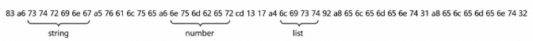
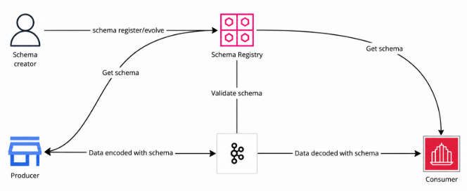
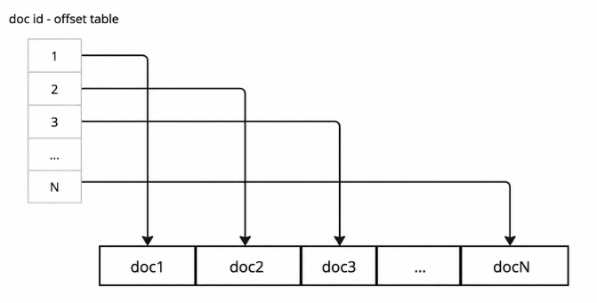
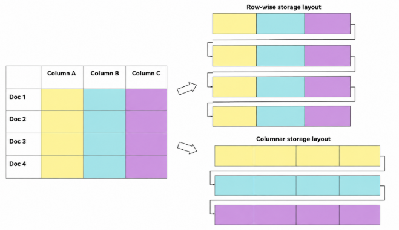
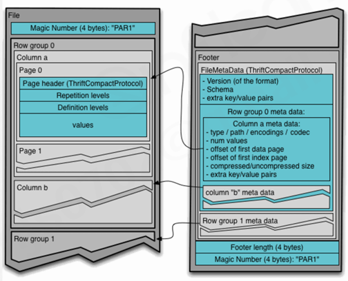
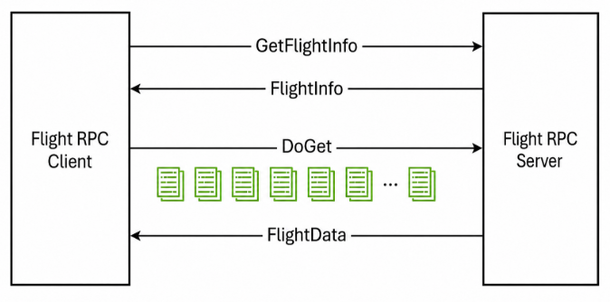
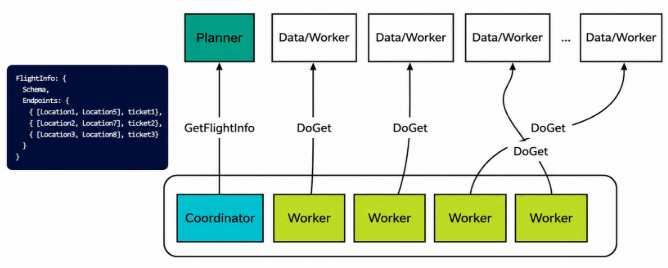

# Encoding & Serialization

> [!NOTE]
> - [데이터의 진화와 인코딩 (개념)](#데이터의-진화와-인코딩-개념)
>   - [데이터의 진화 (Evolvability)](#데이터의-진화-evolvability)
>   - [인코딩/디코딩](#인코딩디코딩)
>   - [인코딩 형식의 요구사항](#인코딩-형식의-요구사항)
> - [인코딩 형식 비교](#인코딩-형식-비교)
>   - [1. 텍스트 형식 (Text Format)](#1-텍스트-형식-text-format)
>   - [2. 바이너리 형식(Binary Format)](#2-바이너리-형식binary-format)
>   - [3. ProtoBuf와 Thrift](#3-protobuf와-thrift)
>   - [4. Avro](#4-avro)
>   - [결론: 스키마 + 바이너리 인코딩을 권장하는 이유](#결론-스키마--바이너리-인코딩을-권장하는-이유)
> - [Encoding / Decoding 사용 사례](#encoding--decoding-사용-사례)
>   - [검색 엔진의 문서 저장소 (Elasticsearch)](#검색-엔진의-문서-저장소-elasticsearch)
>   - [컬럼형 포맷 — Parquet](#컬럼형-포맷--parquet)
>   - [마이크로서비스 아키텍처(Micro-Service Architecture)](#마이크로서비스-아키텍처micro-service-architecture)
>   - [Apache Arrow](#apache-arrow)

### 요약
- 이 장의 질문: 
    > 데이터를 바이트로 어떻게 표현하고(인코딩), 그 표현이 **시간이 지나 스키마가 바뀌어도** 안전하게 읽히려면(호환성) 어떻게 해야 하나

- 진화(Evolvability)의 핵심
    - 롤링 업그레이드 중엔 새 코드·옛 코드가 공존 
    - → **하위 호환성**(새 코드가 옛 데이터를 읽음) + **상위 호환성**(옛 코드가 새 데이터를 읽음)을 모두 만족해야 함

- 인코딩 형식의 스펙트럼
    - 텍스트(JSON/XML/CSV): 사람이 읽기 쉽지만 타입 정보 없음, 장황함
    - 바이너리(MessagePack): 숫자는 압축되지만 필드 이름 반복은 못 없앰
    - **ProtoBuf/Thrift**: 필드를 **숫자 태그**로 식별 → 장황함 해소, 스키마가 진화 규칙(optional 추가, 태그 재사용 금지 등)을 강제
    - **Avro**: 태그도 없이 **필드 이름 매칭**(Writer/Reader Schema 분리)으로 더 작고 유연하게 진화
    - 결론: 실무에선 **스키마 있는 바이너리 인코딩**을 권장 (ex. Kafka + Schema Registry)

- 이 인코딩 기법들이 실전에서 재사용되는 방식
    - Elasticsearch: 3장의 해시 인덱스(키→오프셋) 그대로 문서 검색에 사용
    - Parquet: 3장의 열 지향 저장·비트맵·RLE·Bloom Filter를 파일 포맷으로 구현한 하이브리드(Row Group) 컬럼 포맷
    - REST/RPC: 인코딩된 바이트를 **어떻게 주고받을지**의 프로토콜 
        - RPC는 멱등성·SerDe 오버헤드 같은 "원격 호출 고유의 문제"를 안고 있음 (gRPC = ProtoBuf + HTTP/2)
    - Apache Arrow: 디스크·네트워크가 아니라 **메모리 안에서** 언어·프로세스 간 데이터를 무변환으로 공유하는 표준 (Zero-copy)

## 데이터의 진화와 인코딩 (개념)
### 데이터의 진화 (Evolvability)
- 데이터 모델은 시간이 지나며 반드시 바뀜
    - 관계형 DB: `ALTER TABLE`로 필드 추가·삭제·변경
    - 스키마가 바뀌면 그걸 읽는 애플리케이션 코드도 함께 바뀌어야 함

- 그래서 "새 버전 코드"와 "옛 버전 코드"가 한동안 공존하게 됨
    - 서버는 보통 **롤링 업그레이드(Rolling Upgrade)** 로 배포함
        - 서버 전체를 한 번에 내렸다 올리지 않고, **몇 대씩 순서대로** 새 버전으로 교체
        - ex. 서버 10대 중 2대씩 순서대로 교체 → 나머지 8대가 서비스를 계속하니 다운타임 없음
        - 교체 중인 구간에는 옛 버전 서버와 새 버전 서버가 동시에 살아있고, 각자 다른 버전의 데이터를 쓰고 읽을 수 있음
    - 클라이언트(모바일 앱 등)의 업그레이드는 서버가 강제할 수 없음
        - 사용자가 앱 업데이트를 미루면, 옛 버전 클라이언트가 한참 동안 새 서버와 통신하게 됨

- 때문에 호환성(Compatibility)이 필요함
    - 하위 호환성(Backward Compatibility): **새 코드**가 **옛 데이터**를 읽을 수 있어야 함 (새 서버가 옛 서버가 쓴 데이터를 읽는 경우)
    - 상위 호환성(Forward Compatibility): **옛 코드**가 **새 데이터**를 읽을 수 있어야 함 (롤링 업그레이드 중 옛 서버가 새 서버가 쓴 데이터를 읽는 경우, 혹은 옛 클라이언트가 새 서버 응답을 읽는 경우)
    - 방향을 헷갈리기 쉬운데: **"누가 누구를 읽는가"** 로 구분
        - Backward는 시간을 거슬러(새→옛) 읽는 것, Forward는 시간을 따라(옛→새) 읽는 것

### 인코딩/디코딩
- 메모리 내부(In-memory)의 자료구조
    - 객체(Object), 구조체(Struct), 리스트, 트리, 해시 테이블 등 — 포인터로 서로 연결된 형태
    - 이걸 디스크에 저장하거나 네트워크로 전송하려면 **순서가 있는 바이트(Byte) 나열** 로 바꿔야 함 (포인터는 다른 프로세스·다른 컴퓨터에서 의미가 없으므로)

- 인코딩(Encoding): 메모리 구조 → 바이트 배열
    - = Serialization(직렬화), Marshaling (같은 개념을 부르는 여러 이름)

- 디코딩(Decoding): 바이트 배열 → 메모리 구조
    - = Deserialization(역직렬화), Unmarshalling

### 인코딩 형식의 요구사항
- ① 프로그래밍 언어에 독립적이어야 함
    - Java `java.io.Serializable`, Python `pickle`, Ruby `Marshal` 같은 언어 내장 포맷에 의존하지 말 것
    - 이런 포맷으로 인코딩한 데이터는 **그 언어로만** 디코딩 가능
        - 다른 언어로 짠 서비스와 통신 불가
- ② 보안성이 확보되어야 함
    - 언어 내장 직렬화는 디코딩 과정에서 **임의의 클래스를 그대로 생성(Invocation)** 하는 경우가 많음
    - 공격자가 조작된 바이트를 보내면, 디코딩하는 것만으로 악성 코드가 실행될 수 있음 
        - 실제로 Java `Serializable`, Python `pickle` 모두 이 방식의 원격 코드 실행(RCE) 취약점이 다수 보고된 이력이 있음
- ③ 버전 관리(Versioning)를 지원해야 함
    - 위에서 본 하위·상위 호환성을 지원해야 함
- ④ 효율적이고 데이터 크기가 작아야 함

- 그래서 `java.io.Serializable`, `pickle`, `Marshal`을 범용 인코딩으로 쓰지 않는 게 권장됨
    - ①(언어 종속) 위반은 명백하고, ②(임의 객체 생성으로 인한 보안 위험)도 실제 사고 사례가 많은 위반이며, 클래스 메타정보까지 함께 직렬화해 크기가 커져 ④도 잘 어김
    - 결국 4가지 요구사항 중 상당수를 동시에 어기는 셈이라, 프로세스 내부·같은 언어끼리의 임시 용도가 아니면 지양

## 인코딩 형식 비교
### 1. 텍스트 형식 (Text Format)
- 종류
    - `XML`: 태그가 여는 것·닫는 것 한 쌍씩 붙고 괄호가 많아 표현이 장황하고 복잡함
    - `JSON`: 웹 브라우저가 기본 지원, XML보다 단순
    - `CSV`: 단순한 표(Table) 형태

- 단점
    - **타입 정보가 없음**
        - JSON은 따옴표로 문자열과 숫자를 구분하긴 하지만, 숫자가 정수인지 부동소수점인지, 그 정밀도가 얼마인지는 표현 못 함
        - ex. JSON의 큰 정수(2^53을 넘는 값)를 JS에서 파싱하면 정밀도가 깨질 수 있음 — JSON 숫자 타입의 유명한 약점
    - **사람이 읽는 문자만 표현 가능** , 바이너리 데이터는 별도 인코딩 필요
        - 이미지·파일 같은 바이너리 데이터를 JSON에 넣으려면 Base64로 텍스트화해야 함
        - Base64는 3바이트를 4개의 ASCII 문자로 바꿈 → **원본보다 약 33% 커짐** — 효율이 떨어짐
    - **스키마 지원이 까다로움**
        - JSON Schema 같은 도구가 있긴 하지만 언어 자체에 내장된 게 아니라 별도로 관리해야 함

### 2. 바이너리 형식(Binary Format)
- 텍스트 형식의 "타입 정보 없음" 문제를 해결하기 위해 등장 (Binary JSON, Binary XML 등)
    - 하지만 **장황함(Verbosity) 자체는 해결하지 못함**
        - 필드 이름 같은 불필요한 반복은 여전히 바이트 안에 그대로 남음
    - 즉, "숫자를 텍스트가 아닌 진짜 바이너리로 표현"하는 문제만 풀렸을 뿐, "이 필드 이름이 왜 매번 반복돼야 하나"라는 문제는 그대로임

- MessagePack 예시

    ```json
    {"string": "value", "number": 4887, "list": ["element1", "element2"]}
    ```

    - 위 JSON을 바이너리 형식으로 표현하면:

        
        - `83`: "맵(Map), 항목 3개"를 뜻하는 타입 바이트
        - `a6` + `string`(6바이트): "문자열, 길이 6" + 그 문자열 — 이게 **키 이름 "string"**
        - `a5` + `value`(5바이트): "문자열, 길이 5" + 그 문자열 — **값 "value"**
        - `cd` + `13 17`: "부호 없는 16비트 정수" 타입 바이트 + 실제 2바이트 값(0x1317 = 4887) — 숫자가 텍스트 "4887"(4바이트)이 아니라 진짜 2바이트 정수로 표현된 것이 텍스트 형식과의 차이
        - `a4` + `list`: 키 이름 "list" / `92`: "배열, 항목 2개" / `a8`+`element1`, `a8`+`element2`: 각 원소
        - 즉, **타입+길이를 알려주는 헤더 바이트 하나 + 실제 데이터**의 반복
        - 숫자는 진짜 바이너리라 이득이지만, `"string"`, `"number"`, `"list"` 같은 **키 이름은 여전히 매 레코드마다 통째로 반복** 저장됨 → 그래서 "장황함은 못 없앴다"는 것

### 3. ProtoBuf와 Thrift
- Google(ProtoBuf), Facebook(Thrift)에서 개발
- 여러 언어용 코드 생성(Code Generation) 도구 제공
- 핵심 아이디어: 
    - MessagePack의 "매번 키 이름을 반복 저장"하는 낭비를 없애기 위해, **스키마를 미리 정의** 하고 **필드 이름 대신 숫자 태그(Tag)** 를 씀

    - protobuf, thrift 스키마 예제

        ```protobuf
        message Example {
            required string string_field = 1;
            optional int64 number_field = 2;
            repeated string str_array_field = 3;
        }
        ```
        ```thrift
        struct Example {
            1: required string stringField,
            2: optional i64 numberField,
            3: optional list<string> strArrayField
        }
        ```
        - `= 1`, `1:` 이 바로 태그 번호. 인코딩할 때는 `"string_field"`라는 이름 대신 **숫자 1** 만 바이트에 씀 → 훨씬 작음
        - 스키마 컴파일러가 이 정의를 보고 **인코딩/디코딩 코드를 자동 생성** 해줌 (개발자가 파싱 코드를 직접 안 짬)

- 가변 바이트 인코딩 (Variable Byte Encoding, Varint)
    - 작은 정수를 적은 바이트로 표현하는 압축 방식
    - 규칙: 
        - 정수를 7비트씩 쪼개서 바이트에 담고, **각 바이트의 최상위 비트(MSB)를 "다음 바이트가 이어지는지"의 신호로 사용**
        - `MSB = 1` → "다음 바이트도 이 숫자의 일부다, 계속 읽어라"
        - `MSB = 0` → "이게 마지막 바이트다"
    - 예시: 300을 인코딩하면
        - 300 = 이진수 `1 00101100` (9비트)
        - 하위 7비트(`0101100`)와 나머지(`10`)로 쪼갬
        - 1바이트: `1` (MSB, 계속됨) + `0101100` = `0xAC`
        - 2바이트: `0` (MSB, 마지막) + `0000010` = `0x02`
        - 결과: `[0xAC, 0x02]` — 4바이트 고정 정수 대신 **2바이트**로 300을 표현
    - `0~127`: 1바이트로 끝남 (7비트로 표현 가능한 최대값이 127) / `128~16383`: 2바이트
        - → 작은 숫자를 4바이트, 8바이트씩 고정으로 낭비하지 않고, **필요한 만큼만** 씀

    - 단조 증가(Monotonically Increasing) 수열에 특히 효율적인 이유
        - 단조 증가 = 값이 계속 커지기만 하는 수열 (ex. 정렬된 문서 ID 목록)
        - 절대값을 그대로 저장하면 숫자가 클수록 varint도 여러 바이트가 필요해짐
        - 하지만 **"이전 값과의 차이(Delta)"만 저장**하면 얘기가 달라짐:
            - 정렬돼 있으니 그 차이는 대체로 작은 값
        - ex. 문서 ID `[1000, 1015, 1032, 1500]` → Delta로 저장하면 `[1000, 15, 17, 468]` 
            - 절대값(4바이트급)보다 훨씬 작은 수들(1바이트급)이 됨
        - 검색 엔진의 인덱스, Posting List(어떤 단어가 등장하는 문서 ID 목록)가 이 패턴(정렬된 ID + Delta + Varint)을 즐겨 씀

- ProtoBuf Wire Format — 공식 문법 (Protocol Buffers 공식 문서)

    ```ProtoBuf
    message      := (tag value)*

    tag          := (field << 3) bit-or wire_type;
                    encoded as uint32 varint

    value        := varint        for wire_type == VARINT,
                    i32           for wire_type == I32,
                    i64           for wire_type == I64,
                    len-prefix    for wire_type == LEN,
                    <empty>       for wire_type == SGROUP or EGROUP

    varint       := int32 | int64 | uint32 | uint64 | bool | enum | sint32 | sint64;
                    encoded as varints (sintN are ZigZag-encoded first)

    i32          := sfixed32 | fixed32 | float;
                    encoded as 4-byte little-endian;
                    memcpy of the equivalent C types (uint32_t, float)

    i64          := sfixed64 | fixed64 | double;
                    encoded as 8-byte little-endian;
                    memcpy of the equivalent C types (uint64_t, double)

    len-prefix   := size (message | string | bytes | packed);
                    size encoded as int32 varint

    string       := valid UTF-8 string (e.g. ASCII);
                    max 2GB of bytes

    bytes        := any sequence of 8-bit bytes;
                    max 2GB of bytes

    packed       := varint* | i32* | i64*,
                    consecutive values of the type specified in `.proto`
    ```
    - `message := (tag value)*`: 메시지 = (태그, 값) 쌍의 나열
    - `tag := (field << 3) bit-or wire_type`: 필드 번호를 3비트 왼쪽 시프트하고, 그 자리에 wire_type을 OR로 끼워 넣음 (uint32 varint로 인코딩)
        - ex. `string_field = 1`(LEN=2) → `(1<<3)|2 = 0x0A` 
        - ex. `number_field = 2`(VARINT=0) → `(2<<3)|0 = 0x10`
    - `value`: wire_type이 뭐냐에 따라 값의 형식이 달라짐 
        - varint / 4바이트(i32) / 8바이트(i64) / 길이-접두(len-prefix) / 빈 값(그룹 타입, 사실상 안 씀)
    - `varint`: 정수 계열(int32, int64, uint32, uint64, bool, enum, sint32, sint64)이 여기 해당
        - **sintN은 varint로 넣기 전에 먼저 ZigZag 인코딩을 거침** — 이게 왜 필요하냐면:
            - 일반 varint는 이진수를 그대로 7비트씩 쪼개는 방식이라, **음수**(2의 보수 표현이라 상위 비트가 전부 1)를 넣으면 최대 크기(10바이트)로 뻥튀기됨
            - ZigZag는 부호 있는 수를 부호 없는 수로 지그재그로 매핑: `0→0, -1→1, 1→2, -2→3, 2→4...`
            - 그러면 절댓값이 작은 음수(-1, -2 등)도 varint에서 적은 바이트로 표현됨 → sintN이 이 매핑을 자동으로 해줌
    - `i32` / `i64`: `sfixed32/fixed32/float`, `sfixed64/fixed64/double`은 varint를 안 쓰고 **고정 4바이트/8바이트 리틀엔디안**으로 그대로 씀 (C의 `memcpy`와 같은 방식)
        - 왜 varint 대신 고정 크기를 쓰나: 
            - **float나 double, 혹은 값이 대체로 큰 정수**는 varint로 압축해봤자 어차피 여러 바이트를 다 쓰게 되니 이득이 없고, 
            - 오히려 매번 "몇 바이트인지 계산"하는 오버헤드만 생김 → 애초에 고정 크기로 그냥 복사하는 게 더 빠름
    - `len-prefix`: 길이를 먼저 varint로 쓰고, 그 뒤에 실제 바이트를 나열 — 문자열, bytes, 내포된 메시지, packed 배열이 전부 이 형식
    - `string`: 유효한 UTF-8, 최대 2GB
    - `bytes`: 임의의 바이트 시퀀스(타입 제약 없음), 최대 2GB
    - `packed`: `repeated` 필드가 varint나 i32/i64 같은 **기본 타입**일 때, 원소마다 태그를 반복하지 않고 **값들을 통째로 이어붙여** len-prefix 하나로 감싸는 최적화
        - ex. `repeated int32`를 packed 없이 쓰면 원소 100개 = 태그 100번 반복. packed면 태그 1번 + 값 100개 연속
    - 정리: 스키마에서 정의한 각 필드를 태그로 식별하고, wire_type에 맞는 형식으로 값을 이어붙이는 게 전체 인코딩의 전부

- Thrift 형식
    - BinaryProtocol, CompactProtocol 두 가지 존재
    - 문법(필드 구조)은 동일하지만, **CompactProtocol이 Varint를 사용** → 같은 데이터라도 크기가 더 작음

- ProtoBuf/Thrift의 스키마 진화
    - 필드 매칭 기준이 **이름이 아니라 태그 번호** — 그래서 필드 이름은 자유롭게 바꿔도 호환성이 안 깨짐 (태그 번호만 안 바뀌면)
    - `required`: 런타임에 "이 필드는 반드시 있어야 함"을 검사. 없으면 에러
    - 새 필드 추가: **새 태그 번호 + `optional`** 로 추가
        - 새 코드가 옛 데이터(그 필드가 없음)를 읽어도 optional이라 문제없음 → **하위 호환성** 성립
        - 옛 코드가 새 데이터(그 필드가 있음)를 읽으면, 모르는 태그를 만나지만 **길이-접두 덕분에 그 값을 건너뛸 수 있음** → **상위 호환성** 성립
        - 이 두 조건을 동시에 만족시키는 유일한 방법이 "새 필드는 항상 optional"인 이유
    - optional 필드 제거: 가능하지만 **그 태그 번호는 영원히 재사용 금지**
        - 만약 태그 5를 재사용해서 다른 의미의 필드를 새로 붙이면, 옛 데이터에 태그 5로 남아있는 값을 새 코드가 **엉뚱한 필드로 오해**하고 읽어버림
    - `required` 필드는 절대 제거 불가
        - required는 "반드시 있어야 한다"는 계약인데, 이걸 나중에 지우면 그 필드를 여전히 기대하는(옛 스키마를 쓰는) 코드가 데이터를 읽다가 검증 실패로 에러남
    - 데이터 타입 변경: 가능하지만 정밀도 손실이나 값 잘림 위험 있음 (ex. int64 값이 int32로 표현하기엔 너무 클 경우)
        - ProtoBuf는 단일 `optional` 필드를 `repeated`(리스트)로 바꾸는 것 허용 — 옛 코드는 그냥 리스트의 첫 값만 읽음
        - Thrift는 이런 편의 변환 없이 별도 `list` 타입을 명시적으로 씀

### 4. Avro
- Hadoop의 하위 프로젝트로 시작
- 태그 번호를 쓰지 않음 — ProtoBuf/Thrift와 정반대 전략
- Avro IDL과 JSON 스키마, 두 가지 형식으로 스키마 작성 가능

    - Avro IDL
        ```avro
        record Example {
            string                  stringField;
            union { null, long }    numberField = null;
            array<string>           strArrayField;
        }
        ```
        - 필드 이름과 타입이 그대로 스키마에 들어감 (ProtoBuf처럼 숫자 태그를 따로 부여하지 않음)
        - `union { null, long }`: 이 필드가 null이거나 long일 수 있다는 뜻
            - Avro에서 "값이 없을 수 있다(nullable)"를 표현하는 유일한 방법 (아래에서 다시 설명)

    - Avro IDL을 JSON으로 표현: 

        ```json
        {
        "type": "record",
        "name": "Example",
        "fields": [
            {"name": "stringField",   "type": "string"},
            {"name": "numberField",   "type": ["null", "long"], "default": null},
            {"name": "strArrayField", "type": {"type": "array", "items": "string"}}
        ]
        }
        ```

- Avro의 Writer Schema와 Reader Schema
    >“Binary encoding does not include field names, self-contained information about the types of individual bytes, nor field or record separators. Therefore readers are wholly reliant on the schema used when the data was encoded.” - From Avro doc

    “바이너리 인코딩에는 필드 이름, 각 바이트의 타입을 자체적으로 설명하는 정보, 필드 또는 레코드 구분자가 포함되지 않는다. 따라서 데이터를 읽는 쪽은 데이터가 인코딩될 때 사용된 스키마에 전적으로 의존한다.” - Avro 문서

    - 태그도 필드 이름도 안 넣는다는 건, **바이트만 봐서는 이게 무슨 필드인지 전혀 알 수 없다**는 뜻
        - ProtoBuf라면 바이트 안의 태그 번호를 스키마와 대조해서 필드를 알아냄. Avro는 그 태그 자체가 없으니, **오직 스키마의 필드 순서**로만 "1번째 값=stringField, 2번째 값=numberField..." 식으로 해석 가능
    - 그래서 Avro는 인코딩할 때 쓴 스키마(**Writer Schema**)와 디코딩할 때 쓰는 스키마(**Reader Schema**)를 별개 개념으로 나눔
        - Writer Schema: 데이터를 쓴 시점에 실제로 사용된 스키마
        - Reader Schema: 지금 이 데이터를 읽으려는 코드가 기대하는 스키마 (버전이 다를 수 있음)
    - 두 스키마가 정확히 같지 않아도 됨
        - Avro 라이브러리가 **Writer Schema로 바이트를 해석**해서 각 값을 필드 이름에 대응시킨 뒤, **Reader Schema 기준으로 필드를 재매핑**해줌
        - 그래서 "필드 이름을 기준으로 매칭"하며, 둘 사이에 필드 **순서**가 같을 필요는 없음

    - 스키마 진화 규칙
        - 기본값(default)이 있는 필드는 추가·제거 가능
            - 추가: Reader가 새 필드를 요구해도 Writer 데이터에 없으면 default 값을 채워 넣음
            - 제거: Writer 데이터에 그 필드가 있어도 Reader가 무시
        - null을 허용하려면 반드시 **Union 타입**(`["null", "long"]` 같은 형태)에 포함시켜야 함
            - Avro는 "이 필드는 null일 수도 있다"를 표현할 다른 방법이 없음 — Union이 유일한 통로
        - `optional`/`required` 키워드 자체가 없음
            - ProtoBuf/Thrift와의 근본적 차이: 그쪽은 키워드로 필수 여부를 명시하지만, Avro는 **"default 값이 있는가"** 와 **"Union에 null이 있는가"** 로 사실상 같은 효과를 냄
        - 데이터 타입 변경 가능 (Writer/Reader 스키마 간 호환되는 타입끼리, ex. int → long)
        - 필드 이름 변경은 까다로움
            - Reader Schema에 **Alias**(별칭)를 등록하면 옛 이름으로 쓰인 데이터도 매칭 가능
            - 하지만 이건 Backward만 성립(새 Reader가 옛 이름의 데이터를 읽을 수 있음), **Forward는 깨짐**(옛 Reader는 새 이름을 모르므로 새로 쓰인 데이터를 못 읽음)
        - Union 타입에 새 분기(branch) 추가도 마찬가지로 **Backward만 되고 Forward는 안 됨**
            - 새 Writer가 Union에 새로 추가된 타입으로 값을 쓰면, 그 타입을 모르는 옛 Reader는 해석할 방법이 없음

- Writer Schema를 어떻게 전달할까 — 상황별 3가지 방식
    - 동일 스키마 레코드가 잔뜩 든 대용량 파일: 
        - **파일 헤더**에 스키마를 한 번만 저장 (Avro Object Container File 방식)
    - 레코드가 개별적으로 기록되는 DB: 
        - 각 레코드 헤더엔 **스키마 버전 번호**만 저장하고, 실제 스키마 전체는 DB 어딘가(스키마 저장소)에 버전별로 보관
    - 네트워크로 레코드 전송: 
        - 연결을 맺을 때 클라이언트·서버가 **어떤 스키마를 쓸지 미리 협상**(핸드셰이크 시점에 스키마 버전을 주고받음)
    - 공통점: 
        - **스키마 자체를 매 레코드마다 반복해서 보내지 않는다**는 것
        - 이게 Avro가 태그 없이도 크기가 작을 수 있는 이유

- Avro의 장점
    - 동적으로 생성되는 스키마에 더 적합
        - 태그를 수동으로 일일이 부여하는 ProtoBuf와 달리, Avro는 필드 이름 기준 매칭이라 **스키마를 자동 생성해도 안전**
        - ex. DB 테이블 구조가 바뀔 때마다 그 구조를 그대로 Avro 스키마로 자동 변환해서 쓰는 파이프라인 (Database Dump)
    - 정적 타입 언어와 동적 타입 언어 모두에서 사용 가능
    - **자기 설명형(Self-describing) 객체 컨테이너 파일**
        - 파일 자체에 Writer Schema가 포함돼 있어서, `avro-tools` 같은 도구로 열면 스키마 없이도 내용을 텍스트처럼 확인 가능

### 결론: 스키마 + 바이너리 인코딩을 권장하는 이유
- 시간이 없어서 일단 JSON으로 데이터 파이프라인을 구성하는 경우가 많은데, 나중에 JSON 특유의 장황함과 스키마 없이 제멋대로 진화한 데이터 때문에 고생하는 경우가 흔함

- 스키마가 있는 바이너리 인코딩의 이점
    - 공간 효율성이 높음 (텍스트 대비 작음)
    - 하위·상위 호환성을 모두 지원하는 진화가 가능
    - 스키마 자체가 훌륭한 문서 역할을 하며, 데이터가 어떻게 변해왔는지 이력을 보여줌

- 실전 예시: Kafka + Schema Registry

    
    - 스키마 작성자가 Schema Registry에 스키마를 등록·수정
    - 프로듀서는 Registry에서 스키마를 가져와 그 스키마대로 데이터를 인코딩해 Kafka 브로커로 전송
        - 이때 메시지에 **스키마 전체가 아니라 스키마의 ID(번호)만** 붙여서 보냄
        - 매 메시지마다 스키마를 통째로 반복하면 낭비이므로, Writer Schema를 "네트워크로 협상"하는 방식의 실제 구현체가 이 스키마 ID 전달임
    - 브로커는 받은 데이터를 Registry를 통해 스키마와 일치하는지 검증
    - 컨슈머는 메시지에 붙은 스키마 ID로 Registry에서 해당 스키마를 가져와 디코딩
    - 이 구조 덕분에 프로듀서와 컨슈머가 서로 다른 버전의 스키마를 쓰고 있어도(롤링 업그레이드 중처럼) 각자 Registry에서 필요한 스키마를 가져와 호환성 있게 주고받을 수 있음


## Encoding / Decoding 사용 사례
### 검색 엔진의 문서 저장소 (Elasticsearch)
> "Elasticsearch serializes and stores data in the form of JSON documents. A document is a set of fields, which are key-value pairs that contain your data. Each document has a unique ID, which you can create or have Elasticsearch auto-generate."

"Elasticsearch는 데이터를 JSON 문서 형태로 직렬화하여 저장한다. 문서는 데이터를 담고 있는 키-값(Key-Value) 쌍으로 이루어진 필드(Field)들의 집합이다. 각 문서는 고유한 ID를 가지며, 이 ID는 사용자가 직접 생성하거나 Elasticsearch가 자동으로 생성하도록 할 수 있다." - Elasticsearch 공식 문서

- Elasticsearch란?
    - Lucene 기반의 오픈소스 검색·분석 엔진
        - 2장에서 언급된 검색 인덱스(Search Index)의 대표 구현체
    - 데이터를 관계형 DB의 행(Row)이 아니라 **JSON 문서(Document)** 단위로 저장하고, 텍스트 검색·집계·로그 분석 등에 특화됨
    - 왜 이 장에 등장하나:
        - Elasticsearch는 내부적으로 문서를 JSON으로 직렬화해서 저장하는데, 그 저장·조회 방식이 이 장에서 배운 **인코딩 + 인덱싱**의 실전 사례이기 때문

- 검색 결과에 문서 본문을 보여주려면, 문서를 ID로 빠르게 찾아야 함
    - 3장에서 본 해시 인덱스(키 → 바이트 오프셋)와 정확히 같은 원리를 씀: 
        - **문서 ID를 키로, 그 문서가 저장된 위치(오프셋)를 값으로** 하는 테이블을 유지

        
        - 왼쪽 테이블: `{1: 위치, 2: 위치, 3: 위치, ..., N: 위치}` — doc id별 오프셋 테이블
        - 오른쪽: 실제 문서 데이터가 doc1, doc2, doc3, ... 순서로 이어붙어 저장된 파일
        - 문서 ID로 조회하면 테이블에서 오프셋을 찾고, 그 위치로 바로 점프해서 문서를 읽음 — 3장 Bitcask의 "키→오프셋" 구조가 여기서도 그대로 재사용됨
    - Elasticsearch는 기본적으로 문서를 JSON으로 저장하지만, 공간 효율을 위해 내부적으로 다른 인코딩(SMILE 등 바이너리 포맷)을 쓸 수도 있음

### 컬럼형 포맷 — Parquet


- 여러 컬럼으로 구성된 데이터는 테이블로 표현 가능하고, 이를 디스크에 쓸 때 두 가지 방식이 있음
    - **Row-wise(행 지향)**: Doc1의 Column A·B·C를 한데 묶어 저장 → 그다음 Doc2를 한데 묶어 저장 (3장에서 본 행 지향 저장과 동일)
    - **Columnar(컬럼 지향)**: 모든 Doc의 Column A끼리 묶어 저장 → 그다음 모든 Doc의 Column B끼리 (3장의 열 지향 저장과 동일)

- 컬럼형 포맷이 효율적인 이유 (3장 내용의 재확인)
    - 분석 질의는 대부분 **일부 컬럼만** 사용 (`SELECT col_a, col_b WHERE col_c = ...`) → 안 쓰는 컬럼은 아예 안 읽어도 됨
    - 같은 컬럼의 값이 메모리에 연속으로 놓이므로 **벡터화 연산(Vectorized Computation)** 가능
        - 값 하나하나에 개별 연산을 반복하는 대신, 연속된 데이터 블록 전체에 **한 번의 연산**을 적용
        - CPU의 **SIMD(Single Instruction, Multiple Data)** 명령어를 활용할 수 있게 됨 
            - 명령어 하나로 여러 데이터를 동시에 처리하는 CPU 기능

- Parquet은 하이브리드 포맷 — 완전한 컬럼 포맷이 아님
    - **File**: 실제 데이터와 메타데이터를 함께 담은 자기 설명형(Self-described) 파일
    - **Row Group**: 여러 행(문서)을 묶은 단위 
        - Parquet은 전체 파일을 한 번에 컬럼 지향으로 바꾸는 게 아니라, **먼저 행들을 Row Group으로 나누고, 그 Row Group 안에서만 컬럼 지향으로 저장**
        - Row Group 크기를 파일 전체 크기만큼 키우면 사실상 100% 컬럼 포맷과 같아짐
        - 즉 Row Group 크기가 "행 지향적 성격"과 "컬럼 지향적 성격" 사이의 다이얼 역할
        - 왜 완전한 컬럼 포맷으로 안 가고 굳이 Row Group을 두나:
            - Row Group 단위로 병렬 처리(여러 워커가 Row Group을 나눠 읽음)가 가능해지고, 
            - 특정 Row Group 전체를 건너뛰는 최적화(아래 min/max pruning)도 가능해지기 때문
    - **Column Chunk**: Row Group 안에서 특정 컬럼 하나에 해당하는 데이터
    - **Page**: Parquet에서 가장 작은 데이터 단위. Column Chunk는 여러 Page로 나뉨
        - Data Page: 실제 값
        - Dictionary Page: 아래 Dictionary Encoding에 쓰이는 사전
        - Index Page: 빠른 탐색을 위한 인덱스

- Parquet 파일 포맷 (공식 문서 기준 레이아웃)

    ```
    4-byte magic number "PAR1"
    <Column 1 Chunk 1>
    <Column 2 Chunk 1>
    ...
    <Column N Chunk 1>
    <Column 1 Chunk 2>
    <Column 2 Chunk 2>
    ...
    <Column N Chunk 2>
    ...
    <Column 1 Chunk M>
    <Column 2 Chunk M>
    ...
    <Column N Chunk M>
    File Metadata
    4-byte length in bytes of file metadata (little endian)
    4-byte magic number "PAR1"
    ```
    - 파일의 시작과 끝에 `"PAR1"`(매직 넘버)을 넣어서, 이 파일이 Parquet 형식이 맞는지 + 파일이 잘리지 않고 온전한지 검증
    - 그 사이에는 **Row Group별로 Column Chunk가 연속** 
        - Row Group 1의 모든 컬럼이 먼저 쭉 나오고, 그다음 Row Group 2가 이어짐
    - 마지막에 File Metadata + 그 메타데이터의 길이(4바이트) 
        - → **끝에서부터 읽으면** 메타데이터 위치를 즉시 알 수 있음 
        - 즉, 메타데이터를 찾으려고 파일 처음부터 스캔할 필요 없음

- Parquet 파일 내부 구조

    
    - File 안에 Row Group들이 있고, 각 Row Group 안에 Column별로 여러 Page(Page 0, Page 1, ...)가 있음
    - 각 Page는 헤더(ThriftCompactProtocol로 인코딩 3장에서 본 Thrift의 실제 활용 사례) + Repetition/Definition Levels(중첩 구조 표현용 메타정보) + 실제 값(values)으로 구성
    - Footer(파일 끝)에 File Metadata 저장:
        - Format Version, Schema, 추가 key/value 쌍
        - 각 Row Group과 그 안의 Column 메타데이터 (타입, 경로, 인코딩, 값 개수, 첫 Data Page의 오프셋, 압축 전/후 크기 등)
        - Column Chunk 메타데이터에 **첫 Data Page·Index Page의 오프셋**이 있어서, 특정 컬럼의 데이터로 바로 점프 가능 (3장 SSTable의 희소 인덱스와 같은 발상)

- Parquet의 효율성 최적화
    - **Column Chunk 메타데이터에 최소값(Min)·최대값(Max) 저장**
        - 조건절(Predicate) 필터링 시, 조건을 만족할 수 없는 Column Chunk 자체를 통째로 건너뜀(Pruning)
            - 그 Chunk를 디스크에서 읽지도 않음
        - ex. `WHERE age < 10` 질의에서, 어떤 Chunk의 메타데이터에 `min=15`라고 적혀 있으면 그 Chunk 안엔 10 미만 값이 있을 수 없으므로 통째로 스킵
    - 추가 인코딩 기법
        - **Dictionary Encoding**: 컬럼에 고유 값이 적을 때(ex. 국가 코드), 값 목록을 사전(Dictionary Page)에 한 번만 저장하고 실제 데이터엔 사전의 인덱스(작은 정수)만 저장 
            - 3장 비트맵 인코딩과 목적이 같은 압축 기법
        - **Run-Length Encoding(RLE)**: 같은 값이 연속될 때 "값+반복 횟수"로 압축 (3장에서 본 것과 동일)
    - **Parquet에 내장된 Bloom Filter**
        - "Compact data structure that over-approximates a set" — "집합을 근사적으로(넉넉하게) 표현하는 공간 효율적인 자료구조"
        - 원소 포함 여부를 "확실히 없음(definitely no)" 또는 "있을 수도 있음(probably yes)"으로만 판단 (3장 SSTable의 Bloom Filter와 완전히 동일한 원리 
            - "없다"는 100% 확실, "있다"는 확인이 필요)
        - 특히 **조인(Join)** 에 유용: 
            - 다른 테이블과 조인하기 전에, 조인 키가 이 Row Group/Chunk에 아예 없다는 걸 Bloom Filter로 먼저 걸러내면 불필요한 스캔을 피할 수 있음


### 마이크로서비스 아키텍처(Micro-Service Architecture)
> 이 절이 인코딩 장에 있는 이유: 지금까지는 데이터를 "어떤 바이트로 표현할지"(JSON, ProtoBuf, Avro...)를 다뤘다면, 이 절은 그 바이트를 "누가 누구에게 어떻게 전달할지"(REST, RPC)를 다룸 — 인코딩 형식은 이 전달 방식들 위에서 실제로 오가는 페이로드(payload)임

- 네트워크 통신의 가장 고전적인 모델: 클라이언트/서버(Client/Server)
    - 클라이언트가 요청을 보내면, 서버가 받아 처리한 뒤 응답을 보냄
    - 이 요청-응답 경로 하나하나를 **API**라 하고, 한 서버(또는 서버 그룹)가 공개하는 API들의 묶음을 **서비스(Service)**라 함

- 마이크로서비스 아키텍처
    - 큰 애플리케이션을 작은 서비스들로 쪼개고, 서비스끼리는 네트워크 API로만 통신
    - 서비스 지향 아키텍처(SOA)와 마이크로서비스 아키텍처가 이 접근의 대표적인 이름
    - 장점
        - 서비스 단위로 독립적인 관리·배포·확장이 가능 (한 서비스만 스케일 아웃하거나, 한 서비스만 배포할 수 있음)
    - 대가
        - 서비스들이 서로 다른 팀·다른 배포 주기로 독립적으로 진화하므로, **API의 호환성**을 반드시 지켜야 함
        - 이게 이 장 맨 앞(Evolvability)에서 본 하위·상위 호환성 얘기가 다시 나오는 지점
            - 단일 애플리케이션 안의 스키마 진화가 아니라, **서비스 간 API의 진화** 버전

- 웹 서비스(Web Service): HTTP를 통신 프로토콜로 쓰는 서비스
    - REST와 SOAP이 대표적인 두 스타일

- REST / RESTful (Representational State Transfer)
    - HTTP 환경에 맞춰 설계된 아키텍처 스타일 (특정 프레임워크가 아니라 설계 원칙)
    - Stateless(무상태) 클라이언트-서버 구조 
        - 서버가 클라이언트의 이전 요청 상태를 기억하지 않음 
        - 1장에서 본 Stateless 서버의 원리와 동일: 어떤 서버가 요청을 받아도 결과가 같아야 스케일 아웃이 쉬움
    - URL로 **리소스(Resource)** 를 식별 (ex. `/users/100`이 곧 "100번 유저"라는 자원)
    - HTTP 메서드로 동작을 표현
        - `GET`(조회) / `POST`(생성) / `PUT`(수정) / `DELETE`(삭제) → CRUD와 1:1 대응
        - 캐시 제어(Cache-Control 헤더), 인증(Authorization 헤더), 콘텐츠 타입 협상(Accept 헤더로 JSON/XML 등 원하는 응답 형식 지정) 등 HTTP가 이미 제공하는 기능을 그대로 재사용
    - 현재 가장 널리 쓰이는 방식이며, 주로 JSON으로 요청·응답을 주고받음

- SOAP (Simple Object Access Protocol)
    - XML 기반 프로토콜, WSDL(Web Service Description Language)로 API 명세를 정의
        - WSDL을 보고 클라이언트 코드를 자동 생성 가능 (ProtoBuf/Thrift의 코드 생성과 비슷한 발상)
    - WSDL 자체가 매우 장황하고 복잡해서 사람이 직접 작성하기 어렵고, 동적 타입 언어(Python, JS 등)와는 특히 궁합이 잘 안 맞음
    - REST가 부상하면서 지금은 레거시 엔터프라이즈 시스템(금융권 등)에서 주로 남아있는 방식


- 원격 프로시저 호출 (Remote Procedure Call, RPC)
    > "Causes a procedure to execute in a different address space which is written as if it were a normal (local) procedure call without explicitly writing the details for the remote interaction" - Wikipedia

    "원격 상호작용에 대한 세부 사항을 명시적으로 작성하지 않고도, 마치 일반적인 로컬 프로시저를 호출하는 것처럼 다른 주소 공간에서 프로시저를 실행하도록 하는 기술이다." - Wikipedia

    - 발상: `result = add(2, 3)`처럼 **로컬 함수를 부르듯** 원격 서버의 함수를 호출하게 만들자는 것 
        - REST가 "리소스"를 다루는 스타일이라면, RPC는 "함수(동작)"를 그대로 원격으로 옮기는 스타일

    - 로컬 호출과 원격 호출은 근본적으로 다름 — RPC가 "그런 척"을 해도 숨길 수 없는 차이들:
        - **예측 불가능성**: 네트워크 요청은 로컬 함수 호출과 달리 중간에 사라질 수 있음
            - 타임아웃이 났을 때, 다음 셋 중 뭐가 일어난 건지 클라이언트는 구분할 수 없음: ① 요청이 서버에 도달하지도 못함 ② 서버가 처리는 했는데 응답이 돌아오다 유실됨 ③ 서버가 아직 처리 중
            - ①이면 재시도해도 안전하지만, ②라면 재시도 시 **같은 작업이 두 번 실행**됨 — 이게 바로 아래 멱등성 문제
        - **멱등성(Idempotence)**: 같은 요청을 여러 번 보내도 결과가 한 번 보낸 것과 같아야 안전하게 재시도 가능
            - ex. "잔액 조회"는 몇 번을 다시 불러도 안전(멱등) / "계좌에서 1만원 출금"은 멱등하지 않음 → 타임아웃 후 재시도했다가 실제로는 두 번 처리돼서 2만원이 빠져나갈 수 있음
            - 그래서 결제·주문 같은 API는 별도의 멱등키(Idempotency Key)를 요청에 실어, 서버가 "이미 처리한 요청인지" 판별하게 설계하는 경우가 많음
        - **SerDe 오버헤드**: 로컬 호출은 메모리 포인터만 넘기면 끝이지만, 원격 호출은 인자를 바이트로 인코딩 → 전송 → 디코딩해야 함 → 이 장 전체에서 본 인코딩 비용이 매 호출마다 발생
        - **언어 간 호환성**: 클라이언트와 서버가 다른 언어로 짜여 있을 수 있음 → 초반의 "인코딩 형식은 언어 독립적이어야 한다"는 요구사항이 여기서 실전으로 적용됨

    - 이 문제들을 줄이기 위해 RPC 프레임워크가 계속 발전: **gRPC**, Thrift, Finagle, Avro RPC
        - gRPC는 **ProtoBuf를 인코딩 형식으로, HTTP/2를 전송 계층**으로 쓰는 조합
            - 지금까지 배운 인코딩(ProtoBuf)과 통신 방식(RPC)이 실제로 합쳐진 사례
        - Thrift, Avro도 각자의 인코딩 형식에 자체 RPC 지원을 얹은 것

    - RPC와 REST 둘 다 **서비스 호환성(Service Compatibility)** 문제를 안고 있음
        - 레거시 클라이언트의 업그레이드나 종료를 서버가 강제할 수 없음 (챕터 맨 앞의 "클라이언트 업그레이드는 서버가 통제 불가"와 동일한 문제)
        - RESTful API는 보통 **URL에 버전을 명시**해서 대응 (ex. `/v1/users`, `/v2/users`) 
            - 옛 클라이언트는 `/v1`을 계속 쓰고, 신규 클라이언트는 `/v2`를 씀으로써 한 서버가 여러 버전을 동시에 서빙

### Apache Arrow
>“Apache Arrow is a development platform for in-memory analytics. It contains a set of technologies that enable big data systems to process and move data fast. It specifies a standardized language-independent columnar memory format for flat and hierarchical data, organized for efficient analytic operations on modern hardware.”

"Apache Arrow는 **인메모리** 분석(In-Memory Analytics)을 위한 개발 플랫폼이다. 빅데이터 시스템이 데이터를 빠르게 처리하고 이동할 수 있도록 하는 다양한 기술을 포함하고 있다. 또한 평면 데이터와 계층형 데이터를 위한 표준화된 **언어 독립적인(Language-independent) 컬럼형** 메모리 포맷을 정의하여, 현대 하드웨어에서 분석 작업을 효율적으로 수행할 수 있도록 설계되었다."

- 지금까지 배운 인코딩(JSON, ProtoBuf, Avro)은 전부 **"디스크나 네트워크로 보낼 때"** 의 표현이었음
    - Arrow는 다른 문제를 풂: 
        - **"메모리 안에서 서로 다른 프로세스·언어끼리 데이터를 주고받을 때"** 의 표준 표현
    - 예를 들어 Python 프로세스가 만든 데이터를 JVM 기반 Spark 엔진이 읽으려면, 원래는 Python 객체 → 바이트로 직렬화 → JVM이 역직렬화해서 자기 객체로 재구성, 이 과정이 매번 필요함
    - Arrow는 **모든 언어·엔진이 메모리 안에서 똑같은 바이트 레이아웃을 공유**하도록 표준화해서, 이 변환 과정 자체를 없애버림 (Zero-copy)

- 인메모리 분석 데이터 처리를 위한 라이브러리 모음
    - **Zero-copy 공유 메모리와 RPC 기반 데이터 이동**: 데이터를 복사하지 않고 메모리 주소만 공유해서 프로세스 간 전달
    - File formats: Arrow 포맷을 디스크에 저장하는 파일 형식(Feather 등)도 제공
    - 인메모리 분석 및 쿼리 처리: Arrow 포맷 위에서 바로 연산(필터링, 집계 등)을 수행하는 엔진들(Acero 등)

- 활용 분야
    - Python NumPy, Pandas
        - Python이 느리다는 인식이 개선된 배경 중 하나가 이것
        - 원래 "느린 이유"의 상당 부분은 언어 자체의 연산 속도가 아니라, **다른 시스템과 데이터를 주고받을 때의 변환(직렬화) 비용**이었음
        - Arrow로 이 비용이 줄어듦
    - PySpark Pandas UDF
        - PySpark의 고질적 문제가 UDF(사용자 정의 함수)의 성능이었음
            - Spark는 JVM 위에서 도는데, Python 함수를 쓰려면 **JVM ↔ Python 프로세스 간에 매 행(row)마다 데이터를 직렬화·역직렬화**해야 했기 때문
        - Spark 2.0 이후 Arrow 기반 코드 생성을 도입하면서, 데이터를 행 단위가 아니라 **컬럼형 배치(batch) 단위로 한 번에 Arrow 포맷으로 주고받게** 됨 → 변환 횟수 자체가 극적으로 줄어 PySpark 성능이 크게 개선됨

- Apache Arrow 포맷 - 용어
    - **배열(Array)**: Arrow의 기본 데이터 구조 
        - 하나의 컬럼에 해당하는 값들의 모음
    - **슬롯(Slot)**: 배열 안에서 값 하나가 차지하는 자리 (테이블의 한 셀에 해당)
    - **버퍼(Buffer)**: 실제 바이트가 담기는 연속된 메모리 블록
        - Array는 여러 Buffer(값 버퍼, 유효성 비트맵 버퍼 등)로 구성됨
    - **물리적 레이아웃(Physical Layout)**: "이게 논리적으로 무슨 의미인지"와 무관하게, 비트 수준에서 데이터가 어떻게 배치돼 있는지
        - ex. int64와 Timestamp는 논리적으로 다른 의미지만 물리적 레이아웃(8바이트 정수)은 동일 → 아래 "논리 타입"과 대비되는 개념
    - **부모/자식 배열(Parent/Child Arrays)**: 중첩 타입(리스트, 구조체 등)을 표현할 때, 바깥 구조를 담은 부모 배열과 실제 원소 값을 담은 자식 배열로 나눠 구성
        - ex. `List[Int]`라면, 부모 배열엔 "각 리스트가 몇 번째~몇 번째 원소인지"를 나타내는 오프셋들이, 자식 배열엔 모든 리스트의 원소를 이어붙인 정수들이 저장됨
    - **기본 타입(Primitive Type)**: 자식 배열 없이 값 버퍼 하나만으로 구성 
        - ex. int32, float 배열
    - **중첩 타입(Nested Type)**: 부모+자식 배열 조합으로 구성 
        - ex. `List[T]`, `Struct`
    - **논리 타입(Logical Type)**: 물리적 레이아웃은 같아도 의미가 다른 경우를 구분하는 상위 개념
        - ex. Timestamp는 물리적으로 64비트 정수 레이아웃을 그대로 쓰지만, 논리적으로는 "이 정수가 시간을 나타낸다"는 의미가 추가로 붙음

- Apache Arrow 포맷 - Array
    - 하나의 Array는 아래 요소들이 **연속된 메모리 공간**에 저장된 것
        - 데이터 타입(Data Type): enum 값으로 표현 (int32인지, string인지 등)
        - 길이(Length): 원소 개수
        - NULL 개수(Null Count)
        - 유효성 비트맵(Validity Bitmap): 각 원소가 null인지 아닌지를 비트 하나씩으로 표시
        - 값 버퍼(Value Buffer): 실제 값들이 고정 크기로 나란히 들어있는 공간
        - Dictionary Encoding이 적용된 경우 그 사전(Dictionary) 정보 (Parquet에서 본 것과 같은 개념)
        - 중첩 배열이면 자식 배열도 함께 가짐

    - 예시: `[1, null, 2, 4, 8]` (모두 4바이트 정수라고 가정)
        - Length: 5, Null count: 1
        - Validity Bitmap Buffer:
            | Byte 0 (validity bitmap) | Bytes 1-63 |
            |---------------------------|------------|
            | 00011101                  | 0 (padding)|
            - 비트는 **오른쪽(LSB)이 0번째 원소**부터 시작: `00011101`을 오른쪽부터 읽으면 `1,0,1,1,1,0,0,0`
            - 원소0(`1`)=valid(1) / 원소1(`null`)=invalid(0) / 원소2(`2`)=valid(1) / 원소3(`4`)=valid(1) / 원소4(`8`)=valid(1) / 나머지 3비트는 여분(padding)
            - 실제 값이 5개뿐이라도 비트맵은 **바이트 단위(8비트)**로만 할당되므로 남는 비트는 그냥 0으로 채움

        - Value Buffer:
            | Bytes 0-3 | Bytes 4-7 | Bytes 8-11 | Bytes 12-15 | Bytes 16-19 | Bytes 20-63 |
            |------------|-----------|------------|-------------|-------------|-------------|
            | 1          | unspecified | 2        | 4           | 8           | unspecified (padding) |
            - **null인 원소(2번째, bytes 4-7)도 자리를 그대로 차지**하고 값은 그냥 미정(unspecified, 보통 0이나 쓰레기 값)
                - 왜 건너뛰지 않나: 모든 원소가 **고정된 크기(4바이트)로 같은 간격**에 있어야, "n번째 원소"의 위치를 계산(offset = n × 4)만으로 바로 찾을 수 있음 — 이게 벡터화 연산·SIMD가 가능한 이유
                - 만약 null을 건너뛰고 압축해버리면 위치 계산이 깨지고, 매번 어디서 시작하는지 탐색해야 해서 오히려 느려짐
            - 전체 버퍼가 64바이트로 패딩됨
                - Arrow는 버퍼를 **64바이트 경계**에 맞춤 (CPU의 SIMD 명령어, 캐시 라인 크기와 정렬을 맞춰 연산 효율을 극대화하기 위함)

    - 가변 길이 타입(문자열 등)은 가변 크기라 값 버퍼에 고정 오프셋으로 못 넣으므로, **별도의 오프셋 버퍼**에 "각 값이 몇 번째 바이트부터 시작하는지"를 저장 (Parent/Child 구조와 비슷한 발상)
    - 메타데이터(스키마 등) 직렬화엔 **Google FlatBuffers**를 사용
        - ProtoBuf/Avro는 읽을 때 바이트를 파싱해서 객체로 재구성(Unpacking)해야 하는데, FlatBuffers는 **바이트 그 자체를 파싱 없이 바로 읽을 수 있음** (필드 위치가 고정 오프셋으로 계산되므로)
        - Arrow가 "메모리 그대로 공유"를 지향하는 라이브러리인 만큼, 메타데이터도 파싱 단계 없이 바로 접근 가능한 FlatBuffers를 쓰는 게 일관된 선택
    - 이런 구조 덕분에 **데이터를 먼저 파싱하거나 언패킹하지 않고 메모리에 있는 그대로 직접 접근** 가능
        - Arrow 전체를 관통하는 설계 철학

- Apache Arrow Flight RPC
    - Arrow는 **Flight**라는 자체 RPC 프로토콜을 지원 (Part 5에서 배운 RPC의 실제 구현체 중 하나, gRPC 기반)

        
        - ① 클라이언트가 서버에 `GetFlightInfo` 요청 (어떤 데이터를 원하는지 조건을 담아서)
        - ② 서버는 `FlightInfo`로 응답 — 실제 데이터가 아니라 **"어디서 데이터를 가져올 수 있는지"에 대한 메타정보**(스키마, 데이터 위치 등)
        - ③ 클라이언트는 그 정보를 보고 `DoGet` 요청을 보내 실제 데이터를 받음 
            - 데이터는 **Arrow 포맷 그대로 스트림**으로 전송되므로, 받는 쪽이 별도 파싱 없이 바로 사용 가능
        - 즉 "먼저 뭐가 있는지 물어보고(GetFlightInfo), 그다음 실제로 가져온다(DoGet)"는 2단계 구조

    - 분산 환경의 Flight RPC

        
        - 서버뿐 아니라 **클라이언트도 여러 대(Coordinator + Worker들)** 로 확장 가능
        - 클라이언트의 Coordinator가 서버의 Planner에게 `GetFlightInfo` 요청
        - Planner는 `FlightInfo` 안에 **여러 데이터 세그먼트 각각의 위치(Location)와 티켓(Ticket)** 을 나열해서 응답
            - ex. `{[Location1, Location5], ticket1}, {[Location2, Location7], ticket2}, ...` 
            - 데이터가 여러 서버(Location)에 나뉘어 있고, 각 조각에 접근하려면 해당 ticket이 필요하다는 뜻
        - 클라이언트의 Worker들이 이 티켓들을 나눠 가지고, **서버의 Worker들에게 직접** `DoGet` 요청을 보내 데이터를 받음
        - 핵심: 클라이언트 Coordinator나 서버 Planner가 데이터를 중계하는 병목이 되지 않고, **Worker끼리 직접, 병렬로** 데이터를 주고받음
            - Spark의 드라이버-익스큐터 구조와 비슷한 발상 (조율은 중앙에서, 실제 데이터 이동은 분산으로)
