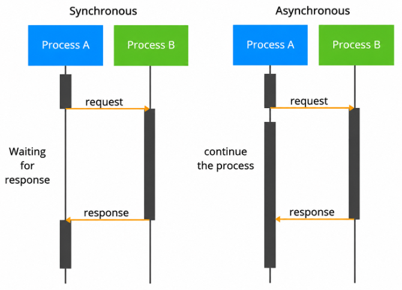
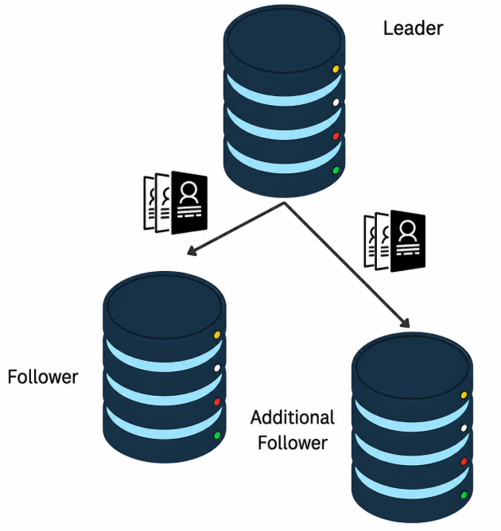

# Data Replication
## 단일 리더 복제(Single Leader Replication)
### 왜 복제(Replication)가 필요한가?
- 사용자와 가까운 위치에 데이터를 유지하여 **지연 시간(Latency)을 줄이기 위해**
    - 지연 시간(Latency): 요청했을 때 응답을 얼마나 빨리 받을 수 있는지?
- 시스템 구성 요소에 장애가 발생하더라도 계속 동작할 수 있도록 하여 **가용성(Availability)을 높이기 위해**
- 읽기 요청을 처리할 수 있는 서버 수를 늘려 **읽기 처리량(Read Throughput)을 향상시키기 위해**

### 복제 방식(Replication Mechanism)
- 리더의 개수
    - 단일 리더 복제(Single Leader Replication)
    - 다중 리더 복제(Multi Leader Replication)
    - 리더리스 복제(Leaderless Replication)

### 리더 기반 복제(Leader-based Replication)
- 리더(Leader)와 팔로워(Follower)
    - Active-Passive 또는 Master-Slave 복제

- 리더(Leader 또는 Primary)
    - 리더 노드는 모든 **쓰기(Write)** 작업을 처리
        - 데이터의 모든 변경 사항과 업데이트는 먼저 리더에서 수행됨
    - 쓰기 작업이 완료되면 리더는 변경 사항을 팔로워 노드로 복제하여 데이터를 동기화함
    - 리더는 일반적으로 데이터 일관성(Consistency)을 관리하며, 팔로워가 최신 데이터를 유지하도록 보장

- 팔로워(Follower 또는 Replica)
    - 팔로워 노드는 **읽기(Read)** 작업을 처리
        - 클라이언트는 팔로워에서 데이터를 조회할 수 있으며, 이를 통해 읽기 부하를 분산하고 확장성을 높일 수 있음
    - 팔로워는 복제 전략에 따라 동기(Synchronous) 또는 비동기(Asynchronous) 방식으로 리더의 변경 사항을 전달받음
    - 동기식 복제(Synchronous Replication)
        - 팔로워가 데이터를 정상적으로 받았음을 확인해야만 리더가 쓰기 작업을 완료한 것으로 간주
        - 이 방식은 **데이터 일관성을 보장할 수 있지만 지연 시간이 증가할 수 있음**
    - 비동기식 복제(Asynchronous Replication)
        - 리더가 팔로워의 응답을 기다리지 않고 쓰기 작업을 완료할 수 있음
        - 이 방식은 **가용성과 처리 속도를 높일 수 있지만** , 일시적인 데이터 불일치가 발생할 수 있음
    
    - 팔로워는 리더 데이터의 복제본 역할을 하며, 장애 조치(Failover) 메커니즘에 따라 기존 리더에 장애가 발생하면 새로운 리더로 승격될 수도 있음

### 복제 전략(Replication Strategy)
1. 동기식(Synchronous)
2. 비동기식(Asynchronous)
3. 준동기식(Semi-Synchronous)
    - 동기식 + 비동기식(sync + async)
        - 리더와 여러 팔로워가 있을 때, 하나는 동기식, 나머지는 비동기식으로 함으로써 하이브리드 

- 동기식(Synchronous)
    - 요청(Request) - 응답 대기(Waiting for response) - 응답(Response)
- 요청(Request) - 계속 작업 수행(continue the process) - 응답(Response)

### 추가 팔로워 구성하기(Configuring additional followers)

- 데이터와 트래픽이 많아지기 시작했을 때 팔로워를 늘리는 방법
    1. 새로운 팔로워 노드를 구성한다.
    2. 리더의 스냅샷(Snapshot)을 생성한다.
    3. 생성한 스냅샷을 새로운 팔로워로 복사한다.
    4. 팔로워에 스냅샷을 적용한다.
    5. 복제를 시작하고 최신 데이터까지 따라잡는다(Catch Up).
    6. 복제 상태를 모니터링하고 정상적으로 동작하는지 검증한다.
        - 뭘 모니터링 하는가?

### 장애 조치(Failover) 발생 시
1. 장애를 감지한다.
    - 모니터링 도구나 Heartbeat 메커니즘(약 30초)을 사용하여 리더 노드의 장애를 감지함
    - 운영팀이 즉시 장애를 인지할 수 있도록 알림(Alert)을 설정
2. 팔로워를 새로운 리더로 승격한다.
    - 가장 최신 상태의 팔로워를 새로운 리더로 선택
    - 두 개의 리더가 동시에 존재하는 상황(Split-Brain)을 방지
3. 클라이언트 연결을 새로운 리더로 전환한다.
    - 클라이언트 또는 로드 밸런서를 재설정한다.
4. 나머지 팔로워들을 업데이트한다.
5. 이중화(Redundancy)를 복구한다.
6. 데이터 무결성(Data Integrity)을 감사(Audit)하고 검증한다.
7. 장애 조치(Failover) 절차를 테스트하고 문서화한다.

### 복제 로그 설정(Setting up Replication Logs)
- 문장 기반 복제(Statement-Based Replication)
    - 리더에서 실행된 SQL 문장을 복제 로그에 기록한 뒤, 팔로워에서 동일한 SQL 문장을 다시 실행하는 방식 
        - 즉, SQL statements가 들어올 때마다 리더에게 적용, 똑같은 statements를 팔로워에게 넘김
        - 단순하고 결정적
    - 장점
        - SQL 문장만 기록하므로 구현이 간단하고 저장 공간을 적게 사용함
        - 대부분 결정적인(Deterministic) 연산으로 이루어진 데이터베이스에서는 효과적으로 동작함
    - 단점
        - `NOW()`, `RAND()` 와 같은 비결정적 함수(Non-deterministic Function)를 사용할 경우 데이터 불일치가 발생할 수 있음
        - 각 SQL 문장을 팔로워에서 다시 실행해야 하므로, 높은 동시성 환경에서는 성능이 저하될 수 있으며 실행 결과가 달라질 수도 있음

- Write-Ahead Log(WAL) 전송
    - 디스크 블록 변경과 같은 저수준 변경 사항을 기록한 Write-Ahead Log(WAL)를 리더에서 팔로워로 전송하는 방식
        - 강한 일관성
    - 장점
        - 실제 데이터 변경 사항 그대로를 복제하므로 데이터 일관성을 보장함
        - 데이터 변경 사항만 기록하므로 처리량이 높은 대규모 데이터베이스에서도 효율적
    - 단점
        - 팔로워는 리더와 동일한 데이터베이스 버전 및 저장 포맷을 사용해야 하므로 유연성이 떨어짐
        - 로그 크기가 커질 수 있어 더 많은 디스크 공간과 네트워크 대역폭이 필요

- 논리적(Row-Based) 로그 복제
    - 디스크 블록 전체를 복제하는 대신 개별 행(Row)의 변경 사항(Change Data Capture, CDC)을 기록하여 팔로워로 전송하는 방식
        - 내장 기능, DB 간 또는 버전 간 복제 가능
    - 장점
        - 팔로워가 다른 버전이거나 다른 데이터베이스 시스템이어도 사용할 수 있어 유연성이 높음
        - 특정 테이블이나 특정 행만 선택적으로 복제할 수 있음
    - 단점
        - 각 행의 변경 사항을 기록해야 하므로 WAL Shipping보다 저장 공간과 처리 비용이 더 많이 듦
        - 작은 행(Row) 변경이 매우 많을 경우 성능 오버헤드가 발생할 수 있음
    
- 트리거 기반 복제(Trigger-Based Replication)
    - 데이터베이스 트리거를 이용하여 변경 사항을 별도의 테이블이나 로그에 기록하고, 이를 팔로워가 읽어 적용하는 방식
        - 사용자 정의가 가능하며 세밀한 제어 가능
    - 장점
        - 트리거를 이용해 원하는 변경 사항만 선택적으로 기록할 수 있어 세밀한 복제 제어가 가능
        - 복잡한 데이터 변환이나 특정 컬럼 또는 특정 행만 선택적으로 복제할 수 있음
    - 단점
        - 스키마 변경 시 트리거도 함께 수정해야 하므로 관리가 복잡함
        - 데이터 변경마다 추가 코드가 실행되므로 성능 오버헤드가 발생하며 리더의 성능을 저하시킬 수 있음

### 복제 지연(Replication Lag) 해결 방법
- Replication이 일어나면 Lagging이 생김
    - Lagging: Replication해야하는데, 팔로워가 Replication를 컴플리트 하는 시간??이 걸리는 것
    - 이를 해결하기 위한 솔루션을 제공

- ① 쓰기 후 읽기 일관성(Read-after-write Consistency)
    - 복제가 지연되더라도 사용자는 자신이 방금 작성한 데이터를 항상 조회할 수 있도록 보장함
    - 쓰기 이후의 읽기 요청은 리더 또는 이미 해당 변경 사항을 받은 팔로워로 전달됨
    - 장점
        - 사용자가 자신의 변경 사항을 즉시 확인할 수 있어 일관된 사용자 경험을 제공함
            - ex. 페이스북 업로드 했는데 바로 안보이면 이상하니까?
        - 세션 정보나 사용자 정보를 기반으로 읽기 요청을 라우팅할 수 있는 시스템에서는 구현이 비교적 간단함
    - 단점
        - 일관성을 위해 리더에서 직접 읽는 경우가 많아져 리더의 읽기 부하가 증가하고 확장성이 제한될 수 있음
        - 사용자 상태나 세션 정보를 모든 노드에서 공유하기 어려운 분산 시스템에서는 관리가 복잡함

- ② 단조 읽기(Monotonic Reads)
    - 사용자가 한 번 읽은 값보다 더 오래된 값을 이후의 읽기에서 다시 보지 않도록 보장함
    - 복제 지연으로 인해 최신 데이터는 아닐 수 있지만, 읽는 데이터는 항상 앞으로 진행되며 결국 최신 상태를 따라잡음
    - 장점
        - 데이터가 일관되게 앞으로 진행되도록 하여 이전 상태로 되돌아가는(Time Travel) 현상을 방지함
        - 복제 지연이 있는 시스템에서도 일관성을 어느 정도 유지하면서 혼란스러운 데이터 역행을 방지할 수 있음
    - 단점
        - 항상 최신 데이터를 보장하지는 않으므로 오래된 데이터를 읽을 가능성은 여전히 존재
        - 사용자 또는 세션별 마지막 읽기 상태를 추적해야 하므로 읽기 라우팅이 복잡해질 수 있음

- ③ 일관된 접두사 읽기(Consistent Prefix Reads)
    - 사용자가 데이터 변경 사항을 항상 올바른 순서대로 읽도록 보장함
        - 시퀀스를 항상 기록?
    - ex. A → B → C 순서로 데이터가 변경되었다면, A와 B를 보기 전에 C를 먼저 보는 일은 발생하지 않는다.
    - 장점
        - 관련된 데이터 변경 사항의 논리적 순서를 유지하여 사용자가 올바른 순서대로 이벤트를 이해할 수 있도록 함
        - 금융 거래나 이벤트 로그처럼 작업 간 의존성이 있어 반드시 순서대로 읽어야 하는 시스템에서 특히 유용함
    - 단점
        - 복제된 노드 간 작업 순서를 추적하고 보장해야 하므로 구현이 복잡함
        - 중간 단계의 데이터가 복제될 때까지 기다려야 하므로 복제 지연으로 인한 대기 시간이 발생할 수 있음

### 정리
- 쓰기 후 읽기 일관성(Read-after-write Consistency)
    - SNS 게시글 작성이나 문서 편집처럼 사용자가 자신의 변경 사항을 즉시 확인해야 하는 경우에 적합하다.
- 단조 읽기(Monotonic Reads)
    - 최신 데이터가 아니어도 괜찮지만, 이전 상태로 되돌아가는 현상을 방지해야 하는 대시보드나 로그 처리 시스템에 적합하다.
- 일관된 접두사 읽기(Consistent Prefix Reads)
    - 채팅 시스템이나 금융 시스템처럼 관련된 변경 사항을 반드시 올바른 순서대로 이해해야 하는 애플리케이션에 적합하다.
    