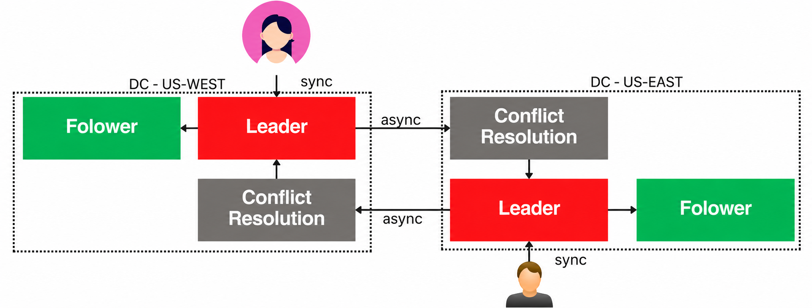

# Multi-Leaders & Leaderless Replication
## 다중 리더 복제(Multi-Leader Replication)
### 다중 리더 복제란? (Master-Master Replication)
- 여러 데이터베이스 노드가 **동시에 리더(마스터) 역할**을 수행 → 여러 노드가 각자 쓰기 요청을 받아 처리할 수 있는 복제 방식
    - 5장의 단일 리더 복제는 "쓰기는 무조건 리더 하나로"였는데, 다중 리더는 **쓰기를 받는 지점 자체가 여러 개**라는 게 근본적 차이

- ex. 미국 서비스를 서부(WEST)·동부(EAST) 두 데이터센터(DC)로 운영하는 경우

    
    - 각 DC(WEST, EAST)는 **자기 지역 안에서는 일반적인 단일 리더 복제 구조**를 가짐
        - DC마다 Leader 하나 + Follower 하나
    - 서부 사용자는 WEST의 Leader와, 동부 사용자는 EAST의 Leader와 **직접(sync)** 통신
        - 각자 자기 지역 리더에 바로 쓰기·읽기
        - 지역 안에서는 동기(sync)로 처리 → 사용자에게 즉각적인 반영을 보장
    - 두 DC의 리더끼리는 서로의 변경 사항을 **비동기(async)로 전파** 
        - WEST에서 일어난 변경이 EAST로, EAST의 변경이 WEST로
        - 대륙을 가로지르는 네트워크 지연 때문에 동기로 하면 사용자가 매 요청마다 그 지연을 다 감수해야 함 → 그래서 지역 간은 async가 기본
    - **Conflict Resolution(충돌 해결)의 위치가 핵심** : 
        - 상대 DC에서 넘어온 변경 사항은 **자기 쪽 리더에 곧바로 반영되지 않고, Conflict Resolution 단계를 먼저 거친 뒤에** 리더에 적용됨
        - 순서: `WEST Leader --async--> EAST의 Conflict Resolution --> EAST Leader` 
        - 왜 이런 순서로 갈까?
            - 서부와 동부에서 **같은 데이터가 동시에 수정**됐을 수 있음
            - 그 상태로 그냥 리더에 덮어써버리면 둘 중 하나가 조용히 사라짐
            - 그래서 반영 직전에 "이 변경이 로컬의 최신 상태와 충돌하는지"를 확인하고, 충돌하면 해결 전략(뒤에서 다룰 LWW, CRDT 등)을 적용한 뒤에야 리더의 실제 데이터에 반영
    - 즉, 지역 안(사용자↔리더, 리더↔팔로워)은 5장에서 배운 단일 리더 복제 그 자체이고, **지역 간(리더↔리더)에서만 다중 리더 복제의 새로운 문제(비동기 + 충돌)가 추가**되는 구조

### 다중 리더 복제의 특징
- 여러 개의 쓰기 노드(Multiple Write Nodes)
    - 쓰기를 받을 수 있는 지점이 여러 곳
- 충돌 처리(Conflict Handling)
    - 서로 다른 리더에서 동시에 같은 데이터를 쓰면 충돌 발생 가능 (위 그림의 Conflict Resolution이 이걸 처리)
    - Last-Write-Wins, Custom Merge Logic 같은 전략으로 해결함
- 높은 가용성(Increased Availability)
    - 리더 하나가 죽어도 다른 리더가 계속 쓰기를 받을 수 있음
- 지역 분산(Geographical Distribution)
    - 여러 데이터센터 환경에 특히 유용
- 비동기 복제(Asynchronous Replication)
    - 한 리더의 변경 사항이 **백그라운드에서** 다른 리더들로 전파(Propagate)됨
        - Propagate = "전파되다" — 한 곳에서 일어난 변경이 다른 노드들로 퍼져나가는 과정 자체를 가리키는 말
        - "변경이 일어난 시점"과 "그 변경이 다른 리더에 실제로 적용된 시점" 사이의 간격은 5장에서 나온 **복제 지연(Replication Lag)**과 정확히 같은 개념 — 다중 리더에서는 이 지연이 리더 간에도 발생한다는 것이 차이점
    - 결과적으로 **최종 일관성(Eventual Consistency)**을 제공함
        - 지금 당장은 리더마다 데이터가 다를 수 있지만, 시간이 지나면(더 이상 새 쓰기가 없다면) 결국 같은 상태로 수렴

### 다중 리더 복제의 활용 사례
- 협업 애플리케이션(Collaborative Applications)
    - 문서 편집 도구처럼 서로 다른 위치의 사용자가 동시에 같은 문서를 수정하는 경우
- 고가용성 시스템(High Availability Systems)
    - 리더 하나가 죽어도 서비스 중단 없이 계속 운영돼야 하는 시스템
- 지역 분산 데이터베이스(Geo-Distributed Databases)
    - 데이터가 여러 지역에 흩어져 있고, 모든 지역에서 낮은 지연으로 쓰기가 가능해야 하는 환경

    
### 다중 리더 복제의 과제
- 충돌 해결(Conflict Resolution)
    - 사용 사례에 따라 충돌 해결이 매우 복잡해질 수 있음
    - ex. 자동 증가 키(Auto Increment Key): 서로 다른 리더에서 각자 다음 ID를 발급하면 같은 ID가 중복 발급될 수 있음 
    - ex. 트리거·외래 키 제약 조건: 한쪽 리더에서만 트리거가 실행되거나, 참조하는 데이터가 아직 다른 리더에 전파 안 됐을 수 있음
- 데이터 일관성(Data Consistency)
    - 비동기 복제 + 동시 쓰기 충돌 가능성 때문에 강한 일관성(Strong Consistency)을 보장하기 어려움
- 네트워크 분할(Network Partitioning)
    - 리더 하나가 네트워크에서 끊기면, 그동안 그 리더에서 일어난 변경이 다른 리더들에 전파되지 않아 일시적 불일치 발생

### 충돌 해결 방법
> 위에서 본 Conflict Resolution 단계가 실제로 무엇을 할 수 있는지의 목록. 
> 자동화 정도와 정확도가 트레이드오프 관계에 있어서, 뒤로 갈수록(자동 ↔ 수동) 도구를 골라 쓰게 됨

- 사용자 개입(User Intervention)
    - 자동으로 풀기 어려운 충돌(복잡한 비즈니스 로직이 얽힌 경우)은 시스템이 충돌을 **표시만 하고**, 사람이 직접 어떤 버전을 남길지·어떻게 합칠지 선택
        - ex. Git의 merge conflict — 자동 병합이 안 되면 `<<<<<<<`로 양쪽 버전을 보여주고 개발자가 직접 고름
    - 장점: 복잡한 상황도 정확하게 해결 가능
    - 단점: 사람이 개입해야 하니 느리고, 자동화 수준이 낮음

- 마지막 쓰기 우선(Last Write Wins, LWW)
    - 타임스탬프(또는 버전 번호) 기준으로 **가장 최근 쓰기만 채택**하고 나머지는 버림
    - 장점: 구현·이해가 가장 쉬움
    - 단점: **더 중요한 데이터가 단순히 늦게 도착했다는 이유만으로 사라질 수 있음**
        - ex. 사용자가 오전 10시에 "긴 상세 설명"을 입력했고, 다른 리더에서 오전 10시 1초에 다른 사람이 "제목만 오타 수정"을 했다면, LWW는 아무 맥락 없이 그냥 나중 것만 남김 — 상세 설명이 통째로 유실
        - 또한 분산 시스템에서 "타임스탬프"는 각 노드의 시계에 의존하는데, **노드 간 시계가 완벽히 동기화돼 있지 않으면** 실제로는 먼저 일어난 일이 타임스탬프상으로는 나중으로 기록될 수도 있음 (시계 오차 문제)

 사용자 정의 병합 로직(Custom Merge Logic)
    - 비즈니스 요구사항에 맞춰 **직접 병합 규칙을 정의**
    - ex. 협업 문서 편집에서 서로 다른 부분을 수정했다면 두 변경 사항을 다 반영 (한쪽만 남기지 않고)
    - 장점: 데이터 품질과 비즈니스 로직을 지키는 맞춤 해결 가능
    - 단점: 비즈니스 규칙을 깊이 이해해야 하니 구현이 복잡함

- 충돌 없는 복제 데이터 타입(CRDT, Conflict-free Replicated Data Type)
    - **애초에 병합 결과가 항상 하나로 결정되도록(모호함이 없도록) 설계된 특수 자료구조** 
        - "어떤 순서로 병합해도 결과가 같다"는 수학적 성질(교환·결합 법칙)을 만족하게 설계됨
    - 대표 예시:
        - **Counter(카운터)**: 각 노드가 자기 몫의 증가분만 따로 세고("A노드가 +3", "B노드가 +5"), 합칠 땐 그냥 다 더함 
            - 순서 상관없이 항상 +8 로 수렴
        - **Set(집합)**: "추가만 가능한 집합"이라면, 병합은 그냥 합집합(Union) — 어느 쪽에서 먼저 추가됐든 최종 결과는 같음
    - 즉 "충돌이 나면 어떻게 풀까"가 아니라 **"애초에 충돌이라는 상황 자체가 성립하지 않도록"** 데이터 구조와 연산을 제한하는 접근
    - 장점: 복제본들이 수학적으로 동일한 상태로 수렴함을 보장 (다른 방법들처럼 "제대로 병합했는지" 걱정할 필요가 없음)
    - 단점: 이 성질을 만족하는 데이터 구조로 모델링 가능한 경우에만 쓸 수 있음 
        - ex. "마지막으로 입력한 값 하나만 유지" 같은 건 CRDT로 표현하기 까다로움

- 운영 변환(Operational Transformation, OT)
    - 동시에 들어온 "작업(Operation)" 자체를 **서로에 맞춰 변환**해서 순서가 달라도 결과가 같아지게 만듦
        - 실시간 문서 편집(Google Docs, Notion 등)에서 주로 씀
    - ex. 문서가 `"hello"`인 상태에서 동시에 두 사람이 편집:
        - A: "5번째 위치에 ' world' 삽입" → `"hello world"`
        - B: "0번째 위치에 'Say: ' 삽입" → `"Say: hello"`
        - 이 둘을 순서 관계없이 그대로 순차 적용하면 위치가 꼬여서 결과가 어긋남
        - OT는 B의 작업이 먼저 적용된 걸 감안해서 A의 "5번째 위치"를 "11번째 위치"로 **변환**해줌 → 최종적으로 `"Say: hello world"`로 항상 같은 결과에 도달
    - 장점: 실시간 협업에 효과적 (타이핑하는 순간순간 반영되면서도 최종 결과가 일관됨)
    - 단점: 구현이 복잡하고 계산 비용이 큼

- 버전 벡터(Version Vectors)
    - "충돌을 어떻게 병합할까"가 아니라, **"이게 진짜 충돌인지 아닌지부터 판별"**하는 도구
        - 위의 다른 기법들이 병합 로직이라면 이건 그 앞 단계의 감지 로직
    - 각 복제본이 "나는 각 노드의 변경을 몇 번째까지 반영했다"를 벡터(노드별 카운터 묶음)로 기록
        - ex. `{A: 2, B: 1}` = "A노드의 변경 2개, B노드의 변경 1개까지 반영한 상태"
    - 두 버전을 비교했을 때:
        - 한쪽이 다른 쪽을 완전히 포함하면(ex. `{A:2,B:1}` vs `{A:2,B:0}`) → 진짜 충돌 아님, 그냥 한쪽이 더 최신
        - 서로 다른 방향으로 앞서 있으면(ex. `{A:2,B:0}` vs `{A:0,B:1}`) → **진짜 동시 발생한 충돌** 
            - 이때만 위의 병합 전략(LWW, Custom Merge 등)을 실제로 적용
    - 리더리스 복제 절에서 나올 **Vector Clock**과 같은 계열의 개념
    - 장점: 충돌과 해결 과정을 정확히 추적 가능 (진짜 충돌인지 아닌지 오판을 줄임)
    - 단점: 동시 쓰기가 많은 대규모 분산 시스템에서는 벡터 자체가 커지고 관리가 복잡해짐
    
- 충돌 예방 전략(Prevention Strategies)
    - 충돌을 "해결"하는 게 아니라 **애초에 안 생기게 막는** 접근
    - 특정 레코드는 항상 특정 리더로만 쓰기가 가도록 라우팅
        - ex. "사용자 A의 데이터는 항상 서부 리더로만 쓰기"
            - 그러면 같은 데이터에 대해 서부·동부 리더가 동시에 쓸 일 자체가 없어짐
    - 동일 데이터에 대한 동시 쓰기 가능성 자체를 차단
    - 장점: 충돌 발생 빈도와 해결 필요성 자체를 줄임
    - 단점: 데이터 분산·라우팅 로직을 신중하게 설계해야 함
        - 사용자가 서부에서 동부로 이동하면 어느 리더로 보내야 하나? 같은 문제가 생김

- 애플리케이션 수준 로직(Application-Level Logic)
    - DB 계층이 아니라 **애플리케이션이 도메인 규칙을 알고 직접 병합**
    - ex. 은행 시스템에서 같은 계좌에 동시에 입금된 두 트랜잭션이 "충돌"처럼 보여도, 실제로는 하나만 선택할 게 아니라 **둘 다 합산**해야 맞음 
        - 입금은 원래 여러 건이 동시에 있을 수 있는 정상 상황
    - 장점: 도메인 특화 규칙을 정확히 구현 가능
    - 단점: 애플리케이션 계층의 복잡도 증가

- 정리: 자동화 정도에 따른 스펙트럼

    | 방법 | 자동/수동 | 특징 |
    |---|---|---|
    | 충돌 예방 전략 | — | 충돌 자체를 안 만듦 (가장 근본적) |
    | CRDT | 완전 자동 | 데이터 구조 자체가 충돌 불가능하게 설계됨 |
    | LWW | 완전 자동 | 가장 단순하지만 데이터 유실 위험 |
    | OT | 자동 (알고리즘 기반) | 실시간 협업 전용, 구현 복잡 |
    | 버전 벡터 | 자동 (감지만) | 병합 자체는 다른 방법과 조합해서 씀 |
    | 애플리케이션 수준 로직 | 반자동 | 개발자가 도메인 규칙을 미리 코딩 |
    | 사용자 정의 병합 로직 | 반자동 | 개발자가 규칙 설계, 실행은 자동 |
    | 사용자 개입 | 수동 | 가장 정확하지만 가장 느림 |

## 리더리스 복제(Leaderless Replication)
### 리더리스 복제란?
- 쓰기를 조정하는 지정된 **리더(Leader)가 아예 없음** — 모든 노드가 동등한 역할
    - 클라이언트가 직접 여러 노드에 읽기·쓰기를 요청하고, 노드들 스스로 알아서 동기화
    - 5장·6장 앞부분까지는 "누가 리더냐"가 계속 주제였는데, 여기서는 그 질문 자체가 사라짐
        - 리더가 없으니 리더 장애·리더 승격 같은 문제 자체가 존재하지 않음

- 주요 특징
    - **단일 장애 지점(SPOF)이 없음**
        - 리더가 없으니 "리더가 죽으면"이라는 시나리오 자체가 없음
    - **분산된 쓰기(Decentralized Writes)**
        - 클라이언트가 하나의 노드가 아니라 **여러 노드에 동시에** 쓰기 요청을 보냄
    - **최종 일관성(Eventual Consistency)**
        - 다중 리더와 마찬가지로, 당장은 노드 간 데이터가 다를 수 있지만 결국 수렴

- **쿼럼(Quorum) 기반 읽기·쓰기** — 리더가 없는데 "쓰기가 성공했다"를 어떻게 판단할까?
    - 전체 복제본 수를 **N**이라 하면
        - **쓰기 쿼럼 W** : 쓰기 요청을 보낸 N개 노드 중 **최소 W개**가 "저장했다"고 응답하면 그 쓰기를 성공으로 간주
        - **읽기 쿼럼 R** : 읽기 요청을 보낸 노드 중 **최소 R개**의 응답을 받아, 그중 **가장 최신 버전**을 클라이언트에게 반환
    - 핵심 조건: **R + W > N**
        - 이 부등식이 왜 일관성을 보장하나: 
            - N개 노드 중 W개에는 반드시 최신 데이터가 있는데, R개를 읽을 때 그 R개와 앞의 W개가 **최소 하나는 겹치도록** 강제하는 게 바로 이 부등식이기 때문
        - ex. `N=5`, `W=3`, `R=3`이라면 `R+W=6 > N=5` 
            - → 쓰기가 반영된 3개 노드와 읽기 대상 3개 노드는 5개 중에서 고르는 거라 **반드시 최소 1개는 겹침** 
            - → 그 겹치는 노드가 최신 값을 갖고 있으므로, R개 중 가장 최신 버전을 고르면 항상 정답을 찾음
        - 반대로 `R+W ≤ N` 이면(ex. N=5, W=2, R=2) 겹치지 않는 경우가 존재 가능 
            - → 최신 값을 하나도 못 읽고 옛날 값만 보게 될 위험
        - 실무에서 흔한 설정: N=3, W=2, R=2 (Cassandra의 기본값과 유사) 
            - 하나가 죽어도 쓰기·읽기 둘 다 나머지 두 개로 계속 가능하면서, `R+W(4) > N(3)` 조건도 만족

- 충돌 처리 — 리더가 없다는 건 "누가 옳은지 정해주는 심판이 없다"는 뜻이기도 하므로, 세 가지 장치가 필요:
    - **Vector Clock** : 데이터의 서로 다른 버전이 "진짜 동시에 일어난 충돌인지" 감지하는 도구
        - 위에서 본 버전 벡터와 같은 아이디어로, 리더리스에서는 **각 값(레코드)마다** "어느 노드가 몇 번째로 이 값을 썼는지"를 태그처럼 붙여서 관리함
        - ex. 노드 A가 값을 쓰면 `[A:1]`, 그다음 노드 B가 (A의 값을 보고) 갱신하면 `[A:1, B:1]`
        - 만약 A와 B가 **서로의 갱신을 모른 채 동시에** 각자 값을 고쳤다면 `[A:2]`와 `[A:1,B:1]`처럼 어느 쪽도 다른 쪽을 포함하지 않는 벡터가 나옴 → 이게 "진짜 동시 충돌"의 신호이고, 이때 병합 전략(LWW 등)이 적용됨
    - **Read Repair** : **읽기 요청이 들어온 김에** 낡은 복제본을 고쳐놓는 방식
        - 클라이언트가 여러 노드에서 값을 읽어와 비교했는데, 그중 일부가 옛날 버전이라면 → 그 자리에서 최신 값을 옛날 버전을 가진 노드에 다시 써줌
        - 즉 "읽을 때마다 청소도 같이 한다"는 발상 
            - 별도 배치 작업 없이 자연스럽게 데이터가 수렴해감
    - **Hinted Handoff** : 쓰기 대상 노드 하나가 **일시적으로 다운**된 경우의 임시 처방
        - 원래 그 데이터를 받아야 할 노드가 응답이 없으면, 대신 **다른 살아있는 노드가 "이건 원래 그 노드 것"이라는 힌트(메모)와 함께 임시로 맡아둠**
        - 나중에 원래 노드가 복구되면, 그 힌트를 넘겨받은 노드가 밀린 데이터를 원래 노드에게 전달(Handoff)하고 자기는 버림
        - 이 덕분에 노드 하나가 잠깐 죽어도 **쓰기 쿼럼(W)을 채우는 데 지장이 없음** (대타가 자리를 메꿔주는 셈)

### 장점
- 높은 가용성(High Availability)
    - 리더가 없으니 노드 장애·네트워크 분할 상황에서도 서비스 지속 가능
- 장애 허용성(Fault Tolerance)
    - 모든 노드가 동등하므로 일부가 죽어도 나머지가 읽기·쓰기를 계속 수행
- 확장성(Scalability)
    - 노드를 그냥 추가하면 됨 (리더 승격 같은 특별한 절차가 없음) 
    - → 리더 기반 모델의 병목(리더 하나가 모든 쓰기를 받아야 하는 한계)이 없음
- 낮은 지연 시간(Reduced Latency)
    - 클라이언트가 가장 가까운 노드로 요청 가능 (어느 노드든 쓰기·읽기를 받을 수 있으므로)
    - 특히 지역 분산 환경에서 유리

### 리더리스 복제의 과제
- 일관성 트레이드오프(Consistency Trade-offs)
    - **CAP 이론**
        - 분산 시스템은 네트워크 분할(Partition) 상황에서 **일관성(Consistency)과 가용성(Availability) 중 하나를 포기**해야 한다는 이론
        - 셋 중 P는 분산 시스템이라면 사실상 항상 감수해야 하는 전제라, 실질적으로는 C와 A 사이의 선택임
        - 리더리스는 이 선택에서 **가용성(A)을 우선**하는 쪽 — 그래서 강한 일관성을 기본으로 보장하진 못하고, 최종 일관성으로 타협
    - 애플리케이션이 일시적인 데이터 불일치를 감내할 수 있게 설계돼야 함

- 충돌 해결의 복잡성(Conflict Resolution Complexity)
    - 리더가 정리해주지 않으니, 노드 간 충돌을 풀려면 애플리케이션 수준 처리나 복잡한 알고리즘
        - 동시 버전 병합 등, 다중 리더 복제 충돌 해결에서 본 기법들이 필요함

- 쿼럼 불균형(Quorum Imbalance)
    - W나 R을 너무 낮게 설정하면(ex. N=5인데 W=1) 위의 R+W>N 조건이 깨지기 쉬워져서, 최신 데이터를 놓치거나 데이터가 유실될 위험이 커짐
    - 반대로 W나 R을 너무 높게 잡으면(ex. W=N) 노드 하나만 느려져도 전체 쓰기가 느려지거나 실패 → 가용성이 오히려 떨어짐 (리더리스를 쓰는 이유 자체가 흐려짐)

### 리더리스 복제를 사용하는 데이터베이스
### 실전 사용 사례
- Amazon DynamoDB
    - 리더리스 복제 개념을 대중화시킨 원조 논문(Dynamo)의 구현체
- Apache Cassandra
    - 쿼럼 설정을 세밀하게 조정 가능, 대규모 쓰기 위주 워크로드에 널리 쓰임
- Riak
